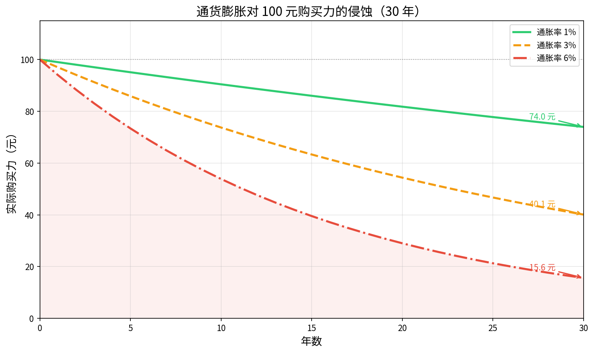
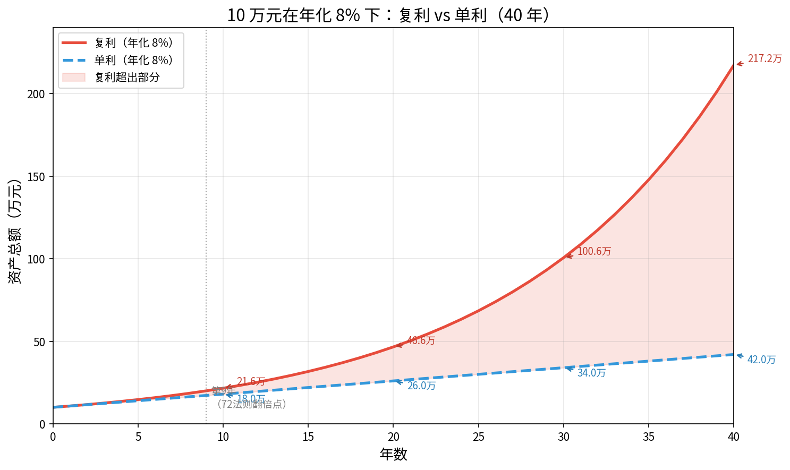
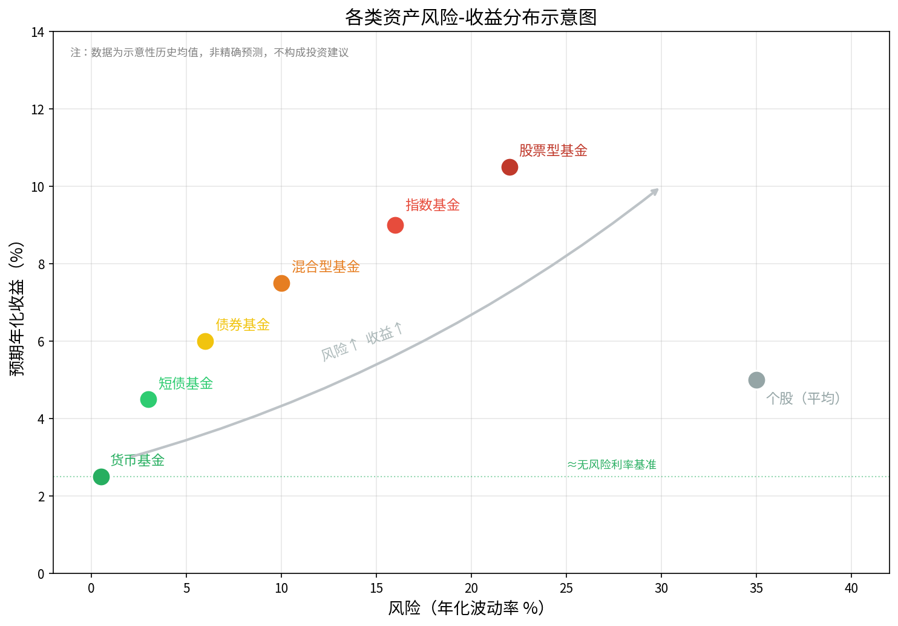

# 第一章：为什么要投资？货币与财富的底层逻辑

> **本章目标**：搞清楚一件事——把钱放着不动，是最大的风险。

作为程序员，你可能写过很多性能优化代码，把时间复杂度从 O(n²) 降到 O(n log n)。但你有没有想过：你的人民币，每天都在悄悄"跑慢"？

本章我们不谈具体买什么基金，先讲底层逻辑：钱为什么会变毛、不投资的代价有多大、什么叫复利的力量。这些是后续一切决策的基础。

---

## 1.1 通货膨胀是什么：钱为什么会变毛

### 从一碗面说起

2000 年，北京一碗兰州拉面大约 3 元。2024 年，同样的一碗面要 15 元。面还是那碗面，但你需要付出 5 倍的人民币。这不是面变贵了，是**钱变毛了**。

这个现象就叫**通货膨胀（Inflation）**：单位货币能购买的商品和服务越来越少。

### 通胀的根源

通胀的成因很多，最直观的逻辑类似一个分布式系统的"资源竞争"：

- **货币超发**：央行印了更多钱，但商品总量没变，每张钞票分到的商品份额自然减少；
- **需求拉动**：经济繁荣时大家都有钱花，商品供不应求，价格上涨；
- **成本推动**：原材料、能源涨价，生产成本转嫁给消费者。

### 通胀率的量化

经济学用 **CPI（居民消费价格指数）** 衡量通胀。中国官方长期目标是 CPI 控制在 3% 以内，但实际生活感受——尤其是房价、教育、医疗——往往远超这个数字。

购买力的计算公式很直接：

$$P_n = P_0 \times (1 - r)^n$$

其中 $P_0$ 是初始购买力，$r$ 是年通胀率，$n$ 是年数。

下图直观展示了 100 元在不同通胀率下，30 年后的实际购买力：

看这张图，如果通胀率长期维持在 6%，你今天的 100 元，30 年后只剩约 **17 元**的购买力。这不是比喻，是真实的数学。

**结论**：把钱放在家里，是在以通胀率的速度亏损。

---

## 1.2 银行存款的真实收益：利率 vs 通胀

### 活期存款：仅比藏钱强一点点

2024 年，中国各大银行活期存款利率约为 **0.1%~0.2%/年**。如果 CPI 是 2%，你的活期存款实际上每年在缩水约 **1.8%**。

### 定期存款的窘境

三年期定存利率约 **2.35%**（2024年），勉强跟上 CPI。但注意：

1. **锁定流动性**：三年内不能动用，否则按活期计息；
2. **机会成本**：这三年里，其他投资机会都与你无关；
3. **税后更低**：利息收入要缴 20% 个人所得税，实际到手更少。

### 真实收益率的计算

**真实收益率 = 名义利率 - 通货膨胀率**

这个公式叫 **费雪方程（Fisher Equation）**的简化版：

$$r_{real} \approx r_{nominal} - \pi$$

其中 $r_{nominal}$ 是银行利率，$\pi$ 是通胀率。

| 存款类型 | 名义利率 | 假设通胀 | 真实收益率 |
|--------|---------|---------|---------|
| 活期   | 0.15%   | 2%      | **-1.85%** |
| 一年定期 | 1.65%  | 2%      | **-0.35%** |
| 三年定期 | 2.35%  | 2%      | **+0.35%** |
| 五年定期 | 2.65%  | 2%      | **+0.65%** |

结论很扎心：**大多数银行存款在通胀面前是负收益**。银行在帮你"保管"钱的同时，通胀在帮你"消耗"钱。

---

## 1.3 财富增值的三种路径：储蓄、投资、投机的区别

### 三个概念的定义

很多人把"投资"和"炒股"混为一谈，实际上这是三种完全不同的行为：

**储蓄（Saving）**：把钱存起来，不追求额外收益，只求保全本金。典型例子：银行存款、货币基金。特点是风险极低，但受通胀侵蚀，长期是负真实收益。

**投资（Investment）**：将资金配置到能产生**持续现金流或价值增长**的资产上。典型例子：买股票分享企业利润、买债券获取利息、买基金参与资本市场。特点是有合理的内在逻辑支撑预期收益。

**投机（Speculation）**：纯粹押注价格短期涨跌，无视资产内在价值。典型例子：追涨杀跌、炒短线、All-in 单只股票。特点是高风险高波动，长期来看大多数投机者亏损。

### 类比：程序员的视角

- **储蓄** = 把代码注释掉放着，什么都不跑，安全但没产出；
- **投资** = 把代码部署成服务，长期稳定运行，持续产出价值；
- **投机** = 赌下一个版本的 API 会不会改，猜对了翻倍，猜错了线上事故。

本教程的目标是教你**投资**，不是教你投机。

---

## 1.4 复利：时间的力量（72法则）

### 什么是复利

**复利（Compound Interest）**：每期利息不取出，而是加入本金，下一期继续产生利息——"利滚利"。

公式：

$$A = P \times (1 + r)^n$$

其中：$P$ 为本金，$r$ 为年化利率，$n$ 为年数，$A$ 为最终金额。

对比**单利**（每期只对本金计息）：

$$A_{simple} = P \times (1 + r \times n)$$

### 72法则：翻倍需要多少年

有一个好用的心算法则——**72法则**：

$$翻倍年数 \approx \frac{72}{年化收益率(\%)}$$

几个例子：
- 年化 **4%**（货币基金）：约 18 年翻倍
- 年化 **8%**（指数基金历史均值）：约 **9 年翻倍**
- 年化 **12%**（激进策略）：约 6 年翻倍

把钱放在银行活期（0.15%），要 480 年才能翻倍。

### 复利 vs 单利的差距

下图展示了 10 万元在年化 8% 下，复利和单利 40 年的增长差异：

**第 40 年时**：
- 单利：10 × (1 + 8% × 40) = **42 万元**
- 复利：10 × 1.08⁴⁰ ≈ **217 万元**

差距是 **5 倍**。这就是为什么巴菲特说："时间是优秀投资者最好的朋友。"

### 复利的两个关键要素

1. **时间**：越早开始，效果越显著。25岁开始投资比35岁开始，最终财富差距可达 2~3 倍；
2. **利率**：哪怕每年多 1~2 个百分点，40 年后差异巨大。从 6% 到 8%，40 年后资产翻 2 倍。

**程序员的类比**：复利就像指数增长的时间复杂度，O(1.08ⁿ) 和 O(1.06ⁿ) 早期看起来差不多，长期差距会把你震惊到。

---

## 1.5 普通人为什么应该投资而不是炒股

### 炒股的真实胜率

A股流传一句话：**"七亏二平一赚"**——十个炒股的人，七个亏、两个平、一个赚。

为什么会这样？

1. **信息不对称**：机构有研究员、数据终端、渠道信息，散户靠的是财经公众号和群消息；
2. **时间不对称**：职业交易员盯盘全天，你还有代码要写、Bug 要修；
3. **情绪干扰**：涨了怕踏空追进去，跌了怕亏损割出来——这叫"追高杀低"，是散户亏损的主要原因；
4. **交易成本**：每次买卖有印花税 + 佣金，高频交易的成本会显著拖累收益。

### 基金的优势：专业分工

买基金本质上是**雇专业人士帮你投资**，你只需负责一件事：**定期投入资金，不乱动**。

- **公募基金**：受监管、强制信息披露，基金经理不能卷款跑路；
- **指数基金**：跟踪市场指数，不靠人为判断，长期表现往往优于大多数主动管理基金；
- **分散风险**：一只基金可能持有几十到几百只股票，单只股票暴雷影响有限。

**类比**：自己炒股像是自己写操作系统内核，风险极高，需要极深的专业知识。买指数基金像是用 Linux——稳定、经过检验、不需要自己造轮子。

### 普通投资者的正确姿势

不要追求"战胜市场"，而是**随市场成长**。长期来看，经济总体向上，资本市场会体现这种增长。你需要做的，是把自己放在那条增长曲线上。

---

## 1.6 风险与收益的正相关：天下没有免费的午餐

### 一个基本公理

在金融市场，有一条接近公理的规律：

**风险越高，预期收益越高；高收益必然伴随高风险。**

任何声称"低风险高收益"的产品，要么是谎言，要么是你不了解其中的风险。

### 各类资产的风险-收益谱

下图展示了常见资产类别在风险和收益维度上的大致分布：

从左到右，风险依次增大，预期收益也依次提高：

| 资产类型 | 典型年化收益 | 典型波动率 | 适合人群 |
|--------|-----------|---------|--------|
| 货币基金 | 2~3% | <1% | 短期资金停泊 |
| 短债/纯债基金 | 3~5% | 2~5% | 稳健型 |
| 混合型基金 | 6~9% | 8~15% | 均衡型 |
| 指数基金 | 8~12%（长期）| 15~25% | 进取型 |
| 个股 | 差异极大 | 30%+ | 专业投资者 |

### 夏普比率：衡量"性价比"

光看收益率不够，还要看为了获取收益承担了多少风险。**夏普比率（Sharpe Ratio）** 就是这个度量：

$$Sharpe = \frac{R_p - R_f}{\sigma_p}$$

其中 $R_p$ 是组合收益率，$R_f$ 是无风险利率，$\sigma_p$ 是波动率。夏普比率越高，说明单位风险换来的超额收益越多——性价比越高。

### 风险不等于亏损

初学者常把"风险"理解为"一定会亏"。实际上，金融中的风险是**不确定性**，即未来结果的波动范围。

一只波动剧烈的基金，今年可能涨 50%，也可能跌 30%——这叫高风险。但长期持有 10 年，平均下来可能是年化 10%。

**管理风险的核心工具**：
1. **分散投资**：不把鸡蛋放在一个篮子里；
2. **长期持有**：时间熨平短期波动；
3. **匹配风险偏好**：把投资和自己的心理承受能力对齐。

---

## 1.7 本章小结

本章我们建立了投资的底层认知框架，核心要点如下：

### 关键结论

1. **通胀是隐形税**：钱放着不动，每年都在贬值。按 3% 通胀计算，100 元 10 年后只有约 74 元的购买力。

2. **银行存款跑不赢通胀**：活期利率 0.15% vs 通胀 2%，真实收益是负的。存款保本不保值。

3. **储蓄 ≠ 投资 ≠ 投机**：三者目标、风险、方法论完全不同。本教程聚焦投资，远离投机。

4. **复利是最强大的财富增长引擎**：年化 8%，9 年翻倍；40 年后同样本金，复利结果是单利的 5 倍。越早开始，效果越惊人。

5. **普通人应该买基金而非炒股**：信息不对称、时间不对称、情绪干扰，散户炒股七亏二平一赚。指数基金让你搭上市场整体增长的列车。

6. **风险与收益正相关**：没有高收益低风险的魔法。你要做的，是在自己能承受的风险范围内，争取最高的收益性价比。

### 核心公式速查

| 公式 | 用途 |
|------|------|
| $P_n = P_0 \times (1-r)^n$ | 通胀侵蚀购买力 |
| $r_{real} \approx r_{nominal} - \pi$ | 真实收益率 |
| $A = P \times (1+r)^n$ | 复利终值 |
| $翻倍年数 \approx 72/r$ | 72法则 |
| $Sharpe = (R_p - R_f)/\sigma_p$ | 风险调整收益 |

### 下一章预告

既然知道了"为什么要投资"，下一章我们来讲"投资什么"——基金的分类和基本结构：货币基金、债券基金、股票基金、指数基金分别是什么，有什么区别，怎么选。

---

*本章结束。建议用纸笔默写一遍本章的 5 个公式，加深印象。*

---

*← [目录](index.md) | → [第二章：金融市场全景图](chapter2.md)*
