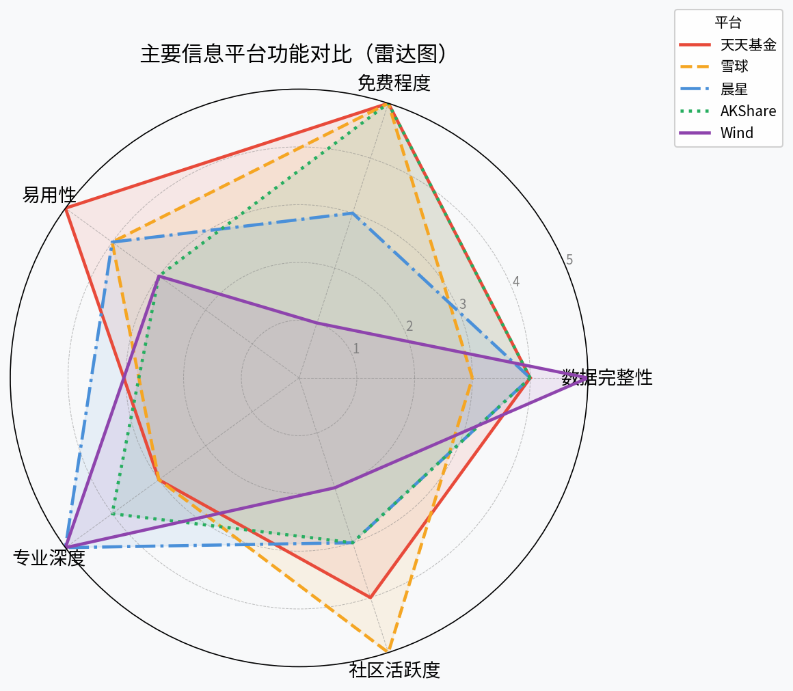

# 第十章：信息获取与研究平台

> 工欲善其事，必先利其器。投资基金，首先要学会在哪里找信息、怎么读数据。本章系统介绍从基金查询、行情分析到量化数据接口的全套工具体系。

---

## 10.1 基金信息查询平台

日常投资者接触最多的是专注于基金的信息平台，主要有以下几家：

### 天天基金网（eastmoney.com/fund）

天天基金是**东方财富旗下**的专业基金信息与交易平台，也是国内用户量最大的基金门户。其核心功能包括：

- **基金档案**：净值走势、申购赎回费率、基金经理履历、持仓明细（季报/年报）
- **基金排名**：按类型、时段筛选涨跌幅榜
- **组合工具**：支持模拟持仓和收益测算
- **信息披露**：公告、分红送配、基金合同一站查询

天天基金免费、信息全、界面友好，是入门投资者的**首选信息平台**。

### 晨星（Morningstar）中国

晨星是全球知名的独立基金研究机构，其中国站（cn.morningstar.com）提供：

- **晨星评级（星级）**：基于风险调整后收益的1-5星评分，参考价值高
- **晨星分类**：采用国际通行方法，细分基金风格（大盘/中小盘、价值/成长）
- **基金分析报告**：深度研究报告，适合机构与进阶投资者
- **业绩归因**：分析超额收益来源

晨星专业深度高，部分深度报告需付费，适合对研究质量有要求的投资者。

### 雪球（xueqiu.com）

雪球是投资社区与信息平台的融合产品，特色在于：

- **投资者交流**：大V组合公开透明、讨论活跃
- **实时行情**：股票与基金行情、净值、持仓变化
- **组合系统**：创建并公开模拟组合，可关注他人的操作逻辑
- **自选提醒**：净值异动、基金经理变动通知

雪球社区氛围浓厚，适合边学边交流，但需具备独立分辨信息质量的能力。

### 好买基金（howbuy.com）

好买是专注于中高净值客户的基金研究与销售平台，提供：

- 私募基金查询（需实名认证，100万起点门槛）
- 公募基金深度报告与量化评分
- 基金组合推荐与配置建议

---

## 10.2 股票与宏观数据平台

当分析基金的持仓标的，或想了解行业、个股层面的信息时，需要借助专业行情终端。

### Wind资讯

Wind（万德）是国内机构投资者最广泛使用的金融数据终端，号称"中国的Bloomberg"。覆盖数据包括：

- 股票、债券、基金、期货、外汇全品类行情
- 财务数据、宏观经济、行业研究报告
- Wind量化平台（支持Python/Excel插件调用）

**定价**：企业版年费数万元，对个人投资者较不友好，但多数高校图书馆提供免费访问权限。

### 同花顺（iFund/iFinD）

同花顺面向个人与机构提供两套产品：

- **同花顺行情软件**（免费）：K线图、技术指标、资金流向，是个人散户使用最广的炒股工具
- **iFinD数据终端**（付费）：接近Wind的机构级数据平台，价格相对亲民

### Choice数据（东方财富）

东方财富旗下的Choice金融终端定位于中小机构，提供：

- 股票、基金、债券全品类数据
- 行业数据、可转债、ETF专题模块
- 相比Wind价格更低，适合买方研究员和独立投资者

---

## 10.3 宏观经济信息来源

基金投资离不开对宏观环境的判断，以下是权威且免费的宏观数据来源：

| 来源 | 特点 | 核心指标 |
|------|------|----------|
| 中国人民银行（pbc.gov.cn） | 权威货币政策 | M2、LPR、社融、外汇储备 |
| 国家统计局（stats.gov.cn） | 月度/季度经济数据 | GDP、CPI、PPI、PMI |
| 财新PMI（caixin.com） | 民间视角，早于官方 | 财新制造业/服务业PMI |
| 彭博/路透（Bloomberg/Reuters） | 全球视野 | 美联储决议、全球利率 |
| 中国债券信息网（chinabond.com.cn） | 债市专项 | 国债收益率曲线、信用利差 |

**实用建议**：每月固定查看CPI、PPI、PMI三项数据，结合央行货币政策执行报告，可对债市与股市方向形成基础判断。

---

## 10.4 量化数据与Python接口

对于希望用程序化方式获取和分析数据的投资者，以下两个Python接口是首选：

### AKShare

AKShare 是完全**免费、开源**的Python金融数据接口，支持：

- A股行情、基金净值、ETF数据
- 宏观经济指标（CPI、GDP、社融等）
- 债券、期货、可转债数据
- 美股、港股基础行情

```python
import akshare as ak

# 获取某只基金的历史净值
fund_nav = ak.fund_open_fund_info_em(fund="110011", indicator="单位净值走势")
print(fund_nav.head())

# 获取沪深300历史行情
hs300 = ak.stock_zh_index_daily(symbol="sh000300")
print(hs300.tail())
```

安装方式：`pip install akshare`，无需注册，开箱即用。

### Tushare Pro

Tushare Pro 是国内知名的金融数据平台，提供：

- A股日线/分钟数据（需积分兑换高频数据权限）
- 基金净值、持仓、经理变动数据
- 宏观经济、行业分类数据

```python
import tushare as ts

pro = ts.pro_api('你的token')
df = pro.fund_nav(ts_code='110011.OF', start_date='20230101', end_date='20231231')
print(df.head())
```

Tushare需要在官网注册获取token，基础数据免费，高频/深度数据需积分。

---

## 本章小结

各平台功能对比如下图所示（雷达图维度：数据完整性/免费程度/易用性/专业深度/社区活跃度）：



**选平台的原则**：

1. **日常查询**：天天基金网满足90%需求，免费且全面
2. **社区交流**：雪球了解市场情绪与他人策略
3. **深度研究**：晨星报告提供专业独立视角
4. **量化分析**：AKShare免费无门槛，是Python数据分析的首选
5. **机构需求**：Wind/Choice提供最完整的机构级数据

信息本身并不决定投资成败，关键是建立**系统性的信息处理流程**：定期采集→筛选过滤→形成判断→指导操作。平台只是工具，理性思考才是核心。

---

*下一章将介绍如何在各平台开户、购买基金，以及如何通过选择平台和时机来节省申购费用。*

---

*← [第九章：技术分析入门](chapter9.md) | → [第十一章：买卖平台与账户开通](chapter11.md)*
