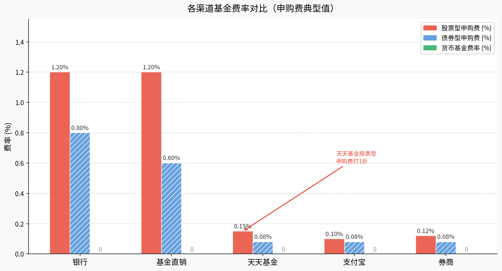
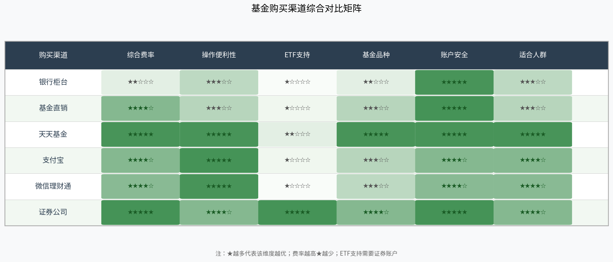

# 第十一章：买卖平台与账户开通

> 选好基金只是第一步，知道去哪里买、怎么买得便宜，同样至关重要。本章详解主流购买渠道的特点、开户流程，以及省钱的实用技巧。

---

## 11.1 基金购买渠道对比

目前国内基金的主要购买渠道可以分为五大类：

### 1. 银行（网银/手机银行）

银行是传统的基金代销渠道，包括工行、招行、建行等。

**优点**：信任度高、与储蓄账户无缝连接、适合老年客户
**缺点**：
- 申购费通常**不打折**，股票型基金申购费高达1.2%~1.5%
- 基金品种有限，只代销与银行有合作的产品
- 不支持购买ETF（ETF只能在证券账户买卖）

### 2. 基金公司直销平台

各家基金公司均有自己的App或官网（如易方达App、广发基金官网）。

**优点**：部分产品打折，避免第三方中间环节
**缺点**：每家公司只卖自己旗下产品，需多个App，操作分散

### 3. 天天基金（东方财富旗下）

天天基金是**东方财富证券旗下**的基金销售平台，持有**基金销售牌照**，合规可信。

**优点**：
- 申购费**全场1折**起，股票型基金1.2%→**0.12%**，节省90%
- 品种最全，涵盖公募基金全量产品约万只
- 支持定投、组合投资、智能推荐
- 与东方财富证券打通，可同时管理股票与基金

**缺点**：不直接支持场内ETF交易（需联动证券账户）

### 4. 支付宝（蚂蚁财富）

**优点**：用户基数大，操作极简，与余额宝无缝切换
**缺点**：部分产品申购费打折力度不及天天基金，品种略少

### 5. 微信理财通

腾讯系产品，与支付宝类似，主要面向微信用户群体，费率与支付宝接近。

### 6. 证券公司（券商）

开立证券账户后，可通过券商App同时操作股票与基金。

**优点**：
- 申购费普遍**1折**，与天天基金相当
- **唯一支持场内ETF、LOF买卖**的渠道
- 一个账户统管股票+债券+基金

**缺点**：开户门槛略高于基金平台，需要实名+人脸识别

---

## 11.2 开户流程详解

### 天天基金开户步骤

天天基金隶属于**东方财富**，持有中国证监会颁发的**基金销售业务资格**，是完全合规的正规平台。

**开户流程（全程线上，约10分钟）：**

1. **下载App**：在手机应用商店搜索"天天基金"，下载安装东方财富旗下天天基金App
2. **注册账号**：输入手机号、设置登录密码，完成短信验证
3. **实名认证**：提交身份证正反面照片 + 人脸识别活体检测（系统自动审核，通常1分钟内通过）
4. **绑定银行卡**：添加本人名下储蓄卡，完成小额验证（银行会发送验证码），即可充值购买基金

> 注意：天天基金账户资金安全由**存管银行**托管，平台无权挪用客户资金，与银行存款一样受法律保护。

### 证券账户开户步骤

若计划购买ETF或同时炒股，需额外开立证券账户：

1. 选择券商（推荐华泰/国泰君安/东方财富证券）
2. 下载券商App，提交身份证 + 银行卡 + 人脸识别
3. 签署风险揭示书，设置交易密码
4. 账户开立后自动获得**沪深A股账户**，即可买卖场内ETF

---

## 11.3 各平台费率对比与省钱技巧

不同渠道的费率差异显著：

### 核心费率数据

| 渠道 | 股票型申购费 | 债券型申购费 | 货基费率 |
|------|------------|------------|--------|
| 银行 | 1.2%（不打折） | 0.8% | 0% |
| 基金直销 | 1.2%（偶有折扣） | 0.6% | 0% |
| 天天基金 | **0.10%~0.15%（1折）** | 约0.08% | 0% |
| 支付宝 | 约0.10% | 约0.08% | 0% |
| 券商 | 约0.10%~0.12% | 约0.08% | 0% |

### 省钱技巧

**① 首选1折费率平台**

天天基金、支付宝、主流券商均可将股票型基金申购费打至**1折**（即0.10%~0.15%），相比银行的1.2%节省约90%。以一次性投入10万元为例：

- 银行申购费：10万 × 1.2% = **1200元**
- 天天基金申购费：10万 × 0.12% = **120元**
- **每次节省约1080元**

**② 定投利用免申购费产品**

部分指数基金（尤其是场外指数基金）在直销平台或天天基金享有**申购费0元**活动，定期定额投资时注意筛选。

**③ 货币基金不收申购费，灵活理财首选**

货币基金全渠道申购费均为0，适合作为"资金中转站"——闲置资金放入货基，投资时直接转出申购目标基金。

**④ ETF省去申购费，但需支付佣金**

场内ETF通过券商买卖，不收申购/赎回费，只收**交易佣金**（通常0.02%~0.03%/笔），适合频繁操作或大资金投资者。

**⑤ 赎回费"满7日"后大幅降低**

多数基金若持有不足7天，赎回费为1.5%；持有满7天后降至0.5%；持有满2年后通常降至0%。切勿频繁短线操作基金，既损失手续费，也影响收益。

---

## 11.4 资金安全：平台合规性判断

选择平台时，安全合规是首要标准。

### 合规判断三步法

**第一步：查牌照**

正规基金销售机构须持有中国证监会颁发的**"基金销售业务资格"**。可在以下网站核查：

- 中国证券投资基金业协会官网：www.amac.org.cn → "机构查询"
- 天天基金（东方财富证券）：牌照号 **ZX0135**，查询可核实

**第二步：查托管**

正规平台的客户资金由**第三方商业银行托管**，平台无权挪用。天天基金、支付宝等均通过银行进行资金存管。

**第三步：辨别风险**

| 特征 | 正规平台 | 警惕平台 |
|------|---------|---------|
| 证监会备案 | 是 | 无法查到 |
| 资金托管 | 第三方银行 | 自行保管 |
| 收益承诺 | 展示历史业绩，不承诺保本 | 承诺高收益或保本 |
| 信息披露 | 完整、及时 | 信息不透明 |

> **重要提示**：任何平台若以"保本保收益""稳赚不亏"等方式宣传基金产品，均涉嫌违规，务必高度警惕。

---

## 11.5 本章小结

购买渠道综合对比如下矩阵所示：

**渠道选择建议**：

- **新手入门**：天天基金，费率1折、品种全、操作简单，一站式满足需求
- **场内ETF**：必须开立证券账户，推荐与天天基金配合使用（东方财富App打通两者）
- **大额投资**：直销平台或天天基金均可，注意查询是否有申购费0元活动
- **避开银行渠道**：仅将银行当作资金出入口，不在银行购买基金，可显著降低成本

**一句话总结**：开天天基金账户+证券账户，几乎覆盖所有基金购买场景，且享受全市场最低费率。

---

*至此，本教程的信息获取与平台操作部分已全部介绍完毕。建议读者动手注册账户，从小额定投开始实践，在实操中加深对前十一章内容的理解。*

---

*← [第十章：信息获取与研究平台](chapter10.md) | → [第十二章：组合投资实战](chapter12.md)*
