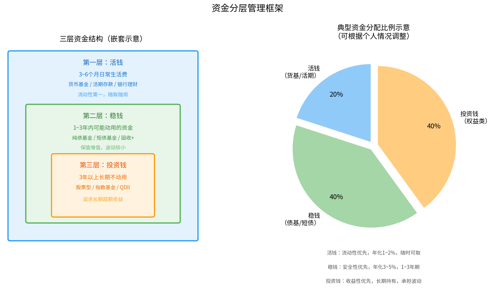
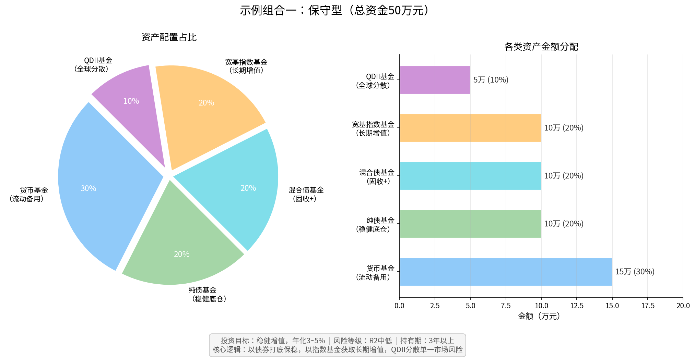
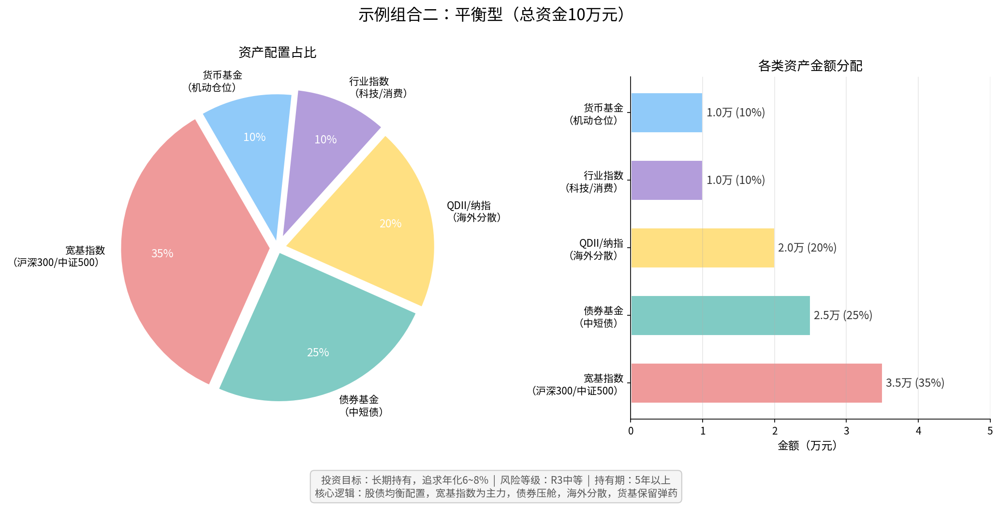
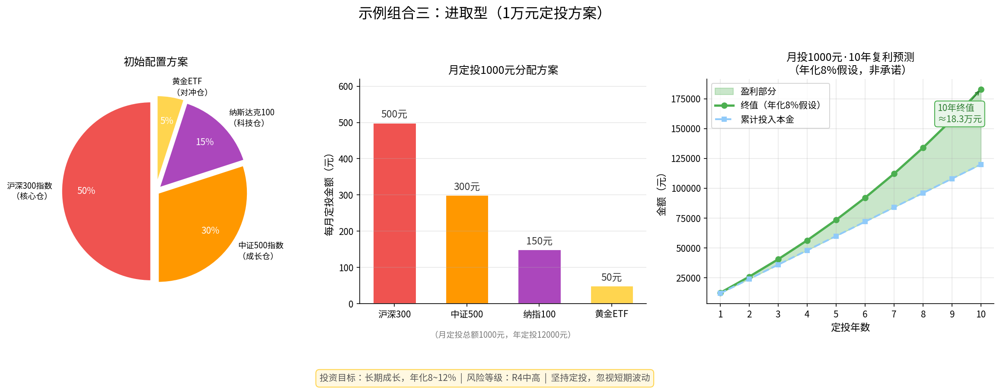

# 第十二章：组合投资实战

> **本章导读**
>
> 前面各章我们已经认识了基金的种类、费率、选择方法和买卖时机。现在进入最关键的实战环节：如何把这些知识组合成一个属于自己的投资方案？本章将从投资目标出发，带你完成资金规划、风险评估、组合搭建和持续管理的完整闭环。

---

## 12.1 确定投资目标与周期

投资的第一步不是"买什么"，而是"为什么买"。目标模糊是大多数投资者失败的根本原因——没有目标，就没有止盈止损的标准，也没有坚守的理由。

### 目标要具体可量化

一个好的投资目标需要回答以下四个问题：

| 问题 | 模糊表述（错误） | 具体表述（正确） |
|------|------------------|------------------|
| 为了什么？ | "想赚钱" | "5年后买一辆20万的车" |
| 需要多少？ | "越多越好" | "需要20万，现有8万，缺口12万" |
| 多久实现？ | "越快越好" | "5年后，即2029年底" |
| 能承受多少亏损？ | "不想亏" | "最多承受15%的阶段性回撤" |

### 常见投资目标分类

**短期目标（1年以内）**
- 明年旅游/装修备用金
- 子女明年学费
- **适合产品**：货币基金、短债基金、银行定期
- **核心要求**：本金安全 > 收益率

**中期目标（1~5年）**
- 3年后购房首付
- 子女出国留学备用金
- **适合产品**：债券基金、固收+、平衡型基金
- **核心要求**：本金相对安全，适度增值

**长期目标（5年以上）**
- 养老补充
- 子女18岁后的教育金
- 个人财务自由
- **适合产品**：股票型基金、宽基指数、QDII
- **核心要求**：跑赢通胀，长期复利增长

> **关键原则**：不同目标对应的钱，绝对不能混用。为养老准备的钱不能因为短期需要而赎回，为3年后买房准备的首付不能拿去做高风险投资。

---

## 12.2 评估风险承受能力

风险承受能力决定了你的组合应该有多大比例配置权益类资产。评估时需要考虑两个维度：**风险承受能力**（客观财务状况）和**风险承受意愿**（主观心理感受）。

### 客观维度：财务状况评分

| 评估项目 | 低风险承受力（1分） | 中风险承受力（3分） | 高风险承受力（5分） |
|----------|---------------------|---------------------|---------------------|
| 年龄 | 55岁以上 | 35~55岁 | 35岁以下 |
| 收入稳定性 | 无固定收入 | 有固定收入但不稳定 | 固定职业，收入稳定 |
| 家庭负担 | 有老有小，负担重 | 负担一般 | 单身或双收无负担 |
| 紧急备用金 | 无或不足1个月 | 3~6个月 | 6个月以上 |
| 投资资金占总资产比例 | 超过50% | 30%~50% | 30%以下 |
| 投资经验 | 无经验 | 有一定经验 | 丰富经验 |

**总分解读**：6~12分（保守型）、13~22分（平衡型）、23~30分（进取型）

### 主观维度：心理测试

假设你投入10万元的基金，3个月后账面亏损了15%（亏了1.5万），你的第一反应是：

- A. 立即赎回，睡不着觉 → **保守型**
- B. 有点担心，但能接受，等等看 → **平衡型**
- C. 加仓机会来了！ → **进取型**

> **重要提示**：取两个维度评估中较低的那个结果。心理测试评分高，但财务状况脆弱，应以保守型为准。

### 权益仓位参考公式

一个简单的经验规则：

```
权益类资产上限 ≈ (100 - 年龄) × 1%
```

例如：30岁投资者，权益上限参考为70%；50岁投资者，权益上限参考为50%。

**注意**：这只是参考起点，需结合个人财务状况调整。

---

## 12.3 资金分层管理（活钱/稳钱/投资钱）



资金分层是个人财务管理的核心框架，将所有可用资金分为三个层次，每层对应不同的目标和产品。

### 第一层：活钱

**定义**：日常生活保障资金，覆盖3~6个月的生活开支。

**核心要求**：流动性第一，随时可取，本金不能有任何风险。

**适合产品**：
- 余额宝、微信零钱通等货币基金（T+0或T+1到账）
- 银行活期存款
- 短期银行理财（注意流动性）

**计算方法**：
```
活钱金额 = 月均生活支出 × 4（月）
例：月均支出5000元 → 活钱至少备20,000元
```

**常见错误**：将活钱全部存入定期，一旦急用只能损失利息甚至提前支取罚款。

### 第二层：稳钱

**定义**：1~3年内可能动用但不是马上要用的资金，如购房首付、子女学费等中期目标资金。

**核心要求**：保值为主，适度增值，波动要小，不能出现大幅亏损。

**适合产品**：
- 纯债基金（历史回撤通常在3%以内）
- 短债基金（久期短，风险低）
- 固收+基金（债券打底+少量股票增强）
- 大额存单、国债

**收益预期**：年化3%~5%，低于股市但远高于活期。

### 第三层：投资钱

**定义**：3年以上明确不会动用的长期资金，用于追求超过通胀的长期收益。

**核心要求**：追求长期复利，能承受20%~30%的阶段性回撤，不因短期波动而赎回。

**适合产品**：
- 宽基指数基金（沪深300、中证500、全市场指数）
- 主动股票型基金（精选长期优秀基金经理）
- QDII基金（纳指100、标普500、港股等）
- 行业指数基金（可选，占比不超过20%）

### 三层资金比例参考

| 风险类型 | 活钱 | 稳钱 | 投资钱 |
|----------|------|------|--------|
| 保守型 | 20% | 50% | 30% |
| 平衡型 | 15% | 35% | 50% |
| 进取型 | 10% | 20% | 70% |

---

## 12.4 示例组合一：保守型（50万，稳健增值）

**适用人群**：50岁以上/有大额中期支出计划/风险承受力偏低/首次接触基金

**投资目标**：稳健增值，年化目标3%~5%，最大回撤不超过8%



### 具体配置方案

| 类别 | 产品类型 | 金额 | 占比 | 预期年化 | 代表产品 |
|------|----------|------|------|----------|----------|
| 货币基金 | 活钱备用 | 15万 | 30% | 1.8~2.5% | 天弘余额宝、易方达货币 |
| 纯债基金 | 稳健底仓 | 10万 | 20% | 3~4.5% | 中短期纯债类 |
| 混合债基金 | 固收+ | 10万 | 20% | 4~6% | 偏债混合型 |
| 宽基指数基金 | 长期增值 | 10万 | 20% | 6~10%（长期） | 沪深300ETF |
| QDII基金 | 全球分散 | 5万 | 10% | 5~8%（长期） | 纳指100/标普500 |
| **合计** | | **50万** | **100%** | **预期3~5%** | |

### 配置逻辑

1. **货币基金30%**：满足流动性需求，同时作为再投资弹药
2. **债券类40%**：纯债+固收+形成稳健底仓，抵御市场波动
3. **权益类30%**：宽基指数+QDII获取长期增长，分散单一市场风险

### 操作建议

- **建仓方式**：货币基金和纯债可一次性投入；宽基指数建议分3~6个月分批买入
- **再平衡周期**：每年12月检查一次，若某类资产偏离目标配比超过5%则调整
- **止盈参考**：达到年化目标收益后，可部分转移至货币基金待机
- **应急预案**：若急需资金，先赎回货币基金，不动股票仓位

---

## 12.5 示例组合二：平衡型（10万，长期持有）

**适用人群**：25~45岁/风险承受力中等/有3~5年以上投资周期

**投资目标**：长期持有，追求年化6%~8%，接受阶段性回撤15%



### 具体配置方案

| 类别 | 产品类型 | 金额 | 占比 | 代表产品 |
|------|----------|------|------|----------|
| 宽基指数基金 | 核心仓 | 3.5万 | 35% | 沪深300/中证500/全A指数 |
| 债券基金 | 压舱石 | 2.5万 | 25% | 中短期债基、固收+ |
| QDII基金 | 海外分散 | 2万 | 20% | 纳指100、港股互联网 |
| 行业指数基金 | 卫星仓 | 1万 | 10% | 科技/消费/医药其中一个 |
| 货币基金 | 机动仓位 | 1万 | 10% | 余额宝等T+0产品 |
| **合计** | | **10万** | **100%** | |

### 配置逻辑

1. **"核心-卫星"策略**：宽基指数为核心（35%），行业指数为卫星（10%），大盘打底稳收益，小仓位追求弹性
2. **国内外均衡**：A股55% + 海外20%，降低单一市场系统性风险
3. **债券压舱**：25%债券在市场大跌时起缓冲作用，且可在低点再平衡时卖债买股

### 再平衡实操

每年做一次再平衡，将偏离目标超过5%的仓位调回。例如：

- 年末权益类大涨至50%（目标45%），则卖出5%权益买入债券
- 年末权益类大跌至30%（目标45%），则卖出债券买入权益（越跌越买）

---

## 12.6 示例组合三：进取型（1万，定投成长）

**适用人群**：初入职场的年轻人/月收入稳定/能长期坚持10年以上

**投资目标**：通过定投积累财富，追求年化8%~12%，接受30%以上阶段性回撤



### 定投方案设计

**一次性基础仓**：1万元按以下比例建仓

| 类别 | 占比 | 金额 |
|------|------|------|
| 沪深300指数基金 | 50% | 5,000元 |
| 中证500指数基金 | 30% | 3,000元 |
| 纳斯达克100指数基金 | 15% | 1,500元 |
| 黄金ETF | 5% | 500元 |

**月度定投安排**（以月定投1000元为例）

| 标的 | 月定投金额 | 比例 |
|------|-----------|------|
| 沪深300 | 500元 | 50% |
| 中证500 | 300元 | 30% |
| 纳指100 | 150元 | 15% |
| 黄金ETF | 50元 | 5% |

### 定投执行纪律

1. **固定日期**：每月固定日期（如8号、18号）扣款，不受市场涨跌影响
2. **坚持原则**：大跌不停投，大涨不加仓，用时间换波动平滑
3. **估值参考**：指数PE百分位低于30%时，可小幅提高定投金额（1.5倍）
4. **止盈机制**：整体收益率达到30%~50%时，可部分止盈（赎回1/3），剩余继续持有

### 10年复利预测

| 定投年数 | 累计投入 | 预期终值（年化8%） | 盈利金额 |
|----------|---------|-------------------|----------|
| 3年 | 3.6万 | 约4.5万 | 约0.9万 |
| 5年 | 6万 | 约8.4万 | 约2.4万 |
| 8年 | 9.6万 | 约15.5万 | 约5.9万 |
| 10年 | 12万 | 约21.6万 | 约9.6万 |

*注：以上为假设年化8%的数学预测，实际收益受市场影响，不构成投资承诺。*

---

## 12.7 组合跟踪与调整节奏

建好组合只是起点，长期维护同样重要。正确的节奏是：**定期审视，非频繁操作**。

### 推荐的跟踪周期

| 频率 | 检查内容 | 行动标准 |
|------|----------|----------|
| 每月 | 定投是否正常执行、基金净值是否异常 | 仅记录，不操作 |
| 每季 | 各类资产偏离目标比例、基金经理是否变动 | 偏离>10%考虑小幅调整 |
| 每年 | 全面复盘：收益、风险、目标进度、基金更换 | 做年度再平衡 |
| 触发事件 | 重大个人变化（结婚/生子/换工作/大额支出） | 重新评估目标和风险 |

### 什么情况需要更换基金

**应该换**：
- 基金经理离职，新经理风格不明或历史不佳
- 基金规模急剧缩水（清盘风险）
- 费率明显高于同类产品且无业绩优势
- 基金风格漂移（股票型基金大量配置债券，与目标不符）

**不应该换**：
- 仅仅因为近3~6个月业绩不好
- 因为某只"更好看"的基金被推荐
- 大盘整体下跌导致亏损

### 再平衡操作流程

```
每年12月底检查 → 计算各类资产实际占比
→ 与目标占比对比 → 偏差超过5%?
  是 → 卖出偏高的 + 买入偏低的 → 记录操作
  否 → 不操作，继续持有
```

---

## 12.8 税务基础：基金盈利要交税吗

许多新手忽视税务问题。了解基本规则有助于计算真实收益。

### 中国大陆基金税务规则（2025年适用）

| 收益类型 | 个人投资者 | 企业投资者 |
|----------|-----------|-----------|
| 股票型/混合型基金买卖差价 | **暂免**个人所得税 | 按25%企业所得税 |
| 债券型基金买卖差价 | **暂免**个人所得税 | 需缴税 |
| 货币基金收益（余额宝等） | **暂免**个人所得税 | 需缴税 |
| 基金分红（股票基金） | **暂免**个人所得税 | 需缴税 |
| 持有国债、地方债的基金 | 利息收入免税 | 部分免税 |

> **重要**：以上为2025年政策，"暂免"意味着存在政策变动风险，请关注最新规定。

### QDII基金的特殊税务

投资QDII基金，买卖差价同样暂免个人所得税。但需注意：
- 海外分红再投资时，基金层面可能已在境外缴税
- 汇率变动会影响实际收益（人民币升值时，外币资产折算缩水）

### 养老基金的税收优惠

若通过个人养老金账户（IRA账户）购买公募基金，享有EEE税收优惠结构：
- 缴费阶段：每年最高12,000元可抵扣当年应纳税所得额
- 投资阶段：投资收益暂不征税
- 领取阶段：按3%优惠税率征收（低于一般个税）

---

## 12.9 本章小结：组合构建完整 SOP

以下是构建和管理投资组合的标准操作流程，可作为实际操盘的检查清单：

### 阶段一：准备期

- [ ] **明确目标**：金额、时间、用途、最大可接受亏损
- [ ] **资金分层**：确定活钱/稳钱/投资钱的金额
- [ ] **评估风险**：完成主客观两个维度的风险评估，确定风险偏好
- [ ] **选择账户**：开通基金账户（基金公司直销/支付宝/天天基金等）

### 阶段二：建仓期

- [ ] **制定配置比例**：参考本章示例，结合自身情况调整
- [ ] **选择基金**：每个类别选1~2只，参考第八章选基方法
- [ ] **分批建仓**：权益类建议分3~6个月建仓，降低时间风险
- [ ] **记录建仓成本**：记录每笔买入的净值和日期

### 阶段三：持有期

- [ ] **设置定投**：若有定投计划，设置自动定投，减少主观干预
- [ ] **每月记录**：简单记录组合市值，不需要每天盯盘
- [ ] **每季度检查**：检查是否需要小幅调整
- [ ] **每年再平衡**：做一次全面再平衡

### 阶段四：退出期

- [ ] **达到目标**：接近目标金额或时间节点，逐步转入低风险产品
- [ ] **分批赎回**：不要一次性全部赎回，分3~6个月逐步降低仓位
- [ ] **税务复核**：确认当年收益和税务情况

---

> **本章核心结论**：
>
> 1. 目标决定策略：先想清楚为什么投，再决定怎么投
> 2. 资金分三层：活钱保流动，稳钱保本金，投资钱追收益
> 3. 三种组合：保守型以债券为主，平衡型股债均衡，进取型以股票为主
> 4. 低频操作：每年再平衡一次，持有期内不随意换仓
> 5. 知税务：普通公募基金买卖暂免个税，但政策可能变动

---

*下一章：第十三章 — 常见误区与心理陷阱*

---

*← [第十一章：买卖平台与账户开通](chapter11.md) | → [第十三章：常见误区与心理陷阱](chapter13.md)*
