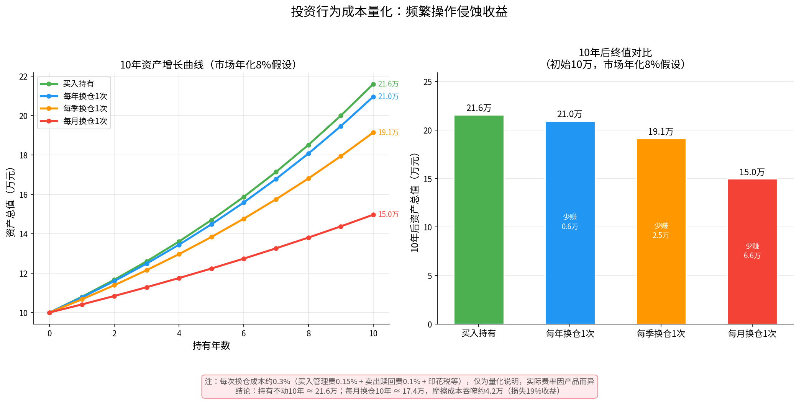

# 第十三章：常见误区与心理陷阱

> **本章导读**
>
> 市场不缺好的投资机会，缺的是不犯错的投资者。研究表明，普通投资者的实际持有收益，往往比所持基金本身的收益低20%~40%——差距全部来自错误的行为。本章梳理最常见的七个误区，并提供可操作的对抗清单。

---

## 13.1 追涨杀跌

### 误区描述

"追涨杀跌"是个人投资者最普遍、代价最大的行为偏差。表现为：

- 看到某基金最近涨了20%，赶紧买入
- 持有的基金跌了10%，赶紧卖掉"止损"
- 结果：买在高点，卖在低点，反复割肉

### 为什么会这样

大脑的损失厌恶机制（卡尼曼研究证明）：**亏损1元的痛苦，是赚到1元快乐的2倍**。当基金下跌时，痛苦感超出理性判断，驱动我们"快跑"。而当基金上涨时，FOMO（害怕错过）情绪驱动我们"快上车"。

### 数据证明代价

以沪深300指数为例：2010~2020年，指数年化回报约5%。但据基金业协会统计，同期散户平均年化回报接近0%。绝大部分差距来自追涨杀跌的买卖时机。

### 对抗方法

1. **定投纪律**：设置固定日期自动扣款，物理隔断情绪干预
2. **冷静期规则**：有赎回冲动时，强制等待72小时再决策
3. **历史对照**：每次想卖时，查看这只基金过去10年的历史图，思考"我是否在历史的相对低点"
4. **禁看频率**：将盯盘频率从每天降低至每周，减少信息刺激

---

## 13.2 频繁操作

### 误区描述

频繁买卖基金，自认为是在"主动管理风险"，实际上是在不断地消耗收益。

### 量化成本

如图所示，假设市场年化8%，初始投入10万元：

| 操作策略 | 10年后终值 | 相比持有不动少赚 |
|----------|-----------|-----------------|
| 买入持有 | 约21.6万 | — |
| 每年换仓1次 | 约20.9万 | 约0.7万 |
| 每季换仓1次 | 约19.0万 | 约2.6万 |
| 每月换仓1次 | 约17.4万 | 约4.2万 |

*注：每次换仓成本估算为买卖费用合计约0.3%（申购费0.15% + 赎回费0.1% + 其他）*

### 费率叠加效应

每次换仓的直接成本：
- 赎回费：通常0.1%~1.5%（持有时间越短，费率越高）
- 申购费：通常0.1%~1.5%（打折后约0.1%~0.15%）
- 合计：约0.2%~0.3% 每次

每月换仓一次 = 每年12次换仓 = 每年约2.4%~3.6%的额外摩擦成本。这已经相当于债券基金的全年收益了。

### 对抗方法

1. **设置最低持有期**：买入时告诉自己"至少持有1年再评估"
2. **换仓前算成本**：强制自己计算赎回费+申购费，确认是否值得
3. **问三个问题**：换仓前问自己"①为什么换？②换仓后的预期是什么？③如果判断错了怎么办？"
4. **设置操作记录**：每笔操作写下原因，事后复盘，是否是对的？

---

## 13.3 幸存者偏差

### 误区描述

我们看到的"明星基金"、"10年10倍基金"，都是幸存下来的佼佼者。那些规模缩水、清盘、或业绩平庸的基金，已经悄悄地从大众视野中消失。

### 典型案例

- **历史现象**：某年度市场出现一批业绩翻倍的基金，吸引大量资金涌入。次年这批基金中有60%跌回均值甚至亏损。
- **基金数量**：中国公募基金数量从2010年的700只增加到2024年的超过11,000只。每年有数百只基金清盘或合并。数据库中展示的，永远是活着的那些。

### 幸存者偏差在选基中的具体表现

1. **排行榜陷阱**：看"近1年业绩前10名"，这10名基金的往年数据往往也被保留，营造出"一直好"的假象
2. **广告偏差**：基金公司只宣传表现好的产品，表现差的不提
3. **媒体报道**：财经媒体只报道大赚的投资案例，亏损案例鲜少报道

### 对抗方法

1. **看长期数据**：不看1年，至少看5年甚至10年的完整业绩记录
2. **关注回撤**：不只看收益，看最大回撤。高收益往往对应高回撤，"完整经历"了市场
3. **了解清盘率**：意识到你选基的"候选池"已经经过幸存者筛选
4. **多用宽基指数**：指数不会被清盘，成分股会动态调整，代表整体市场表现

---

## 13.4 过度分散

### 误区描述

"不把鸡蛋放在一个篮子里"是正确的，但有些投资者会走向另一个极端：买了几十只甚至上百只基金，以为这样更安全。

### 为什么过度分散有害

**1. 分散不充分**

10只都是沪深300指数基金 ≠ 10倍分散效果。实质上是重复持有相同资产，没有分散作用。

**2. 管理负担加重**

持有的基金越多，追踪、评估、再平衡的工作量成倍增加。结果往往是根本无法有效管理。

**3. 拉低收益**

优秀的基金会被表现平庸的基金稀释。如果你持有20只基金，整体表现必然向均值回归。

**4. 自我欺骗**

买很多基金让人感觉"做了功课"、"管理了风险"，但实际上是一种回避深度研究的心理防御机制。

### 合理的分散度

| 资产规模 | 建议基金数量 | 说明 |
|----------|------------|------|
| 1万以下 | 1~2只 | 宽基指数即可，不必复杂 |
| 1~10万 | 2~4只 | 股债2~3只 + 可选海外1只 |
| 10~50万 | 4~6只 | 多一个维度（海外/行业） |
| 50万以上 | 6~10只 | 增加大类资产品种 |

### 判断是否过度分散

- 你能说出每只基金的投资策略和基金经理吗？说不上来 → 可能过多了
- 两只基金的相关性高于0.85？ → 没有分散意义，合并一只
- 单只基金占比低于3%？ → 影响甚微，考虑合并

---

## 13.5 忽视费率

### 误区描述

"就差0.5%的费率，有什么关系？"——这是最常见的认知错误之一。费率的差异，在时间的放大作用下，会产生惊人的影响。

### 费率复利计算

同样投入10万，持有20年，市场年化8%：

| 管理费率 | 20年后终值 | 差距 |
|----------|-----------|------|
| 0% | 466,096元 | — |
| 0.5% | 420,152元 | 少45,944元 |
| 1.0% | 378,668元 | 少87,428元 |
| 1.5% | 341,000元 | 少125,096元 |

**结论**：1%的费率差异，20年后导致约9%的终值差距。

### 常见的被忽视费率

| 费率类型 | 常见范围 | 说明 |
|----------|---------|------|
| 申购费 | 0~1.5% | 直销渠道通常打折至0.1%，部分免申购费 |
| 赎回费 | 0~1.5% | 持有7天以内通常1.5%（惩罚性），持有2年以上通常0% |
| 管理费 | 0.1%~1.5%/年 | 指数基金约0.1~0.5%，主动基金约1~1.5% |
| 托管费 | 0.05%~0.25%/年 | 随管理费一起收取，易被忽视 |
| 销售服务费 | 0~0.4%/年 | C类份额收取，替代申购费 |

### 实操建议

1. **选直销渠道**：基金公司官网/天天基金买入申购费通常打1折
2. **持有满1~2年**：规避高赎回费
3. **同类产品比费率**：同样追踪沪深300，费率0.1%和费率1%是完全不同的产品
4. **优先选A类长期持有**：长期持有选A类（一次性申购费，年费低）；短期持有选C类（无申购费但年费较高）

---

## 13.6 短期业绩崇拜

### 误区描述

一只基金最近1年涨了50%，你觉得这是一只好基金。这个判断过于草率。

### 短期业绩无法预测未来

**原因1：均值回归**

学术研究反复证明，基金业绩存在均值回归现象。今年排名前10%的基金，明年排进前10%的概率仅约25%（如果随机排列是10%的话，25%意味着轻微的正向持续性，但远谈不上稳定）。

**原因2：风格轮动**

A股市场存在明显的风格轮动：大盘/小盘、成长/价值、科技/消费……不同阶段市场偏好不同。今年大涨的基金，往往是踩准了某种风格，而非基金经理能力超群。

**原因3：运气成分**

在短期（1~3年），运气对基金业绩的贡献可能高达50%以上。识别"运气"和"能力"，至少需要7~10年的完整市场周期。

### 如何判断长期能力

- **完整周期表现**：至少经历一次牛市+熊市的完整周期
- **信息比率（IR）**：超额收益 / 超额波动，>0.5 说明超额收益具有稳定性
- **最大回撤控制**：在市场大跌时，是否比基准少跌？控制回撤往往比取得绝对高收益更体现能力
- **基金经理任职时间**：至少5年以上管理同一只基金，才有参考意义

---

## 13.7 情绪化决策

### 主要情绪陷阱

**1. 恐惧（市场大跌时）**

- 表现：大盘跌10%时，开始怀疑"是不是会跌更多"，产生清仓冲动
- 后果：在低点割肉，踏空随后的反弹
- 对抗：写下"如果此时清仓，我的钱去哪里？货币基金年化2%还是继续等待机会？"

**2. 贪婪（市场大涨时）**

- 表现：市场大涨时仓位加到最高，甚至借钱投资
- 后果：在高点重仓，随后大跌
- 对抗：设置仓位上限，高于上限自动止盈

**3. 后悔（错过涨幅时）**

- 表现：某基金涨了30%而你没买，懊悔买入，此时往往已是高点
- 后果：追高买入，成为"接盘侠"
- 对抗：接受"错过机会"是投资的常态，下一个机会永远在前方

**4. 锚定（按买入价判断涨跌）**

- 表现："我是8000点买的，现在5000点了，必须等涨回8000点才能卖"
- 后果：沉没成本陷阱，继续持有一只基本面恶化的产品
- 对抗：问自己"如果今天是第一次买，我还会买这只吗？"答案是"不会"则换仓

**5. 确认偏见（只看自己想看的信息）**

- 表现：买了A基金之后，只关注A基金的利好消息，屏蔽负面信息
- 后果：客观判断能力下降，不能及时识别基金劣化
- 对抗：主动寻找反方观点，想想"哪些迹象说明我的判断是错的？"

### 情绪管理工具

**投资日记法**

每次有操作冲动时，写下：
1. 当前情绪状态（恐惧/贪婪/焦虑/兴奋）
2. 触发该情绪的具体事件
3. 如果按这个冲动操作，最坏结果是什么？
4. 72小时后，重新阅读日记，再决定是否操作

**预设规则法**

在情绪平稳时，提前制定规则并书面化：
- "如果整体组合回撤超过20%，我会买入而非卖出"
- "如果整体收益率达到50%，我会赎回1/3"
- "每年只做一次再平衡，其他时候不操作"

---

## 13.8 本章小结：投资者行为检查清单

以下清单可作为每次操作前的自检工具。**在执行任何非计划性操作前，请逐项检查。**

### 操作前自检（5分钟）

**关于追涨杀跌**
- [ ] 这次操作是因为近期涨跌触发的吗？
- [ ] 如果价格没有变动，我还会做这个决策吗？

**关于频繁操作**
- [ ] 这是计划内的操作（定投/年度再平衡）还是临时起意？
- [ ] 我计算过这次换仓的交易成本了吗？

**关于幸存者偏差**
- [ ] 我是否只看了这只基金近期的好业绩？
- [ ] 我是否查看了这只基金历史上的最大回撤？

**关于分散度**
- [ ] 这次买入会让我总基金数超过合理数量吗？
- [ ] 新买入的基金与已有持仓相关性高吗？

**关于费率**
- [ ] 我知道这只基金的管理费率吗？
- [ ] 赎回费率是多少？持有时间是否已满低费率区间？

**关于短期业绩**
- [ ] 我是否因为近1年业绩好就决定买入？
- [ ] 这只基金经历过完整的牛熊周期吗？

**关于情绪**
- [ ] 我现在的情绪状态是什么？（恐惧/贪婪/焦虑/兴奋/平静）
- [ ] 如果情绪是"平静"以外的任何一种，我能等72小时再决定吗？

### 行为偏差快速识别表

| 你的想法 | 可能的偏差 | 建议行动 |
|---------|----------|----------|
| "这只基金涨了好多，要快买！" | 追涨 + FOMO | 冷静72小时，查历史估值 |
| "跌了这么多，再跌我受不了了" | 损失厌恶 + 恐慌 | 查历史最大回撤，比较当前位置 |
| "我买了这么多只，风险很分散" | 过度分散的假安全感 | 计算实际相关性 |
| "这个明星基金经理肯定很厉害" | 幸存者偏差 + 光环效应 | 查完整10年业绩，不只看近年 |
| "手续费就差一点点，无所谓" | 忽视复利的费率侵蚀 | 用复利公式计算20年差距 |
| "大家都在买，我也要买" | 羊群效应 | 问自己：这个逻辑独立成立吗？ |
| "等涨回来再说" | 锚定效应 + 沉没成本 | 问：今天第一次看，还会买吗？ |

---

> **本章核心结论**：
>
> 1. 行为差距：普通投资者实际收益远低于基金本身的收益，差距来自行为错误
> 2. 最贵的错误：追涨杀跌 + 频繁操作，直接侵蚀收益
> 3. 偏见的代价：幸存者偏差、短期业绩崇拜让你选错基金
> 4. 情绪是敌人：恐惧时不卖，贪婪时不加仓，用规则约束情绪
> 5. 最好的解药：纪律、低频、长期，然后什么都不做

---

*下一章：附录 — 推荐书单、术语速查表、常用公式*

---

*← [第十二章：组合投资实战](chapter12.md) | → [附录A：推荐书单](appendix_a.md)*
