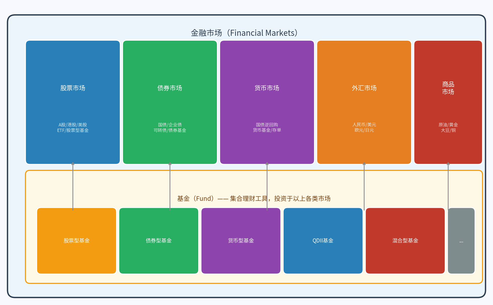
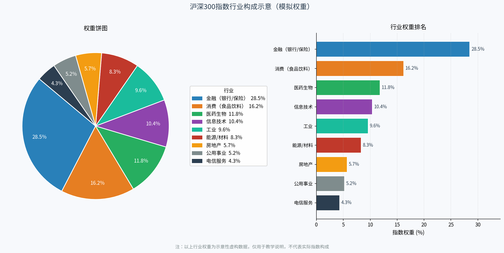
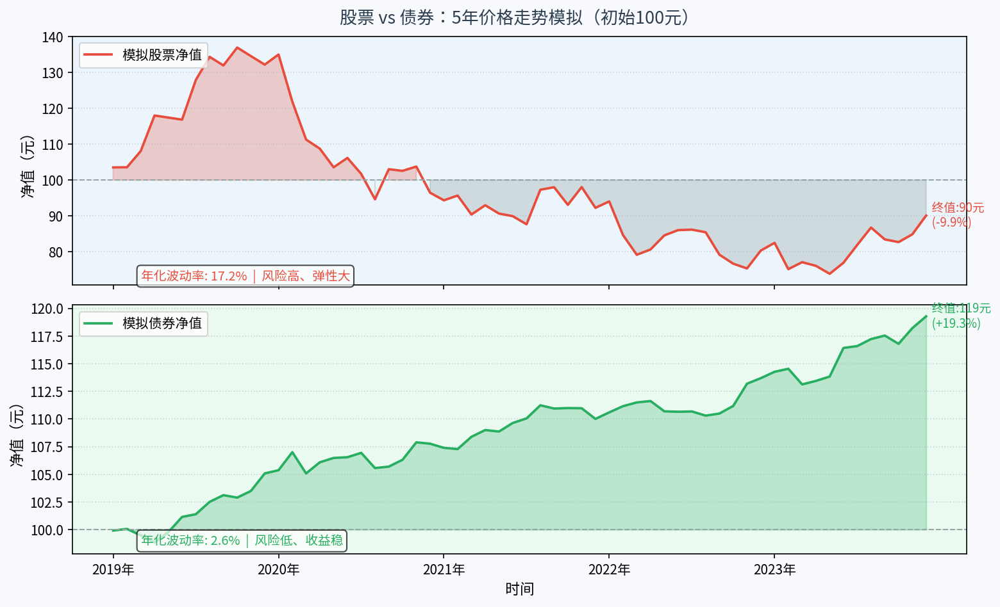

# 第二章：金融市场全景图

> **本章目标**：建立对金融市场的整体认知，搞清楚股票、债券、指数、基金各自是什么、彼此关系如何，为后续学习基金投资打牢地基。

---

## 2.1 金融市场的组成：股市、债市、货币市场、商品市场

金融市场，简单来说就是"钱在各方之间流动的地方"。和软件工程里的消息总线、API 网关类似，金融市场扮演的是**资金的路由和撮合平台**。

从大类划分，金融市场主要包括：

| 市场 | 交易的是什么 | 典型产品 |
|------|------------|---------|
| **股票市场** | 公司的股权 | A股、港股、美股、ETF |
| **债券市场** | 债务凭证（借条） | 国债、企业债、可转债 |
| **货币市场** | 短期资金使用权 | 国债逆回购、货币基金、大额存单 |
| **外汇市场** | 不同货币兑换 | 人民币/美元/欧元/日元 |
| **商品市场** | 实物大宗商品的权利 | 原油、黄金、大豆、铜 |

这些市场并不是彼此隔绝的孤岛。比如一家公司既可以在股票市场发行股票融资，也可以在债券市场发行债券借钱；投资者既可以直接买股票，也可以通过**基金**间接参与多个市场。

**基金在哪里？** 基金是一种"集合理财工具"，它本身不是一个独立的市场，而是漂浮在各个市场之上的"资金池"。基金把散户的小钱汇聚成大钱，再由专业的基金经理按照既定策略投向上述各类市场。



对程序员而言，可以这样理解：金融市场是一套"分布式系统"，各子市场是不同的服务节点，资金是请求流量，基金经理是智能路由层，而我们购买基金就是在调用这个路由层的 API。

---

## 2.2 股票是什么：公司股权的凭证

股票（Stock / Share）是公司**所有权的一个份额凭证**。

类比很简单：假设你和三个同学合伙开了一家公司，初始注册资本 100 万元，四个人平分，每人持有 25% 的股权。当公司"上市"时，这 25% 的股权就被切成成千上万张"票"，每一张就是一股股票。你可以把其中一部分股票卖给外部投资者，换来现金——这个过程叫做**IPO（首次公开募股）**。

**股票的收益来源有两个：**

1. **资本利得**：低价买入，高价卖出，赚价差。就像你低价买了一个域名，等它涨价了再卖掉。
2. **分红**：公司每年盈利后，按持股比例向股东分配现金，类似公司分利润给股东。

**股票的风险在哪里？** 股票代表的是公司剩余价值的索取权。公司赚钱了，股东受益；公司亏损甚至破产，股东可能血本无归。这就是为什么股票的波动性远高于债券——它直接绑定了公司的经营风险。

在 A 股市场，股票代码有规律可循：
- `600XXX`、`601XXX`、`603XXX`、`605XXX`：上交所主板
- `000XXX`、`001XXX`：深交所主板
- `300XXX`：深交所创业板（科技成长型公司为主）
- `688XXX`：上交所科创板

---

## 2.3 债券是什么：借贷关系的凭证

债券（Bond）是**借贷关系的书面凭证**，通俗理解就是一张有法律效力的"借条"。

程序员视角：债券相当于一个有固定返回值的函数调用。你借出 100 元，约定 3 年后还本，每年支付 4% 的利息——这个收益是**事先约定好的**，不像股票那样不确定。

**债券的主要参数：**

- **面值**：通常是 100 元或 1000 元（本金）
- **票面利率**：每年支付的利息比率，比如 4%
- **到期期限**：几年后归还本金，比如 3 年期、10 年期
- **发行主体**：国家（国债）、地方政府（地方债）、企业（企业债/公司债）

**国债为什么被称为"无风险资产"？** 因为国债是国家发行的，国家还不起钱的概率极低（主要靠税收和印钞支撑），所以国债的利率被视为市场的"无风险利率基准"。企业债的利率通常高于国债，因为企业有破产风险，投资者要求更高的回报作为风险补偿。

**债券 vs 股票的关键差异：**

| 对比维度 | 股票 | 债券 |
|---------|------|------|
| 收益性质 | 不确定（可能暴涨也可能归零） | 相对确定（固定利息+本金） |
| 风险 | 高 | 低（优先受偿权高于股东） |
| 持有关系 | 公司股东（所有权） | 公司债主（债权） |
| 典型年化收益 | 长期平均约 8-12%（含大幅波动） | 国债约 2-4%，企业债约 3-7% |

---

## 2.4 指数是什么：沪深300、上证50、纳斯达克是怎么算的

指数（Index）是用来**衡量一篮子股票整体表现**的数字，可以理解为"市场温度计"。

**一个直观的比喻**：假设你家房间有 5 盏灯，每次开关几盏，你想知道"整个房间现在有多亮"，就可以算 5 盏灯亮度的加权平均——这就是指数的逻辑。

### 沪深300 是怎么构成的？

沪深300 指数从沪深两市选取**市值最大、流动性最好的 300 只股票**，按**自由流通市值加权**计算：

```
指数点位 = Σ（每只成分股 × 该股权重）/ 基准点位

某股权重 = 该股自由流通市值 / 全部成分股自由流通市值之和
```

大白话：公司越大，它的涨跌对指数影响越大。宁德时代股价涨 5%，比某个小公司涨 20% 对指数的推动作用更强。

### 常见指数对比

| 指数名称 | 覆盖范围 | 特点 |
|---------|---------|------|
| **沪深300** | 沪深两市前 300 大市值 | 最能代表 A 股整体走势 |
| **上证50** | 上交所最大 50 家公司 | 多为银行、白酒等蓝筹龙头 |
| **中证500** | 市值排名 301-800 的中型公司 | 偏成长，波动较大 |
| **创业板指** | 深交所创业板 100 只龙头 | 科技属性强，弹性大 |
| **纳斯达克100** | 纳斯达克前 100 大非金融股 | 苹果、微软、英伟达等科技巨头 |
| **标普500** | 美国前 500 大上市公司 | 美股最具代表性的宽基指数 |

指数本身不能直接买卖。但"**指数基金**"允许你用极低的成本复制指数涨跌——这是后续章节的重点。



---

## 2.5 基金在金融体系中的位置：集合理财工具

基金（Fund）的核心逻辑是"**众筹投资**"。

假设你有 1 万元想买股票，但直接买一手茅台（约 1600 元/股×100 股 = 16 万元）都不够，更别说做到分散投资了。基金解决的就是这个问题：

> **基金 = 很多人的小钱 → 基金公司汇聚 → 专业经理管理 → 投资各类资产 → 收益按份额分配**

这在软件架构中类似**线程池**：多个小任务（散户资金）进入统一的任务队列，由线程池（基金经理）统一调度执行，共享计算资源（市场机会），输出结果（收益）按比例分配。

### 基金在金融市场中的位置

基金并不直接"生产"收益，它是一个**资产配置的中间层**：

```
散户投资者
    ↓  购买基金份额（出资）
基金公司（托管在银行）
    ↓  基金经理决策
各类金融市场
    股票市场 / 债券市场 / 货币市场 / 海外市场
    ↓
投资收益（亏损）返回给投资者
```

基金对个人投资者的核心价值：

1. **门槛低**：1 元起投（货币基金），100 元起投（大多数基金）
2. **分散风险**：一只基金持有几十上百只股票，单只股票暴雷不至于全军覆没
3. **专业管理**：不需要自己研究公司财报
4. **流动性好**：大多数基金可以随时申购/赎回

当然，基金也有代价：**管理费**（年化 0.1%-1.5%）、**销售服务费**、**赎回费**等，这些费用会侵蚀收益——后续章节会详细展开。

---

## 2.6 A股市场特点：与美股的核心差异

作为程序员，你可能会注意到 A 股和美股有些"设计哲学"上的差异。了解这些差异，有助于正确理解 A 股基金的表现。

### 核心差异对比

| 对比维度 | A股 | 美股 |
|---------|-----|------|
| **涨跌停限制** | 主板 ±10%，科创板/创业板 ±20% | 无涨跌停（熔断机制是整市层面） |
| **T+1 vs T+0** | **T+1**：今天买的股票明天才能卖 | **T+0**：当天可以反复买卖 |
| **交易时间** | 工作日 9:30-15:00（北京时间） | 工作日 9:30-16:00（美东时间） |
| **注册制 vs 核准制** | 2019 年后全面推行注册制 | 长期实行注册制 |
| **退市制度** | 相对宽松（近年在收紧） | 严格，垃圾公司难以存活 |
| **散户比例** | **散户占成交量约 70-80%** | 机构主导，散户占比低 |
| **市场情绪** | 政策敏感度高，波动周期性强 | 受业绩和宏观经济驱动为主 |

### 对基金投资的影响

**散户主导 + 政策敏感** 意味着 A 股容易出现情绪化的"羊群效应"——牛市时人人入场，熊市时恐慌性抛售。这对基金投资者有两层含义：

1. **短期波动大，需要更强的持有耐心**：A 股历史上经历过多次腰斩级别的熊市（2008年、2015年），但长期（10年+）来看，宽基指数仍然保持上涨趋势。
2. **"便宜"的定投机会更多**：正因为情绪化抛售，A 股的估值低谷往往比成熟市场更极端，对定期定额投资者反而是好事。

**T+1 制度** 对基金投资者影响有限，因为基金本身采用的是"下一个交易日净值"成交，不存在日内交易的问题。

---

## 2.7 本章小结：金融市场一张图

本章内容较多，核心要记住以下几个要点：

### 关键概念速查

| 概念 | 一句话定义 | 类比 |
|-----|-----------|------|
| **股票** | 公司所有权的一个份额 | 给公司入股，成为股东 |
| **债券** | 借贷关系的书面凭证 | 把钱借给公司/政府，收利息 |
| **指数** | 一篮子股票整体表现的加权平均 | 一组股票的"平均温度" |
| **指数基金** | 复制指数成分和权重的基金 | 跟着"平均温度"涨跌 |
| **基金** | 集合多人资金进行专业投资的工具 | 众筹买股票/债券，按份额分成 |

### A股 vs 美股三句话

1. A股有涨跌停，美股没有；A股 T+1，美股 T+0。
2. A股散户多、政策敏感、情绪化周期明显。
3. 长期看，A股宽基指数（沪深300）仍然跑赢大多数人的自己操盘。

### 股票 vs 债券走势对比

下图直观展示了股票与债券在5年维度下的价格走势差异——股票弹性大、波动剧烈；债券稳健爬升、回撤极小。两者的差异直接决定了不同基金产品的风险收益特征。



### 下一章预告

第三章将深入基金的"内部结构"：基金份额如何计算、基金净值（NAV）是什么、管理费到底怎么收——把基金从黑盒变成透明的玻璃盒。

---

*本章完*

---

*← [第一章：为什么要投资](chapter1.md) | → [第三章：基金基础概念](chapter3.md)*
