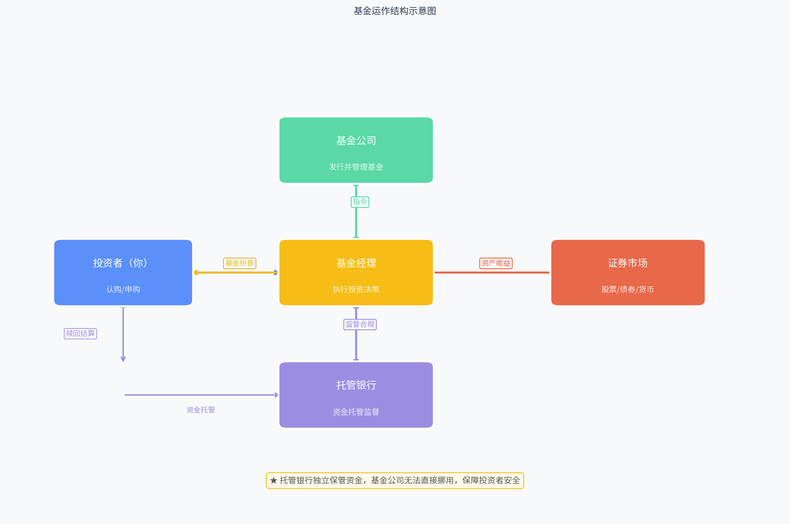
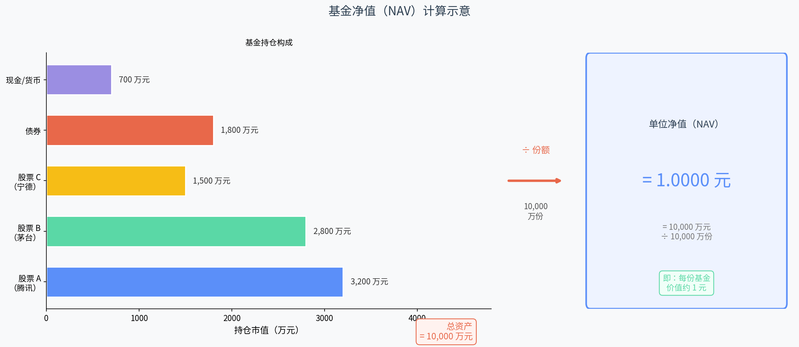
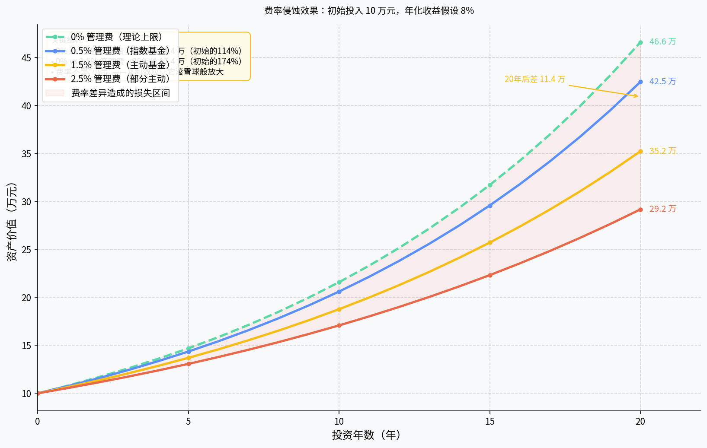

# 第三章：基金基础——最重要的那些概念

> **本章目标**：搞清楚买基金时绕不开的几个核心名词，为后续实操打好地基。

---

## 3.1 基金是什么：本质是"集资雇人炒股/买债"

如果你用程序员的思维理解基金，最准确的类比是**众包（Crowdfunding）+ 托管执行（Managed Execution）**。

想象这样一个场景：你和一千个陌生人各出 1 万元，总共凑了 1000 万元，然后大家一起雇了一个"专业操盘手"，让他用这笔钱去买股票、债券或其他金融资产，最终收益按出资比例分配，亏损也按比例承担。这就是基金的本质。

具体来说：

- **你**：出钱的人，也叫**投资者**或**持有人**
- **操盘手**：就是**基金经理**，拿着所有人的钱去做投资决策
- **平台/公司**：**基金公司**，负责发行和管理这只基金，也是基金经理的雇主
- **资金保险箱**：**托管银行**，独立保管这笔钱，基金公司无法随意挪用

你无法直接控制钱怎么投，但你可以通过选择不同的基金来选择不同的"操盘手"和不同的投资方向。买基金就是在**用钱投票**——把钱交给你认为靠谱的人去管理。

这种结构有几个核心优势：
1. **门槛低**：100 元起买，普通人也能参与原本需要几十万才能分散投资的资产组合
2. **分散风险**：一只基金通常持有几十到上百只股票，单只股票暴雷影响有限
3. **专业管理**：（理论上）由专业人士做研究和决策，不需要你天天盯盘

当然，"专业"不代表一定赚钱，这点后面章节会详细讨论。

---

## 3.2 基金的运作结构：基金公司、基金经理、托管银行、投资者

基金不是一个简单的"你把钱给某人"的两方交易，背后有一套法律规定的多方制衡结构。



**四个核心角色**：

**① 投资者（你）**
用真实的钱认购或申购基金份额，享有对应比例的资产所有权。你是基金的委托人，基金公司为你服务。

**② 基金公司**
基金的发行方和管理方。负责：设立基金（向监管机构申请）、雇用基金经理、制定投资策略、定期披露基金信息（净值、季报、年报等）。你买"某某基金"，通常就是某家基金公司旗下的产品。国内知名的基金公司有华夏、易方达、南方、富国等。

**③ 基金经理**
具体操刀的"司机"。他/她每天研究市场，决定买什么、卖什么、什么时候调仓。基金经理的水平、风格、任职年限，是投资者选基金时最关注的维度之一。需要注意：**一个基金经理可能同时管理多只基金**，精力是否分散值得考量。

**④ 托管银行**
扮演"独立监管方"的角色。所有投资者的资金必须存放在托管银行的专用账户中，基金公司无权直接动用。每一笔交易指令都要经过托管银行核验合规后才能执行。这是保护投资者利益的关键制度设计——即使基金公司破产，你的钱也不会凭空消失。

**资金流向**：
```
你的资金 → 托管银行（专户保管）
               ↓
          基金经理发出买入指令
               ↓
          托管银行核验后执行
               ↓
          证券市场（购入股票/债券等资产）
               ↓
          资产升值/分红/利息 → 流回托管账户
               ↓
          按你的份额比例，体现为净值上涨
```

---

## 3.3 净值（NAV）：基金价格是怎么算出来的

"净值"对应英文 **NAV（Net Asset Value）**，是基金的"单价"——买入 1 份基金需要多少钱。

**计算公式非常简单**：

```
单位净值（NAV）= 基金总资产 / 总份额
```

"总资产"就是基金当前持有的所有股票、债券、现金等资产按**当天市场价**加总的价值。



**举个例子**：假设一只基金持有：
- 股票 A（腾讯）：3200 万元
- 股票 B（茅台）：2800 万元
- 股票 C（宁德）：1500 万元
- 债券：1800 万元
- 现金：700 万元

总资产 = 10,000 万元。如果该基金共发行了 10,000 万份，则：

```
NAV = 10,000 万元 ÷ 10,000 万份 = 1.0000 元/份
```

第二天股票涨了，总资产变成 10,200 万元，NAV 就变成 1.0200 元。

**几个关键细节**：

- 净值**每天收盘后**计算并公布一次（货币基金例外，每日结算）
- 你下午 3 点前提交的申购/赎回指令，使用**当天**收盘后计算的净值（未知价制度）
- 有些基金还有**累计净值** = 单位净值 + 历史每份分红总额，反映基金成立以来的总回报

> 程序员类比：NAV 就像一个股票的"最新价格"，但它不是市场双向撮合出来的，而是每天算一次的快照。

---

## 3.4 申购与赎回：买入和卖出的正式叫法

在基金领域，"买入"和"卖出"有对应的专业术语：

| 日常说法 | 基金术语 | 说明 |
|----------|----------|------|
| 买入基金 | **申购**（Purchase） | 用现金换取基金份额 |
| 卖出基金 | **赎回**（Redemption） | 用基金份额换回现金 |
| 最初参与 | **认购**（Subscription） | 仅用于新基金募集期，价格可能优惠 |

**为什么叫"赎回"而不是"卖出"？**

因为你不是把份额卖给另一个人，而是"还给"基金——基金公司按当日 NAV 收回你的份额，从基金池子里划出对应的钱还给你。没有对手方，是基金公司直接"回购"。

**时间延迟（T+N）**：

与股票的 T+1 不同，基金的申购赎回有更长的处理周期：

- **申购**：T 日提交 → T+1 日确认份额 → T+2 日可见账户
- **赎回**：T 日提交 → T+1 日确认金额 → T+3~T+7 日资金到账（不同基金不同）
- **货币基金**：申购和赎回通常 T+0 或 T+1 到账，流动性最好

这个延迟意味着：**你无法像炒股一样随时买卖**，基金更适合中长期持有而非频繁操作。

---

## 3.5 费率详解：申购费、赎回费、管理费、托管费

费率是基金投资中**最容易被忽视、影响却最大**的因素之一。买基金要付的钱，不只是净值本身。

**四种主要费用**：

### ① 申购费（前端收费）
- **时机**：买入时一次性收取
- **典型值**：0.1%～1.5%（金额越大往往越低，大额申购有折扣）
- **谁收**：基金公司或销售渠道（银行/第三方平台）
- **现状**：很多平台（天天基金、支付宝等）已做到**打一折**，甚至部分基金免申购费

### ② 赎回费
- **时机**：卖出时按赎回金额收取
- **典型值**：0%～1.5%，**持有时间越长费率越低**（持有超过2年通常降到 0%）
- **设计目的**：鼓励长期持有，惩罚短期套利

### ③ 管理费（最重要！）
- **时机**：每日从基金资产中扣除（悄悄扣，你看不见）
- **典型值**：货币基金约 0.33%，指数基金约 0.1%～0.5%，主动基金约 1.0%～1.5%
- **为什么重要**：它是**从你的本金里持续扣除**的，通过复利效应在长期对收益产生巨大侵蚀

### ④ 托管费
- **时机**：同样每日从基金资产扣除
- **典型值**：约 0.05%～0.25%，相对较小

---

**费率对长期收益的影响（图示）：**



假设同样投入 10 万元，年化收益率同为 8%，20 年后的差异：

| 管理费率 | 实际年化 | 20 年后资产 |
|----------|----------|-------------|
| 0%（基准） | 8.0% | 约 46.6 万 |
| 0.5% | 7.5% | 约 42.5 万 |
| 1.5% | 6.5% | 约 35.2 万 |
| 2.5% | 5.5% | 约 29.2 万 |

**1.5% 的管理费，20 年后让你少赚 11+ 万，相当于初始投入的 110%！**

> **程序员类比**：管理费就像云服务的按时计费——0.15%/天 看起来很小，但服务器不停机，复利不停跑，最终账单令人咋舌。选基金，费率是你能控制的少数变量之一，一定要关注。

---

## 3.6 份额与金额：买了多少"股"基金

你用钱买基金，得到的是**份额**，而不是股票那样的"股数"。

**计算方式**：
```
获得份额 = 投入金额 ÷ 当日申购净值 × （1 - 申购费率）
         ≈ 投入金额 ÷ 申购净值（费率很小时近似）
```

**例子**：NAV 为 1.2 元，申购 1000 元（设申购费已打一折为 0.015%，约忽略不计）：
```
获得份额 ≈ 1000 ÷ 1.2 ≈ 833.33 份
```

之后 NAV 涨到 1.5 元，你的总资产：
```
833.33 份 × 1.5 元 = 1250 元（盈利 250 元，约 25%）
```

**份额的特点**：
- 可以持有**非整数份额**（如 833.33 份），这点和股票不同（股票必须整数张/股）
- 份额数量不会因为净值涨跌而变化（除非基金分红选择"再投资"）
- 赎回时，你申请赎回多少份（或多少金额对应的份额），资金就按当日 NAV 结算

---

## 3.7 分红：基金分红 ≠ 赚钱

许多新手看到"基金分红"就以为是"赚到了钱"，实际上这是一个常见误区。

**基金分红的本质**：

分红是把基金已实现的收益**从基金资产里取出来**，直接打到你的账户。分红之后：
- 你账户里多了现金
- 但基金的 NAV 会等额下降

**举例**：
- 持有 1000 份，NAV = 2.0 元，总资产 = 2000 元
- 基金分红：每份分红 0.2 元，共分 200 元现金到你账户
- 分红后：NAV 降到 1.8 元，持有份额仍是 1000 份，基金资产 = 1800 元
- 总资产 = 1800 + 200 = 2000 元 ——**一分钱没多！**

**为什么还有分红？**

1. **税务原因**（在某些国家）：分红可能有税收优惠
2. **投资者心理**：看到"收到分红"会有满足感（实际是自己的钱）
3. **锁定收益**：基金经理借分红将已实现利润"落袋"，防止市场回调

**分红方式选择**：

大多数平台允许你选择分红方式：
- **现金分红**：钱直接到你账户，基金份额不变，NAV 下降
- **红利再投资**：把分红的钱自动买入更多份额，NAV 降但份额增加（**推荐长期投资者选这个，省申购费且复利效应更强**）

> **核心结论**：分红不是额外收益，而是"左口袋搬右口袋"。别因为看到分红就以为基金在"给你发钱"。

---

## 3.8 基金代码与简称：怎么识别一只基金

每只基金都有唯一的**6 位数字代码**（类似股票代码），以及一个**简称**。

**代码规律**（国内公募基金）：

| 代码前缀 | 类型 | 举例 |
|----------|------|------|
| `000xxx` 或 `001xxx` | 主动型股票/混合基金 | 易方达蓝筹精选 005827 |
| `110xxx`、`161xxx` 等 | 老代码段（历史遗留） | 易方达上证50 110003 |
| `510xxx`、`159xxx` | ETF（场内交易） | 沪深300ETF 510300 |
| `004xxx`、`007xxx` | 债券基金 | （各家不一） |
| `000xxx` 开头 `A/C` | 同一基金不同份额类别 | 见下方 |

**A 类 vs C 类**（同一只基金的两个"版本"）：

这是新手最容易混淆的地方：

| 特征 | A 类 | C 类 |
|------|------|------|
| 申购费 | 有（通常 0.1%～1.5%） | 无 |
| 销售服务费（每年） | 无 | 有（约 0.25%～0.5%/年） |
| 适合持有周期 | **长期**（1 年以上） | **短期**（几个月内） |

简单记忆：**持有超过 1 年选 A，短期持有选 C**。实际盈亏平衡点取决于具体费率，可自行计算。

**在哪里查基金信息**：
- 中国证监会官网：基金信息登记系统
- 天天基金网（eastmoney.com）：最常用，数据完整
- 支付宝/微信理财：销售平台，有基本信息
- 基金公司官网：最权威，有完整招募说明书

---

## 3.9 本章小结：基金核心概念速查表

恭喜你！读完本章，你已经掌握了基金投资中 80% 最常用的概念。下面是速查表，随时回来复习。

---

### 核心概念速查表

| 概念 | 定义 | 程序员类比 / 记忆方法 |
|------|------|----------------------|
| **基金** | 众人集资，雇专业人士投资，按比例分收益 | 众包项目 + 托管执行 |
| **NAV（净值）** | 基金单位价格 = 总资产 / 总份额 | 每日快照的"单价" |
| **申购** | 用现金买入基金份额 | `buy(amount)` |
| **赎回** | 将基金份额换回现金 | `sell(shares)` |
| **认购** | 新基金募集期的申购，可能有优惠 | 内测/公测优惠价 |
| **份额** | 你持有基金的数量单位（可以是小数） | float，不是 int |
| **基金公司** | 发行和管理基金的机构 | 产品公司 |
| **基金经理** | 实际操盘的人，做买卖决策 | 主程序员 |
| **托管银行** | 独立保管资金，防止基金公司挪用 | 独立审计 + 资金托管 |
| **申购费** | 买入时一次性收取，已普遍打折 | 一次性手续费 |
| **赎回费** | 卖出时收取，持有越久越低 | 违约金，长期为 0 |
| **管理费** | 每日从基金资产扣，最影响长期收益 | 云服务按时计费 |
| **托管费** | 每日从基金资产扣，费率较低 | 存储费用 |
| **A 类份额** | 有申购费，无年服务费，适合长期 | 买断制 |
| **C 类份额** | 无申购费，有年服务费，适合短期 | 订阅制 |
| **分红** | 把已实现收益从基金里取出给投资者，NAV 等额下降 | 从账户里把钱取出来 |
| **红利再投资** | 分红自动买入更多份额，复利更强 | 利润自动再投资 |
| **累计净值** | 单位净值 + 历史分红总额，反映总回报 | 含历史分红的总收益 |
| **T+N** | 申购赎回的处理时间延迟 | 异步操作，有延迟 |
| **基金代码** | 6位唯一标识符 | UUID（短版） |

---

### 下一章预告

了解了基金的基础概念后，下一章我们将深入**基金的分类**——股票型、债券型、混合型、指数型、货币型……它们各有什么特点？风险和收益如何权衡？程序员应该怎么选？

---

*本章配套代码：`/mnt/data2/fund_investment/code/plot_chapter3.py`*

---

*← [第二章：金融市场全景图](chapter2.md) | → [第四章：基金分类详解](chapter4.md)*
