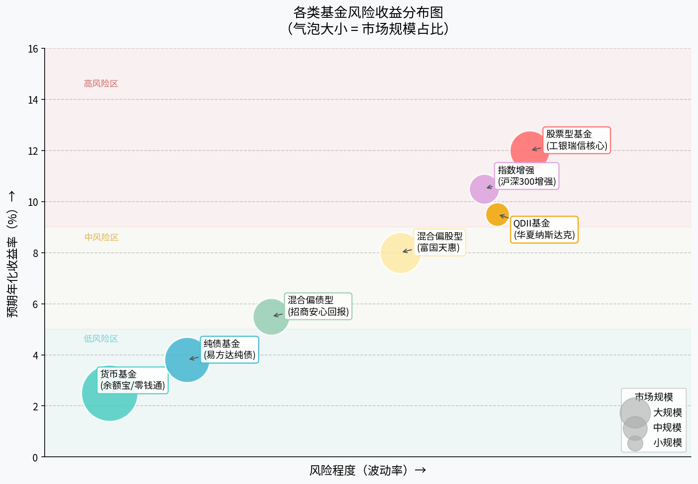
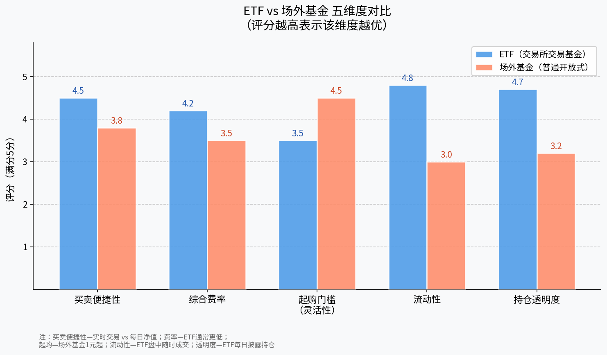
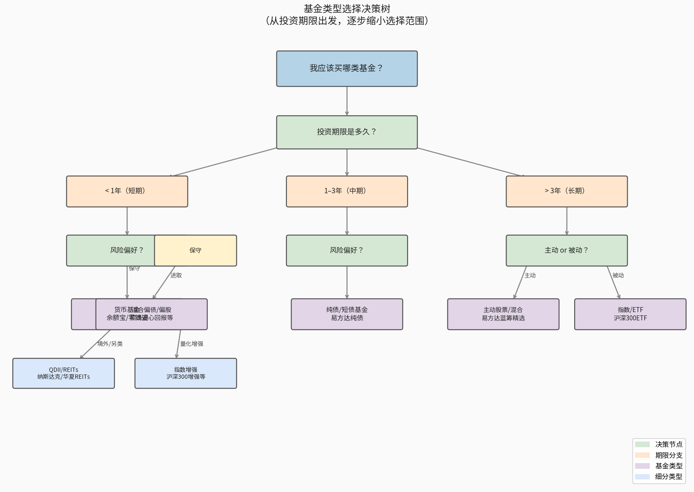

# 第四章：基金分类详解

> **学习目标**：掌握市场上主要基金类型的特征、风险收益特征及适用场景，能够根据自身情况选择合适的基金品类。

---

## 4.1 按投资标的分类

基金最核心的分类维度是"钱被投向了哪里"。不同的投资标的决定了基金的风险收益特征。

### 各类基金综合对比

| 基金类型 | 主要投资方向 | 风险等级 | 预期年化收益 | 典型代表 | 适合人群 |
|---------|------------|---------|------------|---------|---------|
| 货币基金 | 短期货币工具（国债回购、存单） | ★☆☆☆☆ | 1.5%–3% | 余额宝、微信零钱通 | 所有人，现金管理 |
| 纯债基金 | 国债、金融债、企业债 | ★★☆☆☆ | 3%–5% | 易方达纯债债券、南方纯债 | 保守型投资者 |
| 混合偏债型 | 债券为主（≥60%）+ 少量股票 | ★★★☆☆ | 4%–7% | 招商安心回报、中短债混合 | 稳健型投资者 |
| 混合偏股型 | 股票为主（≥60%）+ 债券 | ★★★★☆ | 6%–15% | 富国天惠、兴全合润 | 积极稳健型 |
| 股票型基金 | 股票（≥80%） | ★★★★★ | 8%–20% | 工银瑞信核心价值、易方达蓝筹 | 进取型投资者 |
| 指数基金 | 追踪特定指数成分股 | ★★★★☆ | 跟随指数 | 华泰柏瑞沪深300ETF | 长期价值投资者 |
| QDII基金 | 境外股票/债券/REITs | ★★★★☆ | 6%–15% | 华夏纳斯达克100、南方标普500 | 全球配置需求者 |
| REITs | 不动产、基础设施 | ★★★☆☆ | 4%–8% | 华夏高速公路REIT、中金普洛斯 | 追求稳定分红者 |



*图4-1：各类基金风险收益分布。气泡越大代表该类基金在公募市场中的规模占比越高，可以看出货币基金规模最大、风险最低，股票型/混合型风险与收益均较高。*

### 货币基金

货币基金是最安全的基金类型，主要投资于银行存单、短期国债、货币市场工具等，期限通常不超过一年。**典型代表：余额宝（天弘基金）、微信零钱通（华夏基金）**。

特点：
- 几乎不会亏损（历史上极少出现负收益）
- 流动性极高，T+1或T+0赎回
- 收益率随市场利率浮动，通常略高于银行活期存款

适用场景：日常现金管理、应急备用金存放。

### 债券基金

债券基金主要投资于债券市场，包括国债、地方政府债、金融债和企业债。根据债券类型不同，又分为纯债基金（不投股票）和一级债基（可少量打新股）。

**典型代表：易方达纯债债券、鹏华丰润纯债**。

注意：债券基金虽然风险低，但在利率上行周期（债券价格下跌）时也会出现短期亏损，需耐心持有。

### 混合型基金

混合型基金同时投资股票和债券，根据股票仓位高低又分为：
- **偏债混合**：股票仓位 < 40%，风险较低
- **偏股混合**：股票仓位 > 60%，潜在收益更高
- **灵活配置**：基金经理可根据市场动态自由调整仓位比例（0%–100%）

**典型代表：富国天惠（偏股混合）、兴全安泰（偏债混合）**。

### 股票型基金

股票型基金至少80%的资产必须投资于股票，是收益弹性最大、风险也最高的主动管理型基金。短期可能大幅波动（单年-30%至+80%皆有可能），但长期持有通常跑赢通胀。

**典型代表：易方达蓝筹精选、工银瑞信核心价值**。

### 指数基金与指数增强基金

指数基金被动追踪某一股票指数（如沪深300、中证500、纳斯达克100），费率低，不依赖基金经理的主观判断。**指数增强基金**则在追踪指数的基础上，通过量化模型争取超额收益（Alpha）。

**典型代表：华泰柏瑞沪深300ETF、景顺长城沪深300指数增强**。

### QDII基金

QDII（合格境内机构投资者）基金允许境内投资者通过基金公司在境外证券市场投资，是普通投资者参与全球资本市场的便捷渠道。

**典型代表：华夏纳斯达克100ETF（QDII）、南方标普500ETF（QDII）**。

注意：QDII基金受外汇额度限制，在额度紧张时可能出现溢价，需关注二级市场价格与净值的偏离。

### REITs（不动产投资信托基金）

REITs主要投资于基础设施和不动产，通过租金收益和资产增值为投资者提供稳定现金流。中国公募REITs于2021年上市，目前以高速公路、仓储物流、产业园区为主。

**典型代表：华夏高速公路REIT（CSOP）、中金普洛斯仓储物流REIT**。

---

## 4.2 按运作方式分类

### 开放式基金 vs 封闭式基金

| 维度 | 开放式基金 | 封闭式基金 |
|-----|---------|---------|
| 份额 | 随申赎动态变化 | 固定不变 |
| 买卖方式 | 按每日净值申购/赎回 | 在交易所按市价买卖 |
| 流动性 | 一般（T+1至T+3到账） | 高（盘中随时成交） |
| 价格 | 等于净值（NAV） | 可能折价或溢价 |
| 典型品种 | 普通股票/债券基金 | 传统封闭基金、REITs |

绝大多数公募基金是**开放式基金**，投资者可以随时申购和赎回。

### ETF（交易型开放式指数基金）

ETF兼具开放式基金（可申赎）和封闭式基金（可场内交易）的双重特性，是目前最受欢迎的被动投资工具之一。

**ETF的核心优势**：
1. 费率低：管理费通常0.10%–0.50%/年，远低于主动基金
2. 实时交易：像股票一样在交易所盘中买卖，价格透明
3. 持仓透明：每日公布组合持仓，无"黑箱操作"之虑
4. 税收效率：申赎机制使ETF内部较少触发资本利得税

**典型代表**：华泰柏瑞沪深300ETF（510300）、易方达创业板ETF（159915）

### LOF（上市开放式基金）

LOF同样在交易所上市，但它并非追踪指数，可以是主动管理基金。投资者既可在场外按净值申赎，也可在场内按市价交易，两个渠道之间存在套利机会。

**典型代表**：兴全合润LOF（163406）、景顺长城鼎益LOF（162605）

### ETF vs 场外基金详细对比



*图4-2：五维度评分对比。ETF在费率、流动性、透明度方面领先；场外普通基金在起购门槛和买卖便捷性方面更友好（支持1元起购、手机App操作无需开通股票账户）。*

**如何选择**：
- 没有股票账户，金额较小（< 1000元）→ 优先选场外基金
- 已有券商账户，追踪主流指数 → 优先选ETF
- 希望投资主动管理基金又能灵活交易 → 考虑LOF

---

## 4.3 主动基金 vs 被动基金

这是近年来基金投资领域最热门的争论之一，两种策略各有拥趸。

### 核心区别

| 对比维度 | 主动基金 | 被动基金（指数/ETF） |
|---------|--------|----------------|
| 目标 | 跑赢基准指数（超额收益） | 复制指数表现（跟踪误差最小化） |
| 核心依赖 | 基金经理的选股/择时能力 | 规则化投资流程 |
| 管理费 | 1.0%–1.5%/年（高） | 0.1%–0.5%/年（低） |
| 风险来源 | 市场风险 + 基金经理风险 | 主要是市场风险 |
| 长期表现 | 约30%的主动基金能长期跑赢指数 | 随指数起伏，无法超越 |
| 适合场景 | A股等效率相对较低的市场 | 成熟市场、长期定投 |

### 主动基金的优势与局限

**优势**：优秀的基金经理（如张坤、朱少醒）能在特定市场环境下取得显著超额收益。在A股这一散户主导、信息效率相对较低的市场，主动管理仍有价值。

**局限**：
1. 难以持续——过去5年最好的基金，未来5年往往不再是最好的
2. 费率高——即使净值持平，每年1.5%的管理费也在持续消耗本金
3. "基金经理风险"——明星基金经理离职，可能引发大额赎回和业绩下滑

### 被动基金的优势与局限

**优势**：
1. 费率极低，长期持有"省"出来的费差本身就是收益
2. 分散化彻底——沪深300ETF持有300只股票，单只股票黑天鹅影响有限
3. 操作简单——不需要研究个股，"买市场"即可

**局限**：
1. 永远无法跑赢指数（扣除费率后还略低于指数）
2. 在熊市中，指数跌多少就亏多少，没有防御性
3. 若指数成分股质量较差（如某些行业指数），被动跟踪也意味着被动受损

### 实践建议

对于大多数普通投资者，**"核心+卫星"策略**是一个较为均衡的选择：
- **核心仓（60%–70%）**：宽基指数ETF（沪深300/中证500/纳斯达克100），低费率长期持有
- **卫星仓（30%–40%）**：精选2–3只有长期优秀记录的主动基金，争取超额收益

---

## 4.4 本章小结：基金类型决策树

在了解了各类基金之后，面对"我该买哪种基金"这个问题，可以按照以下决策路径逐步缩小选择范围。

### 文字版决策树

```
我应该买哪类基金？
│
├─ 投资期限 < 1年（短期）
│   └─ ✅ 货币基金 / 短债基金（余额宝、微信零钱通）
│
├─ 投资期限 1–3年（中期）
│   ├─ 风险偏好：保守
│   │   └─ ✅ 纯债基金 / 短债基金（易方达纯债）
│   └─ 风险偏好：进取
│       ├─ 境内市场
│       │   └─ ✅ 混合偏债 / 混合偏股（招商安心回报）
│       └─ 境外市场
│           └─ ✅ QDII基金（南方标普500）
│
└─ 投资期限 > 3年（长期）
    ├─ 偏好被动投资（省心、低费率）
    │   ├─ 宽基指数 → ✅ ETF（沪深300/中证500/纳斯达克100 ETF）
    │   └─ 量化增强 → ✅ 指数增强基金
    ├─ 偏好主动管理（相信基金经理）
    │   └─ ✅ 主动股票/混合基金（易方达蓝筹精选）
    └─ 追求稳定分红
        └─ ✅ REITs（华夏高速公路REIT）
```

### 图示决策树



*图4-3：基金类型选择决策树。从投资期限出发，经过风险偏好和主动/被动偏好两个节点，最终定位到适合的基金类型。*

### 本章核心要点回顾

- [ ] 基金按投资标的分为货基、债基、混合、股票、指数、QDII、REITs，风险从左到右依次升高
- [ ] ETF是指数基金的一种，可以在交易所实时买卖，费率低、透明度高
- [ ] 主动基金依赖基金经理能力，被动基金复制指数，各有适用场景
- [ ] 选基金第一步：确定投资期限；第二步：明确风险承受能力；第三步：再选具体品类
- [ ] "核心（指数）+ 卫星（主动）"组合策略适合大多数普通投资者

---

> **下一章预告**：第五章将深入讲解如何挑选具体基金——从基金规模、基金经理从业年限、最大回撤、夏普比率等量化指标出发，手把手教你在数千只基金中筛选出值得长期持有的产品。

---

*← [第三章：基金基础概念](chapter3.md) | → [第五章：指数基金深度解析](chapter5.md)*
