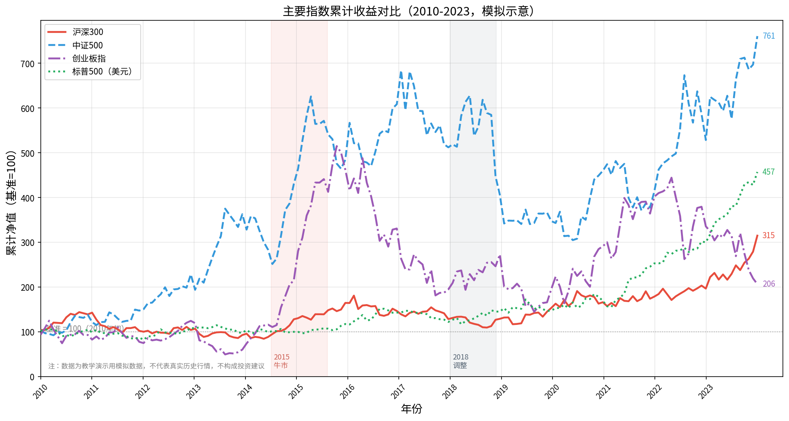
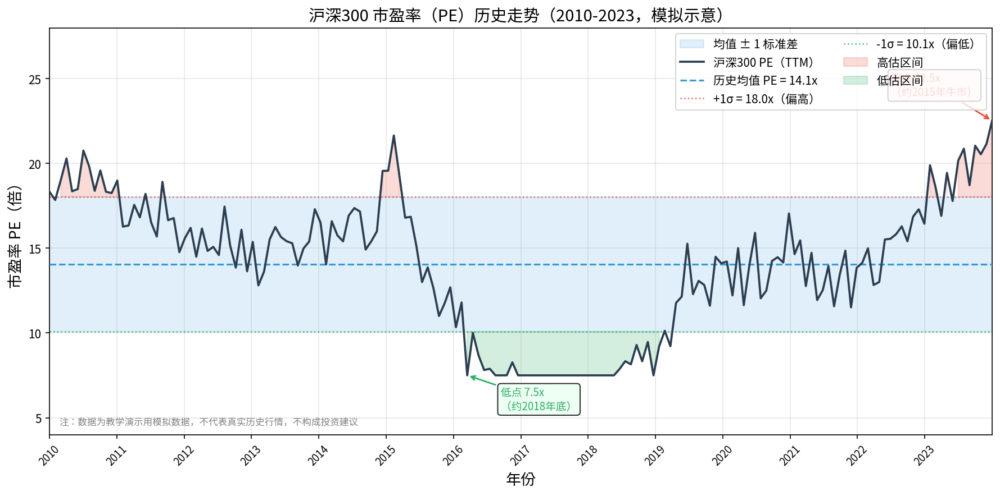
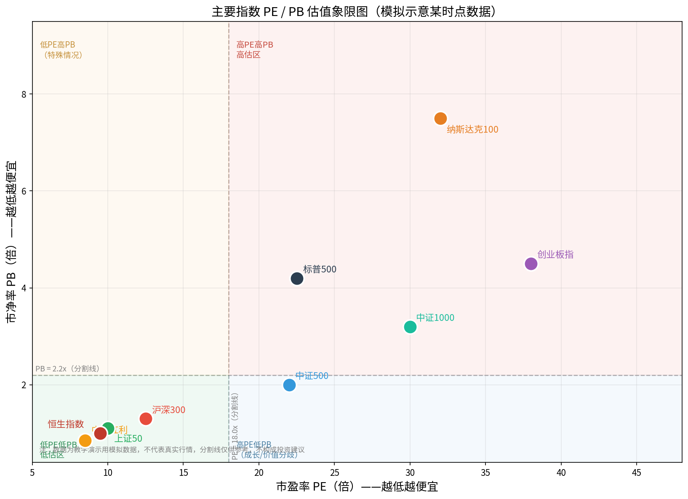
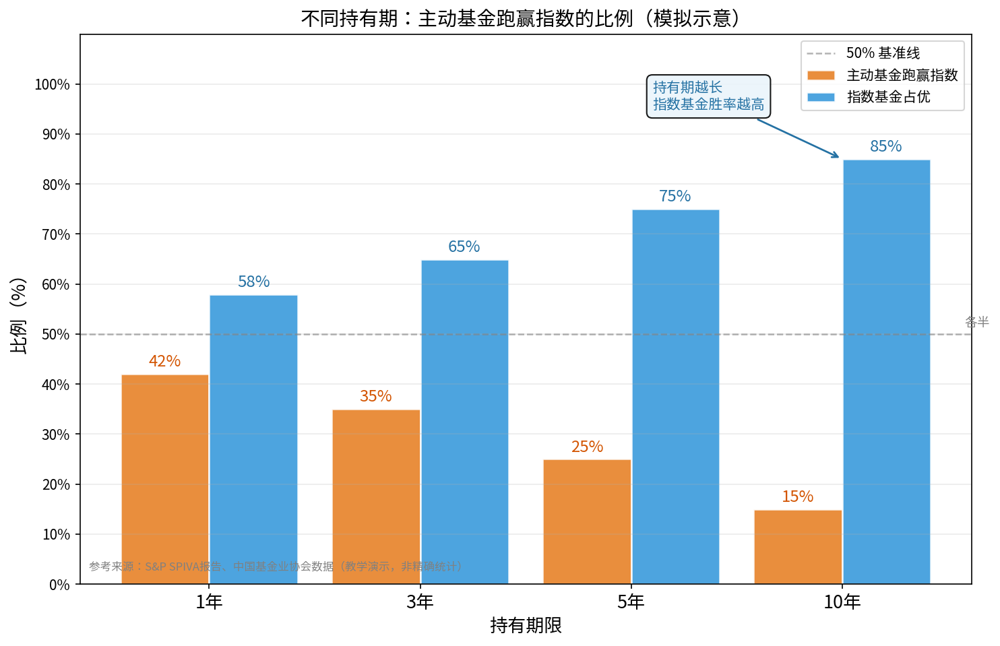

# 第五章：指数基金深度解析

> **本章导读**
>
> 如果说前几章帮你搞清楚了"基金是什么"，那么这一章要解决的问题是：**在众多基金里，为什么指数基金值得被单独拿出来深度研究？** 答案是：指数基金是普通投资者最容易理解、成本最低、长期表现最可预期的工具之一。本章将从底层逻辑讲起，带你彻底读懂指数基金。

---

## 5.1 指数基金的本质：复制指数的成分股

### 什么是指数？

先从"指数"说起。你一定听说过"沪深300今天涨了1%"——这句话里的沪深300，就是一个**指数**。指数本质上是一份"成分股名单 + 每只股票的权重"，再加一套计算规则，把这些股票的整体表现汇总成一个数字。

比如沪深300，是从沪深两市中挑选出市值最大、流动性最好的300家公司，按照市值大小分配权重，把它们的价格涨跌加权平均，形成一个指数值。这个数字每天实时变动，反映的是"中国最大的300家上市公司整体表现怎么样"。

### 指数基金做什么？

指数基金的任务只有一个：**原原本本地复制这份名单**。基金经理按照指数的成分股和权重，买入完全相同的股票组合，不做任何主观选股判断。你持有的指数基金，等于间接持有了这300家公司的一小份股权。

这带来了几个根本性优势：

**1. 透明可预测。** 指数成分股是公开的，任何人都可以查。你买的是什么，一目了然。而主动基金的持仓往往季报才披露，存在明显的信息滞后。

**2. 成本极低。** 指数基金不需要庞大的研究团队去选股，也不需要频繁换仓，因此管理费极低。主动基金管理费一般在1%~1.5%/年，而指数基金的ETF形式管理费只有0.1%~0.5%/年。看上去差距不大，但复利效应下，30年累积下来的成本差异足以吞噬大量收益。

**3. 分散风险。** 一只指数基金往往覆盖几十到几百家公司，单只股票暴雷对组合的影响被极大稀释。2021年某教育龙头股一夜跌去80%，但持有沪深300的投资者同期几乎感知不到。

**4. 永不退市，自动更新。** 指数有定期调整机制，业绩变差、市值萎缩的公司会被剔除，成长起来的新龙头会被纳入。投资者不需要主动"换股"，指数自动完成新陈代谢。

**简单类比：** 买主动基金，你是在雇一个厨师替你挑食材、掌勺烹饪；买指数基金，你是直接买了"整个农贸市场的一小份股权"——不管哪个摊位生意好，你都受益。

---

## 5.2 宽基指数 vs 行业指数

市场上的指数琳琅满目，大体可以分为两类：**宽基指数**和**行业指数**。

### 宽基指数：代表市场整体

宽基指数覆盖范围广，是某个市场或某个层次股票的整体代表。

| 指数 | 覆盖范围 | 特点 |
|------|----------|------|
| **沪深300** | 沪深两市市值最大的300家公司 | 大盘蓝筹，金融地产权重高，波动相对较小 |
| **中证500** | 沪深两市市值排名301~800的公司 | 中盘成长，行业更分散，弹性强于沪深300 |
| **创业板指** | 创业板市值最大的100家公司 | 成长型科技股为主，波动大、潜力大 |
| **纳斯达克100** | 美国纳斯达克市场前100大非金融公司 | 科技巨头集中（苹果/微软/英伟达），全球科技风向标 |
| **标普500** | 美国规模最大的500家上市公司 | 全球最成熟的股票市场基准，长期年化约10% |

这几个宽基指数的历史累计收益对比，见下图——可以明显看到：波动越大的指数（如创业板指），长期累计弹性越大，但期间的回撤也更惨烈。

**选哪个宽基？** 对初学者而言，沪深300和标普500是最经典的起点。前者代表中国经济最优质的资产，后者代表全球最成熟的股票市场。两者搭配，兼顾了国内与全球配置。

### 行业指数：精准押注某个赛道

行业指数只覆盖某个特定行业，比如中证医疗指数、中证白酒指数、新能源车指数等。

行业指数的优势在于，如果你判断某个行业未来几年景气度高，可以通过行业指数集中受益。但缺点同样明显：行业轮动快，散户往往追高进入、低点离场，实际体验远不如直接买宽基。行业指数更适合**有一定行业研究能力、愿意长期跟踪**的进阶投资者。

**新手建议：** 先从宽基指数入手，等真正理解了某个行业逻辑后，再考虑行业指数。

---

## 5.3 ETF vs 场外指数基金

同样是指数基金，购买方式却有两种截然不同的通道：**ETF（交易型开放式指数基金）** 和 **场外指数基金**。

### ETF：像股票一样交易

ETF在交易所挂牌，你可以在股票账户里像买卖股票一样买卖ETF，交易价格实时变动，全天可以随时成交。

- **优点：** 流动性好、费用低（管理费+托管费合计往往仅0.2%~0.6%/年）、可以精确控制买入价格、支持融资融券做空
- **缺点：** 需要开通股票账户（开户成本低，但对纯基金账户用户略显麻烦）；通常不支持定投（需要手动操作）；最低买入单位通常为100份

### 场外指数基金：适合自动定投

场外指数基金在天天基金、支付宝、招商银行APP等平台购买，按照每天收盘后的净值成交，次日才能知道买入价格。

- **优点：** 支持定投（设好金额和日期，自动扣款）；1元起买；不需要股票账户；入门更友好
- **缺点：** 管理费略高于ETF；不能实时买卖；申购赎回有手续费

### 如何选择？

| 场景 | 推荐选择 |
|------|----------|
| 纯小白，想设好定投懒人理财 | 场外指数基金（如沪深300指数基金） |
| 有股票账户，想精确控制买入时机 | ETF（如510300.SH 华泰柏瑞沪深300ETF） |
| 想做行业轮动、短期交易 | ETF |
| 长期持有，忽略短期波动 | 二者皆可，优先选费率最低的 |

---

## 5.4 指数估值：PE、PB是什么，怎么判断高低

"便宜时买，贵的时候少买"——这是指数定投的核心思想。但如何判断指数"贵"还是"便宜"？答案是PE和PB这两个估值指标。

### PE（市盈率）：多少年回本

**PE（Price to Earnings Ratio，市盈率）= 股价 / 每股盈利 = 总市值 / 年净利润**

最直观的理解方式是：**把整个指数当作一家公司，你以现在的价格买入，按照当前的盈利水平，需要多少年才能回本。**

举例：沪深300当前PE是12倍，意味着按现在的利润水平，12年能够回本。PE越低，意味着你花同样的钱能买到更多盈利，更"划算"。

- PE=8x：历史罕见低点，市场极度悲观，可能是极好的买入时机
- PE=13x：历史中位数附近，合理偏低
- PE=20x：偏高，市场情绪较热
- PE=30x+：高估区，市场狂热，需谨慎

当然，PE不是越低越好——如果一个行业的盈利在持续萎缩，低PE只是"陷阱价值"。因此PE要结合行业特性和盈利趋势来看。

### PB（市净率）：账面资产几折出售

**PB（Price to Book Ratio，市净率）= 股价 / 每股净资产 = 总市值 / 净资产**

如果说PE反映的是"盈利能力的价格"，PB反映的是"账面资产的价格"。

类比：假设一家公司账面有100块钱的净资产（厂房、设备、现金等），现在只要80块就能买到，PB就是0.8，意味着你以八折价买入了这家公司的全部资产。PB<1在历史上是强烈的低估信号（银行、地产等重资产行业例外）。

### 历史PE走势与均值回归

下图展示了沪深300的历史PE走势（模拟示意），可以看出几个重要规律：

1. **PE在历史区间内反复震荡**，不会永远高企，也不会永远低迷——这就是"均值回归"。
2. **标注的均值线和±1标准差区间**，可以作为判断高低估的参考框架：PE进入-1σ以下时，历史上往往是绝佳买入区；进入+1σ以上时，应减少投入甚至考虑减仓。

### 什么是均值回归？

**均值回归（Mean Reversion）** 是金融市场中最重要的规律之一：过度偏离历史均值的极端状态，往往会在未来某个时刻回归正常水平。

具体表现：
- 当市场极度悲观（PE极低）时，股价被严重压低，这时买入的"安全边际"更大，未来向上修复的概率更高
- 当市场极度乐观（PE极高）时，股价透支了未来预期，后续可能面临较长时间的震荡调整

均值回归**不是说PE一定会立刻回到均值**，它可能在高位停留很长时间；但放到足够长的时间维度（3~5年以上），均值回归的力量非常可靠。这也是为什么估值定投的逻辑在长期有效——你在便宜时买入，等待市场情绪从悲观回归理性。

### PE/PB估值象限

下图将主要指数按照PE（x轴）和PB（y轴）放置在一张象限图上，帮助直观比较各指数估值水平：

- **左下角（低PE、低PB）**：低估区，历史上胜率较高的入场区域（如上证50、恒生指数、中证红利）
- **右上角（高PE、高PB）**：高估区，需谨慎（如创业板指）
- **右下角（高PE、低PB）**：往往是成长型行业或价值陷阱，需要分辨
- **左上角（低PE、高PB）**：较少见，通常出现在轻资产但高溢价行业

---

## 5.5 指数基金的历史回测数据解读

历史数据虽然不代表未来，但它是我们评估一个投资策略是否"逻辑自洽"的最重要依据。理解历史回测，需要关注以下几个维度：

### 如何读懂累计净值曲线

累计净值曲线（上涨的那根线）直观地展示了"100元投进去，过了N年变成多少"。但新手常犯的错误是**只看终点，不看过程**——一条在10年后涨到500元的曲线，中间可能经历了多次腰斩，你是否有信心和资金坚持拿到最后？

关键指标要一起看：
- **年化收益率（CAGR）**：把总收益折算成每年平均几何增速，用来跨产品比较
- **最大回撤（Max Drawdown）**：从某个高点到后来最低点下跌的幅度。这是衡量你"心理承受能力"最现实的指标。沪深300历史最大回撤超过70%（2007年底高点到2008年底低点），你当时还能持有吗？
- **夏普比率（Sharpe Ratio）**：衡量单位风险所获得的超额收益。值越高，说明"冒同样的险，赚了更多"
- **回撤后恢复时间**：回撤越深，恢复时间往往越长。2015年牛市后的沪深300，等到完全回本用了将近7年

### 定投 vs 一次性投入：哪个更好？

历史回测显示，定投的本质是在不同时间点以不同价格摊平成本，在震荡市中尤为有效。但在**单边上涨**的牛市中，一次性投入反而收益更好。因此，定投更适合以下情形：

1. 你手里没有大笔一次性资金，每月积累工资定投
2. 你判断不了市场高低点，依靠纪律性摊平成本
3. 你的投资期超过5年，目标是穿越周期

**结论：对于普通投资者，结合PE估值的定投策略（PE越低投越多、PE越高投越少）在历史回测中表现优于固定金额定投。**

---

## 5.6 为什么大多数主动基金长期跑不赢指数

这是一个让很多人难以接受、但数据一再证明的事实：**持有期越长，主动基金跑赢指数的比例越低。**

下图展示了不同持有期下，主动基金跑赢指数的概率：

可以看到：
- 持有1年：约42%的主动基金跑赢指数，看似还好
- 持有3年：降到约35%
- 持有5年：降到约25%
- 持有10年：仅约15%的主动基金能持续跑赢

### 原因一：费用的复利侵蚀

主动基金管理费1.5%/年，指数ETF 0.15%/年，差距是每年1.35个百分点。看起来不大，但按复利计算：

- 10万元，年化收益10%（主动）vs 11.35%（指数等效）
- 10年后：主动基金约25.9万，指数约29.3万
- **10年的费用差距，吃掉了3.4万，接近本金的34%**

基金经理必须每年多赚1.35%以上，才能在扣费后与指数持平。这条线在短期可以逾越，但长期极难维持。

### 原因二：市场是有效的（大多数情况下）

经济学中的"有效市场假说"认为，公开信息已经充分反映在股价中。基金经理掌握的大多数信息（宏观数据、财报、产业调研等）在专业机构圈子里已经被充分消化，靠公开信息博弈的超额收益空间越来越窄。

市场参与者越来越专业化（量化基金、AI策略、顶尖分析师云集），"从散户那里赚钱"的机会少了，主动基金之间的博弈加剧，整体超额越来越难。

### 原因三：规模诅咒

一只主动基金规模小时，基金经理可以灵活买卖中小盘股、快速调仓；但当规模扩大到几十亿乃至数百亿后，买卖本身就会影响股价，灵活性大幅下降，只能配置大盘股，与指数趋同的同时还要多付管理费。这就是"规模诅咒"。

### 原因四：人性的弱点

主动基金经理也是人，也会受到业绩压力、行业风口、同行比较等影响，在高点追热点、在低点砍仓的现象并不罕见。这导致基金经理"自我伤害"，即便选股能力强，也可能被错误的操作时机抵消。

### 当然，主动基金并非毫无价值

少数真正优秀的主动基金经理，在漫长的时间里确实能持续跑赢指数——但问题是，**事前无法可靠判断谁是那少数人**。过去的业绩并不能持续预测未来，明星基金经理"翻车"的案例比比皆是。

对大多数普通投资者来说，与其花大量时间和精力去筛选主动基金，不如把精力放在**资产配置、仓位管理、坚守纪律**上，这些才是真正可控的胜负手。

---

## 5.7 本章小结

本章从底层逻辑出发，系统解析了指数基金的方方面面。以下是核心要点回顾：

### 核心知识点

| 概念 | 一句话总结 |
|------|------------|
| 指数基金本质 | 复制指数成分股，机械跟踪，不做主观选股 |
| 宽基 vs 行业指数 | 新手选宽基（沪深300/标普500），进阶再考虑行业指数 |
| ETF vs 场外 | 想定投用场外，想灵活买卖用ETF |
| PE | 多少年回本；越低越便宜 |
| PB | 几折买入账面资产；越低越安全 |
| 均值回归 | 极端低估终将修复，极端高估终将回调 |
| 主动基金困境 | 费用、规模、人性三重压力，长期跑赢指数极难 |

### 简单估值定投策略框架

基于PE的分级定投，是最简单可行的执行框架：

| PE区间（以沪深300为例） | 操作策略 |
|-------------------------|----------|
| PE < -1σ（历史低估区） | 每月投**2倍**正常定投金额 |
| -1σ ≤ PE < 均值 | 每月投**1.5倍**正常定投金额 |
| 均值 ≤ PE < +1σ | 每月投**1倍**正常定投金额 |
| PE ≥ +1σ（历史高估区） | 每月投**0.5倍**正常定投金额，或暂停 |

**操作要点：**
1. 选定宽基指数（沪深300 / 中证500 / 标普500）
2. 在可信数据源（如中证指数官网、集思录、且慢）查询当前PE/PB历史分位数
3. 按照上表调整每月定投金额
4. 设定目标收益（如30%~50%）和止盈规则，达到目标时分批兑现
5. 止盈后不是"把钱放银行"，而是等待下一个低估区间重新入场

### 下章预告

第六章将进入**混合基金与主动股票型基金**的世界——虽然大多数主动基金长期跑不赢指数，但依然有方法筛选出那少数值得持有的基金，帮你构建更完整的投资组合。

---

> **免责声明：** 本章所有历史数据均为教学演示用模拟数据，不代表真实行情，不构成任何投资建议。投资有风险，入市需谨慎。

---

*← [第四章：基金分类详解](chapter4.md) | → [第六章：主动基金选择方法论](chapter6.md)*
