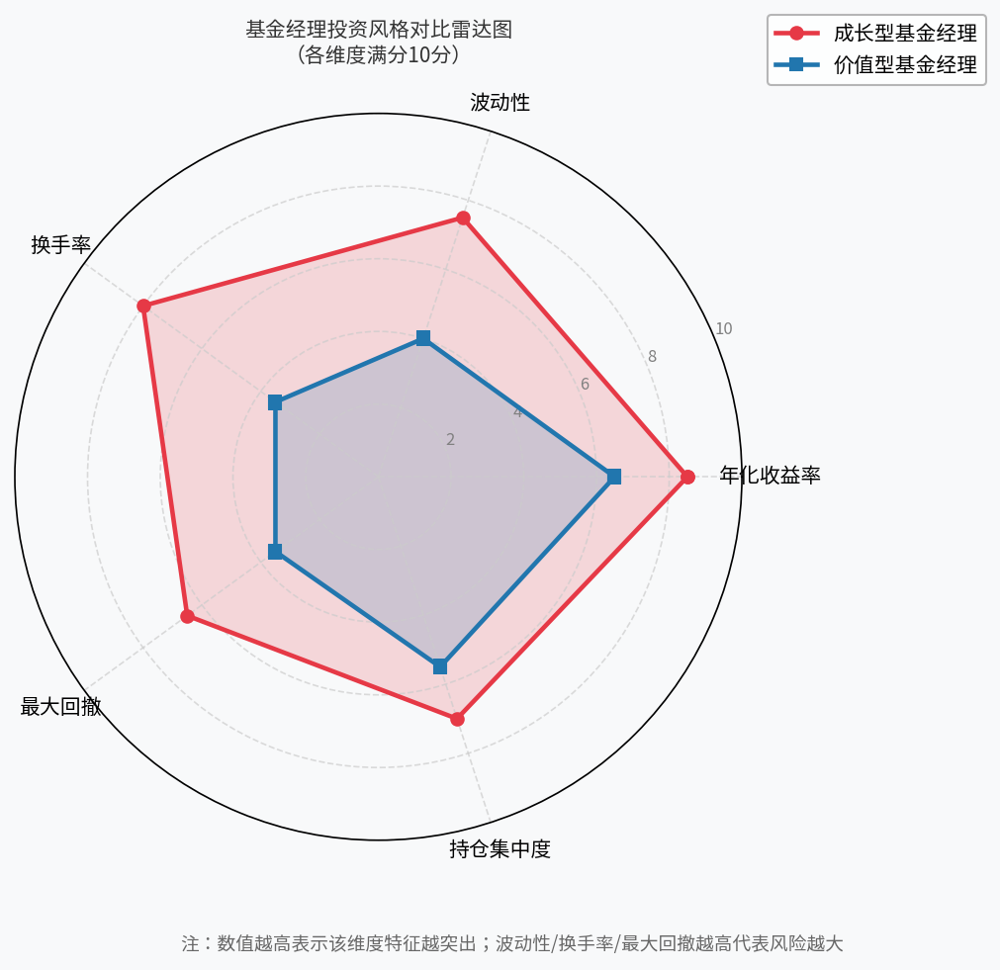
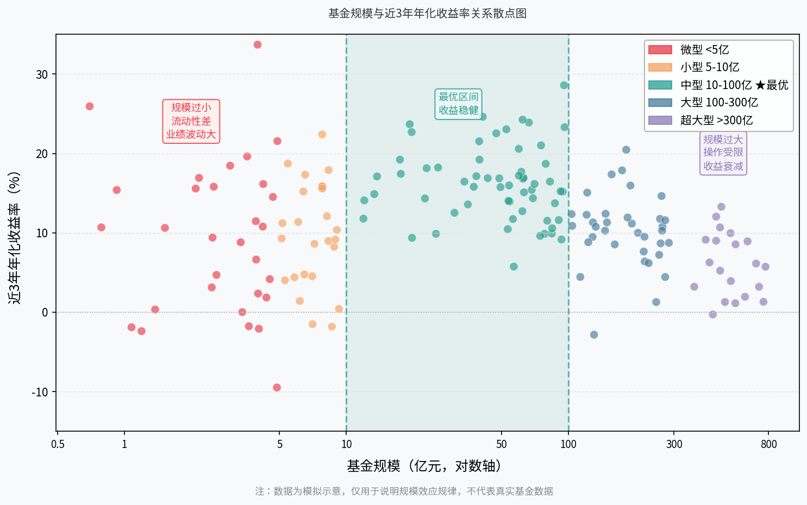
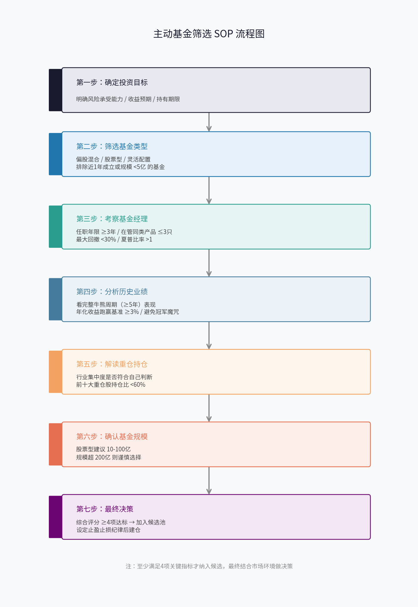

# 第六章：主动基金选择方法论

> 在上一章我们了解了被动指数基金的逻辑，本章回到主动基金的世界。主动基金的核心价值主张是：由专业基金经理主动择股，争取超越市场平均水平的回报。但现实是，大多数主动基金长期跑不赢指数。那么，如何在茫茫基金海洋中找到那少数真正优秀的主动基金？本章给你一套系统的筛选方法论。

---

## 6.1 基金经理：最核心的变量

主动基金与被动基金的本质区别在于"人"。选主动基金，首先是选人。基金经理的能力、风格与稳定性，是决定一只主动基金长期表现的最核心变量。

**投资风格**

基金经理大致分为两大流派：成长型与价值型。成长型经理偏好挖掘高增速赛道，如消费、医药、科技板块的高估值标的，追求进攻性，业绩弹性大，牛市爆发力强，但回撤往往较深；价值型经理更注重低估值、高分红、现金流稳健的公司，防御性更强，熊市表现相对抗跌，但在风格切换的市场中可能跑输。

认清自己偏好哪种风格再对号入座，避免"牛市追成长、熊市后悔买了高风险基金"的循环。

**换手率**

换手率反映基金经理的操作频率。年换手率 200%-300% 属于正常范围。换手率长期超过 500% 的基金，要警惕是否存在过度交易。频繁交易不仅产生更高的摩擦成本（交易佣金、冲击成本），还说明经理可能缺乏长期持仓的信念，业绩可重复性存疑。换手率过低（低于50%）则可能说明持仓偏"僵化"，缺乏动态调整能力。

**回撤控制**

最大回撤是衡量极端下行风险的核心指标。筛选标准建议：**最大回撤不超过 30%**（针对偏股混合型）。若一位基金经理管理的产品历史上曾出现 50% 以上的回撤，普通投资者往往无法承受这种心理压力，容易在最低点割肉离场，导致实际持有体验极差。

**任职年限**

任职年限越长，可参考的历史数据越可靠。建议筛选**任职年限 ≥ 3年**，最好见过完整牛熊周期（≥ 5年）。刚接手产品不足 2年 的"新秀"，历史业绩参考价值有限，无法评估其应对市场剧烈波动的能力。

另外，关注基金经理是否"一拖多"——在管基金只数超过 5 只，往往意味着精力分散，不建议选择。

*图6-1：成长型与价值型基金经理在收益率、波动性、换手率、最大回撤、持仓集中度五个维度的对比*

---

## 6.2 基金历史业绩怎么看：陷阱与真相

历史业绩是最直观的筛选维度，但也是陷阱最多的地方。

**陷阱一：冠军魔咒**

每年的年度冠军基金，次年继续排名前10% 的概率不足 20%。原因在于，短期业绩冠军往往是押注了某一特定主题或赛道（如2021年新能源），一旦风格切换，暴涨之后接踵而来的是暴跌。追买年度冠军是普通投资者最常见、也最昂贵的错误之一。

**正确的业绩观察维度**

1. **时间跨度要够长**：至少覆盖一个完整牛熊周期（5年以上），单看近 1-2 年意义很小。
2. **跑赢基准才算真本领**：要求年化收益率长期跑赢比较基准**不少于 3%**。若一只基金长期只是"随大盘涨跌"，不如直接买对应指数，还省下管理费。
3. **看排名稳定性，不只看绝对值**：连续 3年 保持同类前 1/3，比某年排名第1但另外两年排名后50%更值得信赖。
4. **看逆市表现**：重点考察熊市年度（如 2018、2022 年）的回撤控制，能守住资产的经理，才是真正靠谱的。

**夏普比率**

夏普比率衡量的是"每承担一单位风险获得的超额收益"。一般认为，**夏普比率 > 1** 的主动基金在同类中属于较优秀水平，可作为筛选参考。

---

## 6.3 基金评级：晨星/天天基金星级能信吗

市面上常见的基金评级体系有晨星（Morningstar）五星评级和天天基金的星级评分。很多普通投资者把"五星基金"当作选基的主要依据，但这一做法存在明显局限。

**评级的本质**

晨星评级本质上是过去业绩的量化打分，使用经风险调整后的历史收益（风险调整后收益）在同类基金中做相对排名。五星仅代表**过去3-5年**在同类中排名靠前，**不预测未来**。

**评级的滞后性**

评级会随最新业绩不断调整，往往"高位追入、低位出局"——当一只基金已经历2年大涨并评级提升为五星时，也可能正好是下跌周期的起点。

**正确使用评级的方式**

- 把评级作为**初步筛选的负向过滤器**：直接剔除1-2星的长期落后基金。
- **不要把五星当买入信号**，而要结合基金经理分析、持仓分析等定性维度综合判断。
- 关注评级的稳定性：一只基金在3年内评级始终维持在4-5星，比频繁大幅波动更值得关注。

---

## 6.4 重仓股分析：持仓是否符合你的判断

主动基金的季度报告中会公布前十大重仓股，这是理解基金经理真实投资逻辑最直接的窗口。

**看行业集中度**

若一只基金前十大重仓股有 7 只都在同一行业（如新能源或银行），说明其实际上是一只行业主题基金，而非分散配置的主动基金。这并非不好，但需要你对该行业有判断。**建议：前十大重仓占比不超过总仓位的 60%**，避免单一行业压注。

**看仓位是否"说到做到"**

基金经理在路演、访谈中声称看好某些板块，而持仓中却没有体现，说明"言行不一"，对其投资逻辑需要打个问号。

**观察持仓变化趋势**

对比相邻两期季报（每3个月一次），可以看出基金经理正在增持/减持哪些方向，这是理解其市场判断的重要线索。大幅加仓某板块往往意味着他对该板块未来更有信心；大幅减仓则值得追问原因。

**注意"报告期失真"**

季报只是每季末时点的快照，存在"临时调仓应付报告期"的可能（市场俗称"抢帽子"）。因此建议同时参考持仓稳定性：如果每期重仓股大量更换，换手率也高，说明经理操作频繁，持仓分析参考价值有限。

---

## 6.5 基金规模：太大和太小都有问题

基金规模是一个容易被忽视却非常重要的维度。

**规模过小的风险**

基金规模低于 **5亿元**，面临以下问题：
- 流动性风险：持有的部分小市值股票，卖出时对股价冲击较大；
- 清盘风险：若规模持续低于 5000万元，基金可能触发清盘条款；
- 运营成本分摊：固定运营成本被更少份额分担，实际管理费效率低下。

**规模过大的风险**

规模超过 **200亿元**以上的主动股票基金，往往面临：
- 能力边界问题：要管理 200 亿的资金，必须持有更多标的，无法集中持仓，选股优势被稀释；
- 市场冲击：买卖大量股票时，进出成本高，难以灵活操作；
- 实证数据显示，大量曾经的明星基金规模急速扩大后，业绩均值回归甚至不及指数。

**最优规模区间：10-100亿元**

针对偏股混合型主动基金，**10-100亿元**是兼顾规模效应与操作灵活性的"甜蜜区间"。这一区间的基金既有足够的规模保障运营稳定，又不会大到无法集中持仓，基金经理的选股能力可以充分体现。

*图6-2：基金规模（对数轴）与近3年年化收益率散点图，10-100亿为最优区间（模拟示意数据）*

---

## 6.6 选基金的核心维度清单

以上各节的筛选标准综合如下，形成可操作的量化维度清单：

| 维度 | 筛选标准 | 说明 |
|------|---------|------|
| 基金经理任职年限 | ≥ 3年，最好 ≥ 5年 | 见过完整牛熊周期 |
| 在管基金只数 | ≤ 3只（同类产品） | 避免精力分散 |
| 最大回撤 | ≤ 30%（偏股混合型） | 控制极端风险 |
| 年化收益跑赢基准 | ≥ 3%（5年均值） | 真正体现超额能力 |
| 夏普比率 | ≥ 1 | 风险调整后收益 |
| 年换手率 | 200%-500% 为宜 | 过高则警惕频繁交易 |
| 基金评级 | 晨星/天天 ≥ 3星 | 仅作负向过滤，非买入信号 |
| 前十大重仓集中度 | ≤ 60% | 避免单行业押注 |
| 基金规模 | 10-100亿元 | 偏股混合型最优区间 |
| 成立年限 | ≥ 3年 | 避免新成立无历史数据基金 |

---

## 6.7 本章小结：主动基金筛选 SOP

主动基金的选择是一个综合定量与定性分析的过程，没有"一键选基"的捷径。以下流程图展示了标准化的筛选步骤：

*图6-3：主动基金筛选SOP流程图，从确定目标到最终决策共7步*

**本章要点回顾：**

1. **选主动基金首选人**：基金经理的风格、任职年限和回撤控制是首要考察维度；
2. **历史业绩要看穿牛熊**：避免追买年度冠军，关注长期排名稳定性和跑赢基准幅度；
3. **评级是工具不是答案**：用评级做负向过滤，不要只买五星基金；
4. **读懂重仓持仓**：持仓是否与经理的投资逻辑一致，是判断真实能力的关键；
5. **规模要适中**：偏股混合型基金 10-100 亿为最优区间；
6. **系统化筛选**：用以下清单逐项核查，减少感性判断。

---

## 主动基金筛选清单（Markdown Checklist）

在考虑购买一只主动基金前，请逐项勾选以下条目：

### 基础筛查

- [ ] 基金成立年限 ≥ 3年（有足够历史数据可参考）
- [ ] 基金规模在 10-100 亿元范围内（偏股混合型）
- [ ] 近3年规模无异常大幅缩水（未出现大量赎回）

### 基金经理考察

- [ ] 当前基金经理任职本产品 ≥ 3年（非新接手）
- [ ] 基金经理在管同类产品 ≤ 3只（精力集中）
- [ ] 历史最大回撤 ≤ 30%（偏股混合型基准）
- [ ] 见过完整牛熊周期（经历过 2018 或 2022 年等熊市）

### 业绩分析

- [ ] 近5年年化收益跑赢比较基准 ≥ 3%
- [ ] 近3年同类基金排名持续在前 1/3
- [ ] 夏普比率 ≥ 1
- [ ] 熊市年（2018/2022）回撤优于同类平均

### 评级与口碑

- [ ] 晨星或天天基金评级 ≥ 3星
- [ ] 非年度冠军追捧热点，近6个月无异常大规模资金涌入

### 持仓分析

- [ ] 前十大重仓股持仓比例 ≤ 60%
- [ ] 重仓行业分布符合自己对市场的判断
- [ ] 持仓风格（成长/价值）与自身风险偏好一致
- [ ] 连续两期季报持仓不存在大量翻新（换手率正常）

### 投资纪律

- [ ] 已设定合理的持有周期（建议 ≥ 3年）
- [ ] 已设定止盈目标（如累计盈利 30-50% 分批赎回）
- [ ] 不把全部资金集中在同一只主动基金
- [ ] 了解该基金的费率结构（申购费/管理费/赎回费）

> **决策规则**：上述 21 项中，满足 15 项以上可纳入重点候选；满足 12-14 项可列为备选观察；12 项以下建议放弃，另寻替代。

---

*下一章预告：第七章将介绍基金组合配置的方法，包括如何在主动与被动基金之间做合理搭配，以及核心+卫星策略的实际应用。*

---

*← [第五章：指数基金深度解析](chapter5.md) | → [第七章：投资策略](chapter7.md)*
