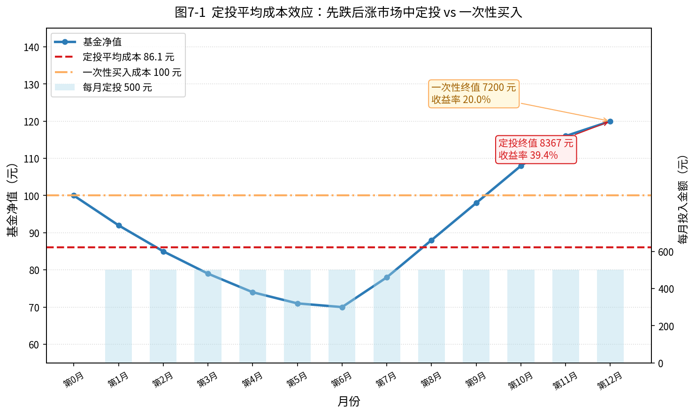
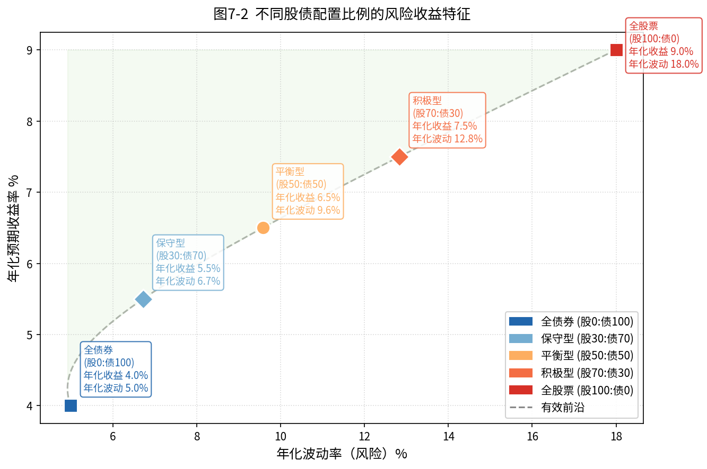
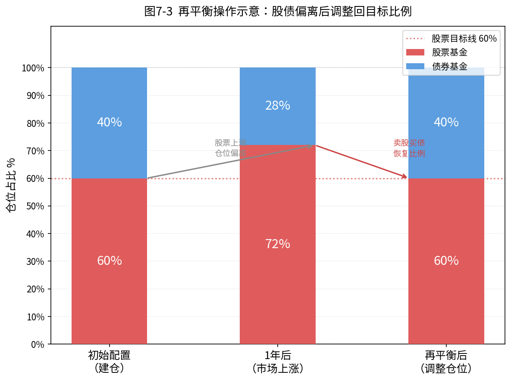
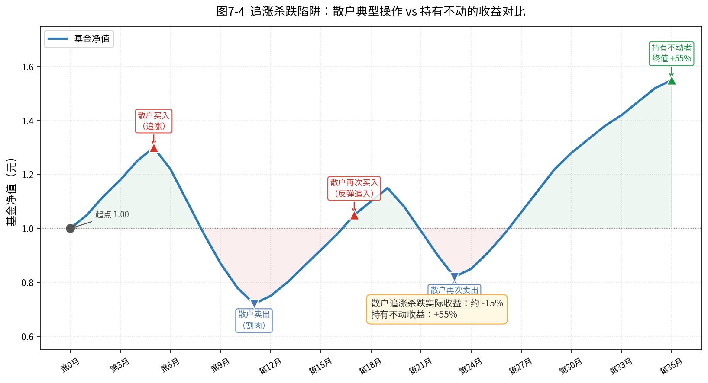

# 第七章 投资策略——怎么买比买什么更重要

很多投资者把大量精力花在"选哪只基金"上，却忽略了一个更根本的问题：**怎么买、什么时候买、买多少**。事实上，同一只优秀的基金，以不同的方式操作，结果可能天差地别——有人赚了30%，有人却亏了10%。本章聚焦于投资行为层面的策略，帮你建立一套系统、纪律、可执行的操作框架。

---

## 7.1 定投策略

### 什么是定投？

定期定额投资（简称"定投"）是指每隔固定时间，投入固定金额购买某只基金，无论当时市场涨跌都持续执行，不做主观判断。这种方式最大的价值不在于"聪明"，而在于**纪律**。

### 为什么定投有效？

定投的核心原理是**平均成本效应**（Dollar Cost Averaging）：净值低时，同样的钱能买到更多份额；净值高时，买到的份额较少。长期执行下来，持仓的平均成本会自动向低位靠拢，低于简单算术平均。

以图7-1为例，假设一只基金净值从100元跌至70元，再涨至120元，整个过程历时12个月。同样投入6000元：

- **一次性买入**：第0月以100元买入，60份额，终值 = 60 × 120 = **7200元**，收益率 20%
- **每月定投500元**：平均成本约82元（低于起点100元），最终份额更多，终值约 **8300元**，收益率约 38%

关键在于：下跌时继续买入，摊低了成本；反弹时收益反而更高。**定投在震荡下行市场中优势最为显著。**

### 定投频率怎么设定？

| 频率 | 适合人群 | 说明 |
|------|---------|------|
| 月定投 | 工薪族 | 与发薪周期对齐，最常见 |
| 周定投 | 有闲暇打理 | 平滑效果更好，但手续费略多 |
| 日定投 | 大额资金 | 成本摊薄效果最强，适合大资金 |

**具体示例：** 月薪1万元的王女士，每月5号发薪后，立即设置自动扣款，定投宽基指数基金500元。这500元约占收入的5%，不影响日常生活，也不需要每天盯盘。持续3年，无论市场如何波动，定投指令自动执行，省心省力。

### 定投的止盈方式

定投不是"买了就放着"，需要制定止盈规则，否则收益会随市场回调而缩水：

- **目标收益止盈**：如设定收益率达到20%即赎回，落袋为安，再重新开始一轮定投。
- **估值止盈**：当市场PE/PB进入历史高位区间（如PE历史百分位>80%），逐步减仓。
- **时间止盈**：定投满3~5年后，市场若处于相对高位，考虑分批赎回。

---

## 7.2 价值投资策略

### 估值是买入的灯塔

价值投资的核心思想：**以合理或低估的价格买入好资产，等待价格回归价值**。对于基金投资者而言，主要通过市场整体估值来判断买入时机，常用指标如下：

**PE（市盈率）**：股价 ÷ 每股收益。PE越低，相对越便宜。宽基指数（如沪深300）PE历史百分位低于30%时，通常被认为是低估区域，适合加仓；高于70%时进入高估区域，需要谨慎。

**PB（市净率）**：股价 ÷ 每股净资产。适合银行、地产等重资产行业基金的估值参考。PB<1意味着市场定价低于账面净资产，通常属于极度低估。

### 均值回归：为什么低估值有效？

市场价格长期围绕内在价值波动，短期可能极度悲观（低估）或极度乐观（高估），但最终总会回归理性。这就是**均值回归**。

研究表明，在PE历史低百分位区间买入，持有3~5年，获正收益的概率超过85%。相反，在高估值区间买入，亏损概率大幅上升。

### 实操建议

1. **查估值工具**：可在集思录、雪球、且慢等平台查询各指数实时PE/PB及历史百分位。
2. **分批建仓**：低估区不要一次性全仓，可分3~4次建仓，避免"越跌越低"的极端情况。
3. **避免行业基金单独估值**：不同行业PE差异巨大，科技行业PE天然高于银行，横向比较意义不大，应纵向与该行业历史均值比较。

---

## 7.3 资产配置策略

### 不要把鸡蛋放在一个篮子里

资产配置是指将资金分散投入不同类型的资产（股票基金、债券基金、货币基金等），以降低整体风险、平滑收益曲线。核心逻辑：**不同资产之间的相关性较低，一个下跌时，另一个可能上涨或保持稳定**。

### 股债平衡：最经典的配置框架

最简单也最有效的资产配置框架是**股债平衡**，即将资金按一定比例分配给股票基金和债券基金。

如图7-2所示，5种不同股债比例在风险（年化波动率）和收益（年化预期收益率）上呈现明显的差异：

- **全债券（股0:债100）**：波动最低（约5%），收益也最低（约4%）
- **平衡型（股50:债50）**：收益约6.5%，波动约9.5%，风险收益性价比较好
- **全股票（股100:债0）**：收益最高（约9%），但波动高达18%

有效前沿上的每个点，都代表在同等风险下可获得的最高收益。位于有效前沿左上方的组合，是理想的投资目标。

### 如何根据风险承受能力选配置？

| 风险类型 | 建议股债比例 | 特征 |
|---------|------------|------|
| 保守型   | 股20:债80  | 退休人群、短期需要用钱 |
| 稳健型   | 股40:债60  | 3~5年不动用 |
| 平衡型   | 股60:债40  | 5年以上，可承受一定波动 |
| 积极型   | 股80:债20  | 长期投资，心理承受力强 |

### 核心+卫星策略

进阶的资产配置框架：

- **核心仓位（70~80%）**：宽基指数基金（沪深300、中证500），长期持有，追求市场平均收益
- **卫星仓位（20~30%）**：行业主题基金、主动管理基金，追求超额收益，灵活调整

核心仓位提供稳定性，卫星仓位提供弹性，两者结合，既不错失机会，又不会因单一押注而满盘皆输。

---

## 7.4 再平衡：保持仓位比例

### 为什么需要再平衡？

时间一长，各类资产的涨跌幅不同，初始配置比例会逐渐偏离目标。如图7-3所示：

- **初始配置**：股票60%，债券40%
- **1年后股市上涨**：股票仓位自然膨胀到72%，债券萎缩到28%
- **不干预的后果**：实际风险大幅上升，偏离了最初设定的风险承受能力

再平衡的操作是：**卖出超配部分（股票），买入低配部分（债券），恢复到60:40**。

### 再平衡的触发条件

建议采用**阈值触发法**，而非固定时间触发：

> **触发规则：当任一资产类别偏离目标比例超过5个百分点时，执行再平衡。**

例如，目标是股60:债40。若股票涨至65%（偏离5%），则卖出股票基金，补入债券基金，恢复到60:40。

具体操作方式：
1. **每季度检查一次**仓位比例，计算实际与目标的偏差
2. **偏差未超过5%**：无需操作，保持持仓
3. **偏差超过5%**：执行再平衡，优先用新增资金补充低配资产，其次才赎回高配资产

再平衡的本质是**强制执行"高卖低买"**：在资产涨多了的时候卖出，在跌多了的时候买入，这与人性的"追涨杀跌"完全相反，也正因如此，长期下来能带来超额收益。

### 再平衡的注意事项

- **税费成本**：频繁赎回会产生手续费，不宜过于频繁，建议每季度检查、必要时才操作
- **新增资金优先**：定投或年终奖等新增资金，优先投入低配资产，可以减少赎回次数
- **宽容带**：设定阈值（如5%）而非精确到1%，避免过度操作

---

## 7.5 常见错误策略：追涨杀跌、频繁换仓

### 最昂贵的错误：追涨杀跌

追涨杀跌是指：在市场上涨、情绪高涨时买入；在市场下跌、恐慌时卖出。这是最典型的"散户陷阱"。

如图7-4所示，某只基金在3年内经历了涨涨跌跌，如果全程持有，最终收益约+55%。但一位典型的追涨杀跌散户：

1. **第5月追涨买入**：此时净值已涨到高位（1.30元）
2. **第11月恐慌割肉**：净值跌至0.72元，亏损44%出局
3. **第17月反弹再追入**：看到市场回升，再次入场（1.05元）
4. **第23月再次卖出**：又一轮下跌，再度止损割肉（0.82元）

经过反复追涨杀跌，这位散户的实际收益约为**-15%**，而持有不动的收益是**+55%**。相差70个百分点。

### 为什么人们会追涨杀跌？

这背后是人类本能：

- **损失厌恶**：亏损的痛苦是同等收益快乐的2倍，导致恐慌性抛售
- **从众心理**：周围人都在买（或卖），难以保持独立判断
- **锚定效应**：心理上把买入价当"正常"，跌破后难以接受，扛不住压力卖出
- **可得性偏差**：近期大涨让人觉得"市场就该涨"，大跌让人觉得"还会继续跌"

### 另一个陷阱：频繁换仓

很多投资者喜欢"追热点"：看到某个行业基金最近涨得好，就把原有基金赎回，换入热门基金。这种行为的代价是：

1. **每次赎回都有手续费**（申购费+赎回费），频繁操作把利润吃掉
2. **追到的往往是阶段高点**，下一轮轮到别的行业涨时，刚买的基金又开始跌
3. **错过长期复利**：优秀的基金需要时间来体现价值，频繁换仓打乱了复利节奏

**正确做法**：选好标的后，除非基本面发生重大变化（基金经理离职、策略改变、规模暴增），否则坚持持有，不以短期涨跌为由换仓。

---

## 7.6 本章小结

本章介绍了四种核心投资策略：

| 策略 | 核心原则 | 适用场景 |
|------|---------|---------|
| **定投策略** | 纪律投入，平均成本 | 工薪族、长期积累 |
| **价值投资** | 低估值买入，等待均值回归 | 宽基指数基金 |
| **资产配置** | 分散风险，股债平衡 | 所有投资者 |
| **再平衡** | 高卖低买，保持比例 | 持仓调整 |

**最重要的三条原则：**

1. **纪律胜过聪明**：不需要预测市场，只需要坚持执行定投和再平衡计划
2. **系统胜过感情**：用规则代替情绪，避免追涨杀跌
3. **时间胜过时机**：在市场中待的时间，永远比抓到最佳时机更重要

下一章，我们将讨论如何挑选适合自己的具体基金产品，把本章的策略落实到具体的投资标的上。

---

> **本章配图索引**
> - 图7-1：`pic/ch7_dca_effect.png` — 定投平均成本效应
> - 图7-2：`pic/ch7_asset_allocation.png` — 不同资产配置比例的风险收益散点图
> - 图7-3：`pic/ch7_rebalance.png` — 再平衡操作示意
> - 图7-4：`pic/ch7_chase_trap.png` — 追涨杀跌陷阱

---

*← [第六章：主动基金选择方法论](chapter6.md) | → [第八章：风险管理](chapter8.md)*
