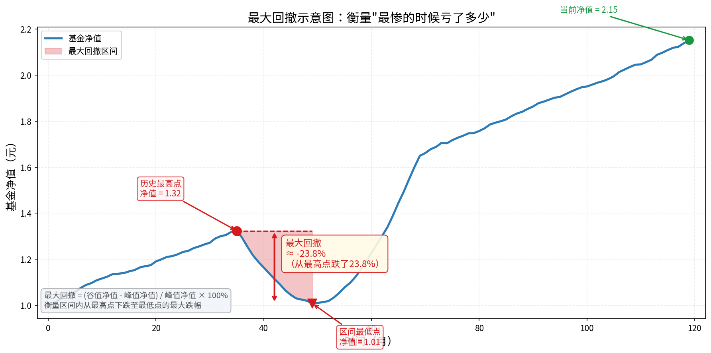
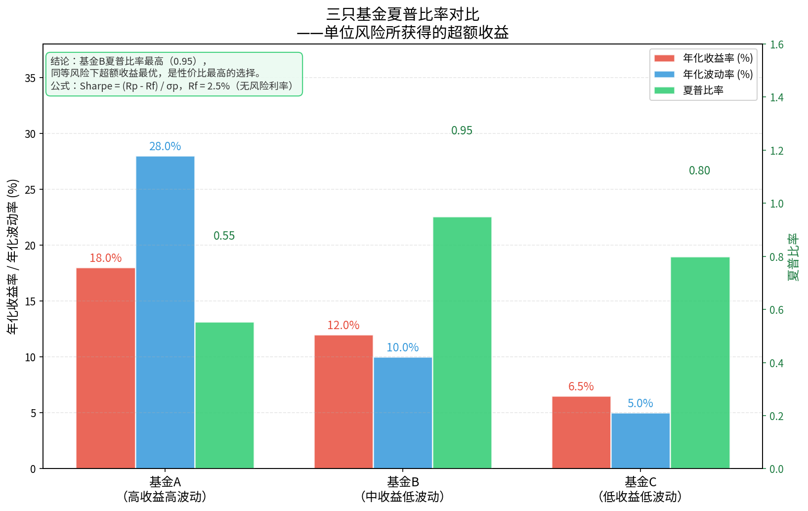
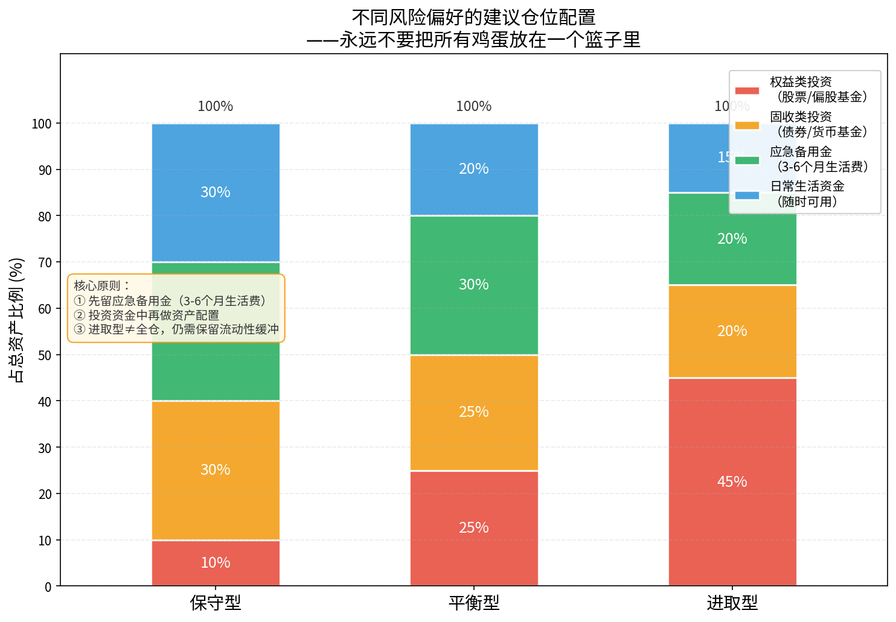

# 第八章　风险管理

> "在投资中，风险不是你的敌人，失控的风险才是。"

---

## 8.1　风险的本质：不确定性，而非亏损本身

很多初学者认为"风险"等于"亏钱"。这个理解并不准确。

**风险的真正含义是：结果的不确定性。**

一笔投资，可能涨20%，也可能跌20%，这个"可能涨可能跌"的状态本身，就是风险。即便最终没有亏损，只要结果事先不确定，风险就已经存在。反过来，一笔稳定下滑的资产，虽然每天都在亏，但结果是"确定的"，在统计意义上反而风险较低。

理解这一点非常重要，因为它决定了我们如何衡量风险。金融学中最常用的风险衡量方式是**波动率（标准差）**，即资产收益率在一段时间内围绕均值的波动幅度。波动越大，不确定性越高，风险越大。

风险还有一个重要特征：它不会凭空消失，只会转移和变形。试图完全规避风险的人，往往把自己暴露在另一种更隐蔽的风险之中——比如将所有钱存入银行的人，规避了市场波动风险，却无法规避通货膨胀侵蚀购买力的风险（参见第一章）。

**成熟投资者的目标，不是消灭风险，而是在可承受的风险范围内，获取尽可能高的收益。**

这意味着：
1. 你必须先搞清楚自己能承受多大的波动和亏损；
2. 再据此选择匹配自身风险承受能力的产品；
3. 最后通过分散投资、仓位控制等手段，把风险维持在目标区间之内。

本章接下来的内容，将系统介绍风险的类型、量化指标、以及具体的管理方法。

---

## 8.2　市场风险：系统性风险与非系统性风险

市场风险，通常被分为两大类：**系统性风险**和**非系统性风险**。两者的区别，决定了你能否通过分散投资来降低风险。

### 系统性风险

系统性风险，又称市场风险，是指对整个市场产生影响的风险，无法通过持有更多个股或基金来规避。典型来源包括：

- **宏观经济周期**：经济衰退、通胀上升、利率变化；
- **地缘政治事件**：战争、贸易摩擦、重大政策转变；
- **全球性危机**：如2008年金融危机、2020年新冠疫情冲击；
- **市场情绪崩溃**：极端恐慌下的踩踏式下跌。

系统性风险"人人都逃不过"。2015年A股的断崖式下跌中，几乎所有股票型基金都遭遇了大幅回撤，无论你持有哪只基金都难以幸免。

### 非系统性风险

非系统性风险，是指仅影响特定行业、公司或基金的风险，**可以通过分散投资有效降低**。典型来源包括：

- **个股风险**：某公司财务造假、高管出事、产品失败；
- **行业政策风险**：某行业遭遇监管重锤（如2021年教育培训行业）；
- **基金经理风险**：某只主动基金的明星基金经理离职；
- **集中度风险**：重仓某一赛道，赛道走弱导致大幅亏损。

当你持有20只以上不相关资产时，非系统性风险几乎可以被分散掉。这就是"不要把鸡蛋放在一个篮子里"的数学依据。

**关键结论**：分散投资可以消除非系统性风险，但无法消除系统性风险。指数基金持有几百只股票，非系统性风险极低，但依然会随市场整体涨跌。投资者需要对系统性风险有清醒预期，不要期待任何产品能在熊市中"独善其身"。

---

## 8.3　最大回撤：衡量风险的核心指标

波动率虽然精确，但对普通投资者来说有些抽象。更直观的风险指标是**最大回撤（Maximum Drawdown，MDD）**。

### 什么是最大回撤

最大回撤，是指在某段时间内，基金净值从**历史最高点**下跌到**随后最低点**的最大跌幅。

$$
\text{最大回撤} = \frac{\text{区间最低净值} - \text{区间最高净值}}{\text{区间最高净值}} \times 100\%
$$

例如，某基金净值从最高点 1.80 元跌至最低点 1.17 元，那么：

$$
\text{最大回撤} = \frac{1.17 - 1.80}{1.80} \times 100\% \approx -35\%
$$

**类比理解**：你可以把最大回撤理解为"你在这只基金上，最倒霉的时候，最多会亏掉多少本金"。如果一只基金历史最大回撤是35%，意味着有人在最高点买入、在最低点卖出，亏了三成多。

上图展示了一条典型基金净值曲线。红色区域就是最大回撤区间：净值从峰值跌至谷值，跌幅约35%。注意，即便该基金长期向上，投资者仍可能因为在高点买入、低点割肉而遭受巨额亏损。

### 最大回撤的实用价值

- **选基参考**：同类基金中，最大回撤越小，说明基金经理对风险控制越好；
- **情绪锚点**：提前知道这只基金可能跌多深，有助于在下跌中保持冷静；
- **仓位决策**：如果某基金历史最大回撤50%，你能否接受投入10万后账面只剩5万？如果不能接受，就不应重仓。

一般来说，优质偏股型基金的历史最大回撤在25%~45%之间。超过50%的产品风险极高，需要特别谨慎。

---

## 8.4　夏普比率：单位风险的收益

收益高不代表好，风险大也不代表坏，**真正重要的是：承担每一单位风险，换来了多少超额收益**。夏普比率（Sharpe Ratio）正是衡量这一性价比的核心指标。

### 公式与含义

$$
\text{Sharpe} = \frac{R_p - R_f}{\sigma_p}
$$

其中：
- $R_p$：基金年化收益率
- $R_f$：无风险利率（通常取货币基金收益率或国债收益率，约 2.0%~2.5%）
- $\sigma_p$：基金年化波动率（标准差）

**夏普比率越高，说明每承担一单位风险，获得的超额收益越多，基金的风险调整后性价比越高。**

### 对比三只基金

如图所示，三只基金的情况如下（无风险利率取2.5%）：

| 基金 | 年化收益率 | 年化波动率 | 夏普比率 |
|------|-----------|-----------|---------|
| 基金A（高收益高波动）| 18% | 28% | **0.55** |
| 基金B（中收益低波动）| 12% | 10% | **0.95** |
| 基金C（低收益低波动）| 6.5% | 5% | **0.80** |

乍看之下，基金A的年化收益率最高（18%），似乎最吸引人。但计算夏普比率后，**基金B的0.95远高于基金A的0.55**——这意味着基金A虽然收益更高，但它承担了接近3倍的波动，"性价比"反而低得多。

基金C虽然绝对收益低，但波动极小、夏普比率也不差，适合保守型投资者。

**实用建议**：在筛选基金时，不要只看收益率排名，一定要同时参考夏普比率。通常认为，夏普比率 > 1 是优秀水平，> 1.5 属于顶尖表现。

---

## 8.5　流动性风险：赎回时间与资金规划

流动性风险，是指**当你需要用钱时，无法及时、以合理价格变现资产**的风险。

基金的流动性风险主要体现在以下几个方面：

### 赎回到账时间差

不同基金的到账时间差别很大：

| 基金类型 | 典型到账时间 |
|---------|------------|
| 货币基金 | T+0 或 T+1 |
| 短债基金 | T+1～T+2 |
| 债券基金 | T+2～T+3 |
| 股票/指数基金 | T+3～T+7（工作日） |
| 封闭期产品 | 封闭期内无法赎回 |

这意味着：若你今天急需一笔钱，持有的股票型基金可能需要等到一周后才能到账。如果遇到长假，时间还会更长。

### 流动性风险的实际危害

很多投资者在股市下跌时，被迫以低价赎回基金来应急，结果"亏本出局"不是因为投资判断错了，而纯粹是因为资金规划不合理，该用钱的时候钱被套牢在基金里了。

**应对方法**：
1. **保留足够的活期/货币类资产**：至少3~6个月的日常支出，放在货币基金或活期账户，随时可用；
2. **区分资金用途**：短期（1年内）要用的钱，不要进入股票型基金；中期（1~3年）资金，可配置债券/混合基金；长期（3年以上）资金，才适合配置权益类产品；
3. **了解封闭期**：购买前务必确认产品是否有封闭期、最短持有期等限制，避免被套。

---

## 8.6　心理风险：恐慌与贪婪

在所有风险中，**心理风险**往往是普通投资者亏损的最大根源。市场的涨跌可以用数学模型描述，但人的情绪却极难预测和控制。

### 损失厌恶：亏10%的痛苦远大于赚10%的快乐

诺贝尔经济学奖得主卡尼曼和特沃斯基的**前景理论（Prospect Theory）**指出：人对损失的心理感受，大约是同等金额收益的2.5倍。也就是说，**亏100元的痛苦，相当于赚250元的快乐**。

这一心理偏差导致投资者：
- **过早止盈**：稍有盈利就急于卖出，生怕"煮熟的鸭子飞了"；
- **迟迟不止损**：亏损时不愿接受现实，一直幻想"等它涨回来"，结果越套越深；
- **厌恶波动**：在市场正常波动中感到过度焦虑，做出非理性操作。

### 处置效应：卖掉赚钱的，留着亏钱的

**处置效应（Disposition Effect）**是行为金融学中的经典现象，指投资者倾向于"过早卖出盈利仓位、过晚卖出亏损仓位"。

这与理性决策恰好相反——从税务和复利角度，你应该让盈利的资产继续持有（发挥复利效应），尽快止损亏损资产（及时止血）。处置效应驱动的操作逻辑正好颠倒，造成"割掉花朵、留住杂草"的结果。

### 羊群效应：市场高位疯狂买入，低位恐慌卖出

人类是社会性动物，会本能地跟随群体行为。在投资中，这表现为：
- 牛市末期人人谈股，散户疯狂涌入，正好买在高点；
- 熊市底部人人悲观，基金大规模赎回，恰好卖在低点。

**如何对抗心理风险：**
1. 制定书面投资计划，在冷静时做好决策，不在情绪激动时操作；
2. 定期定额投资（参见第七章），用纪律代替情绪；
3. 接受波动是正常现象，将注意力从短期涨跌转向长期目标；
4. 减少查看账户频率——数据显示，频繁看账户的投资者因过度交易，收益普遍低于持有不动者。

---

## 8.7　仓位管理：永远不要满仓

仓位管理，是指控制投入高风险资产的资金比例，确保在任何情况下都有足够的流动性缓冲。

**核心原则：永远不要满仓，也不要把所有资金都投入高风险资产。**

上图展示了三种风险偏好对应的建议仓位配置方案。关键逻辑如下：

### 第一步：留好应急备用金（不参与投资）

应急备用金 = 3~6个月的家庭月总支出，放在货币基金或活期账户，**这部分钱不属于投资资金**，不能被计入仓位之中。

例如，家庭月支出8000元，应急备用金至少要保留 8000 × 4 = 3.2 万元，随时可调用。

### 第二步：确定可投资金额

除去应急备用金和未来1年内明确要用的资金，剩余部分才是真正的"可投资资金"。

### 第三步：按风险偏好分配仓位

| 风险类型 | 权益仓位（偏股类）| 固收仓位（债券/货基）| 参考人群 |
|---------|---------------|------------------|---------|
| 保守型 | ≤ 30% | ≥ 70% | 临近退休、高度厌恶波动者 |
| 平衡型 | 40%~60% | 40%~60% | 中长期目标、可接受适度波动 |
| 进取型 | 60%~80% | 20%~40% | 投资期限10年以上、能承受大幅回撤 |

### 具体操作规则

- **分批建仓**：不要一次性全部买入，分3~5批、间隔2~4周逐步建仓，降低时机风险；
- **再平衡规则**：每半年或每年检查一次，若权益仓位因上涨超出目标5个百分点以上，则卖出部分锁定收益；若因下跌低于目标，则适当补仓；
- **市值上限**：单只基金的持仓市值，不超过总投资资金的30%，防止单一产品的集中风险；
- **现金缓冲**：始终保留约10%的现金或货币基金，用于在市场急跌时低位补仓。

---

## 8.8　止损与止盈的设置逻辑

### 止损：保护本金的最后防线

**止损**，是指当亏损达到预设阈值时，主动卖出，将损失锁定在可控范围内，防止"小亏变大亏"。

设置止损线的常见方法：

**方法一：固定比例止损**
预设亏损比例，例如"单只基金亏损超过20%时，无论如何都要卖出一半仓位"。这是最简单的方法，执行成本低，但比较机械。

**方法二：基于最大回撤止损**
研究该基金历史上的正常回撤区间。若当前回撤已显著超出历史最大回撤的80%（例如历史最大回撤35%，当前已跌28%），说明此次下跌可能是结构性问题而非正常波动，应考虑减仓。

**方法三：基于持有周期止损**
若持有某只主动基金超过3年，收益仍持续落后同类基金平均水平20%以上，则应考虑更换——这不是价格止损，而是对"错误决策"的纠正。

**止损的心理障碍**：损失厌恶使人难以下手。建议在买入时就写下止损计划，一旦触发机械执行，不给情绪留空间。

### 止盈：锁定果实的艺术

止盈策略同样重要，常见做法：

**方法一：目标收益止盈**
买入前设定目标，例如"这笔钱的投资目标是3年赚40%"，达到后分批减仓，将部分收益转入低风险产品。

**方法二：估值止盈（针对指数基金）**
当沪深300等主要指数的市盈率（PE）达到历史80%分位以上时，认为市场高估，开始逐步减仓；跌至历史20%分位以下时，认为低估，开始加仓。这是一种基于基本面的动态止盈策略（参见第六章估值章节）。

**方法三：时间止盈**
根据人生阶段设置时间窗口。例如，为子女教育基金投资，孩子高考前2年开始将权益仓位逐步转入低风险产品，确保目标金额在需要时可用。

**止盈的常见错误**：赚了一点就全部卖出，错失后续更大的上涨；或者一直"再等等"，最后在下跌中把盈利全部还给市场。建议采用**分批止盈**——达到目标收益的50%时先卖出1/3，达到100%时再卖出1/3，剩余部分继续持有。

---

## 8.9　本章小结：风险管理核心原则

本章系统介绍了基金投资中风险管理的主要维度与实操方法。以下是本章的核心要点：

### 认知层面

| 原则 | 说明 |
|------|------|
| 风险 ≠ 亏损 | 风险是不确定性；承担合理风险是获取收益的必要条件 |
| 分散降低非系统性风险 | 系统性风险无法规避，但非系统性风险可通过分散消除 |
| 最大回撤是直观风险标尺 | 选基金时，先问"最惨能亏多少" |
| 夏普比率衡量性价比 | 不能只看收益率，要看单位风险的超额收益 |

### 行动层面

| 原则 | 说明 |
|------|------|
| 先留应急金，再谈投资 | 3~6个月生活费不能进市场，是底线 |
| 仓位永远有上限 | 权益仓位根据风险偏好控制，不满仓、不借钱炒基 |
| 制定止损止盈计划 | 冷静时定规则，情绪波动时机械执行 |
| 警惕心理偏差 | 损失厌恶、处置效应、羊群效应是三大敌人 |
| 定期再平衡 | 半年至一年检查一次，主动管理仓位偏离 |

### 一句话总结

> **风险管理的本质，是在你能睡得着觉的前提下，让资产尽可能地增长。**

真正的风险不是账面的浮亏，而是：被迫在错误时间卖出、无法控制的仓位、无法克服的情绪。掌握了本章的工具和原则，你就掌握了保护本金、穿越周期的基础能力。

---

*下一章，我们将介绍如何构建完整的基金投资组合，把前面学到的选基、估值、风险管理知识整合为一套完整的实战体系。*

---

*← [第七章：投资策略](chapter7.md) | → [第九章：技术分析入门](chapter9.md)*
