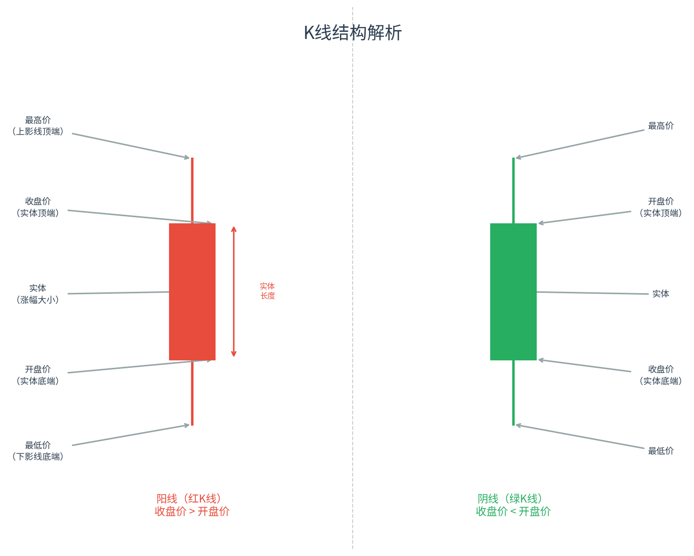
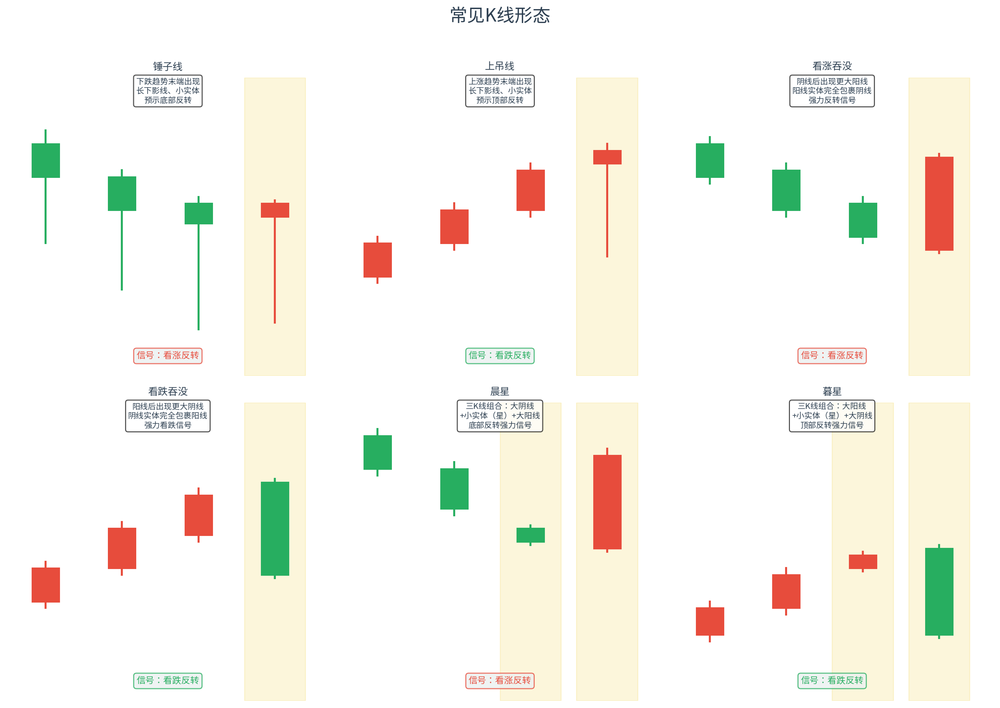
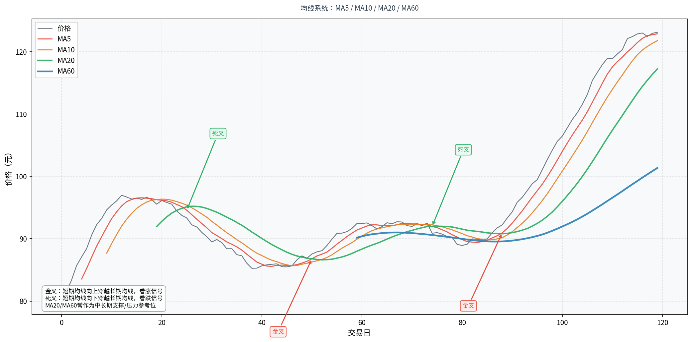
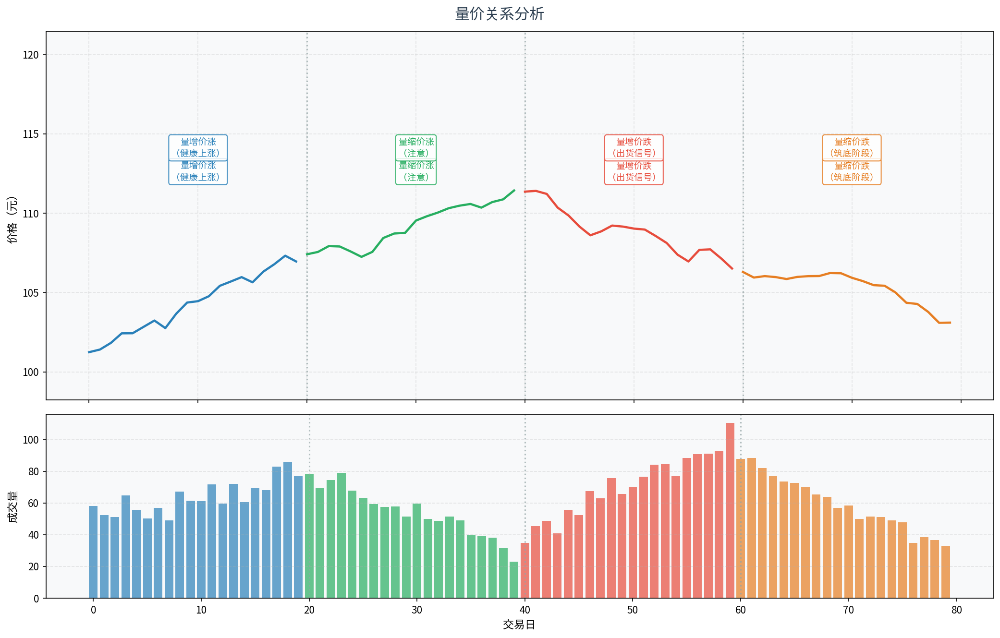
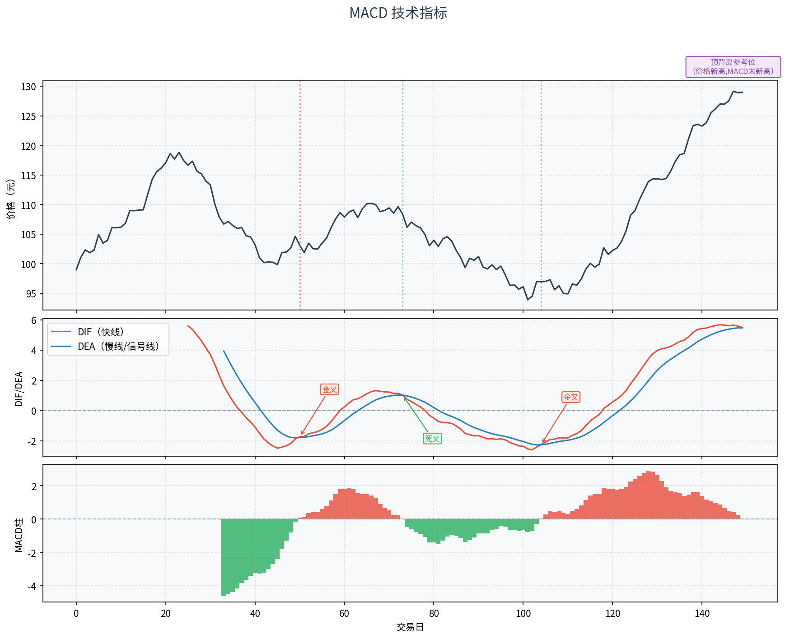
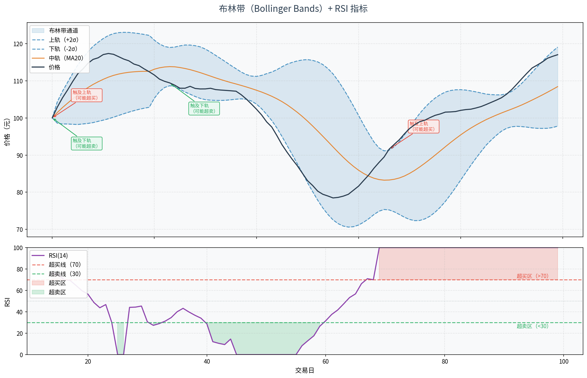

# 第九章：技术分析入门

> **本章导读**
>
> 技术分析是金融市场中历史最悠久、使用最广泛的分析流派之一。对于基金投资者来说，了解技术分析的基本工具，可以帮助我们在一定程度上判断买卖时机，识别市场情绪，但更重要的是清楚地认识它的边界与局限。本章将系统介绍K线图、均线系统、量价关系和常用技术指标（MACD、RSI、布林带），并在每个小节明确指出这些工具在基金投资中的实际参考价值。

---

## 9.1 技术分析的前提假设与局限

### 什么是技术分析

技术分析（Technical Analysis）是一种通过研究历史价格走势、成交量等市场数据，来预测未来价格变动方向的分析方法。与基本面分析关注企业内在价值不同，技术分析的核心信条是：**"价格已经反映了一切"**，所有影响市场的因素——公司财务、政策变化、投资者情绪——最终都会体现在价格走势中。

### 技术分析的三大前提假设

**假设一：市场行为包容一切（Market Action Discounts Everything）**

技术分析认为，影响价格的所有因素，无论是宏观经济、公司基本面还是投资者心理，都已经实时反映在当前价格中。因此，只需分析价格本身，无需另外分析基本面。

**假设二：价格沿趋势运动（Prices Move in Trends）**

市场价格一旦形成趋势，就会沿着趋势方向持续运动，而不是随机游走。技术分析师的目标，就是尽早识别趋势，顺势而为。

**假设三：历史会重演（History Repeats Itself）**

市场参与者在类似情境下会产生类似的行为模式，因此历史价格形态会周期性地重复出现。这也是技术分析形态研究的根本依据。

### 技术分析的局限性

尽管技术分析在短线交易中被广泛使用，但它也存在显著的局限：

**1. 自我实现 vs. 真实预测力**
大量研究者同时使用相同指标，会产生自我实现效应——不是因为信号准确，而是因为大家都相信它准确而同时行动。这种预测力是脆弱的，一旦使用者减少，信号随即失效。

**2. 对随机游走的挑战**
有效市场假说（EMH）认为价格走势本质是随机游走，历史价格不包含对未来的预测信息。大量学术研究对技术分析的超额收益能力存疑，尤其在流动性好的大型市场中，有效性更低。

**3. 对基本面突变无能为力**
技术分析完全无法预判突发政策变化、财务造假曝光、地缘政治冲突等黑天鹅事件。当基本面发生根本性变化时，所有技术形态都会瞬间失效。

**4. 对基金投资的参考价值有限**
股票技术分析逻辑用于基金时，面临更多挑战：基金净值每日更新一次（非实时交易价），基金背后持有数十至数百只股票，单一技术形态在组合层面的意义更加模糊。

**技术分析在基金投资中的正确定位：辅助择时参考工具，而非核心决策依据。**

---

## 9.2 K线图解读

### K线的起源

K线图（Candlestick Chart）起源于18世纪日本大阪的大米期货交易，由传奇交易员本间宗久（Homma Munehisa）发明，后来被西方金融市场广泛采用。K线的中文名来自日语"罫線"（けいせん），音译为"K线"。

### K线的构成要素

每一根K线记录了一个时间周期内（可以是1分钟、5分钟、日、周、月等）的四个核心价格数据：

| 要素 | 含义 |
|------|------|
| **开盘价（Open）** | 该时间周期第一笔成交价格 |
| **收盘价（Close）** | 该时间周期最后一笔成交价格 |
| **最高价（High）** | 该时间周期内的最高成交价格 |
| **最低价（Low）** | 该时间周期内的最低成交价格 |

这四个价格数据通常被缩写为 **OHLC**（Open、High、Low、Close）。

### 阳线与阴线

- **阳线（红K线）**：收盘价 > 开盘价，说明本期价格上涨。实体（矩形部分）用红色（或白色）填充，实体高度反映涨幅大小。
- **阴线（绿K线）**：收盘价 < 开盘价，说明本期价格下跌。实体用绿色（或黑色）填充。
- **十字星**：开盘价 ≈ 收盘价，实体极小，表明多空双方势均力敌，市场方向不明。

实体上下各有一根细线，分别称为**上影线**和**下影线**：
- 上影线 = 最高价 - max(开盘价, 收盘价)，反映了上方卖压
- 下影线 = min(开盘价, 收盘价) - 最低价，反映了下方买撑

*图9-1：K线结构解析。左侧为阳线（上涨），右侧为阴线（下跌）。实体长度代表当期涨跌幅，上下影线代表价格波动范围。*

### 如何读懂一根K线

通过一根K线的形态，可以直观感受当期的多空力量对比：

- **长实体、短影线**：单边行情明显，买卖力量悬殊
- **小实体、长下影线（锤子线）**：盘中大幅下跌后被买盘推回，下方买撑强劲，潜在看涨
- **小实体、长上影线（上吊线）**：盘中上冲后遭遇大量卖盘打压，上方阻力强，潜在看跌
- **十字星**：多空平衡，往往出现在趋势转折前

### 常见K线形态

技术分析师通过研究多根K线的组合形态，来判断趋势的延续或反转。以下是六种经典形态：

*图9-2：六种经典K线形态。黄色背景标注关键K线，信号可靠性需结合成交量和前期趋势验证。*

**1. 锤子线（Hammer）**
出现在下跌趋势末端。特征：小实体位于K线上方，长下影线（通常为实体长度的2倍以上），几乎没有上影线。长下影线表明盘中大幅下跌后，买盘力量将价格推回。当锤子线出现在明显下跌趋势的低位，加上较大成交量确认，是较可靠的底部反转信号。

**2. 上吊线（Hanging Man）**
形态与锤子线完全相同（小实体上方，长下影线），但出现位置截然相反——上涨趋势的高位。同样的形态，在高位出现代表上涨动能衰竭，后市需警惕回调。

**3. 看涨吞没（Bullish Engulfing）**
两根K线组合：第一根为阴线，第二根为阳线，且阳线实体完全包裹（吞没）前一根阴线实体。表明买盘力量全面压制卖盘，反转信号较强。两根K线实体差距越大，信号越可靠。

**4. 看跌吞没（Bearish Engulfing）**
看涨吞没的镜像：在上涨趋势高位，较大阴线实体完全包裹前一根阳线实体。表明卖盘力量突然占据主导，是看跌反转信号。

**5. 晨星（Morning Star）**
三根K线组合，出现在下跌趋势底部：
- 第一根：较大阴线（延续下跌）
- 第二根：小实体K线（星），开盘价低开，实体很小，代表多空均衡
- 第三根：较大阳线，收盘价回升至第一根阴线实体中部以上

晨星形态代表底部已至，是较强的看涨反转组合信号。

**6. 暮星（Evening Star）**
晨星的镜像，出现在上涨趋势顶部。三根K线依次为大阳线、小实体星、大阴线。代表上涨动能耗尽，是较强的看跌反转信号。

> **重要提示**：K线形态的可靠性受多重因素影响，需结合以下条件综合判断：①形态出现的趋势背景（顺势形态比逆势形态更可靠）；②成交量配合（反转形态伴随放量更可信）；③其他技术指标印证。**单凭一个K线形态做投资决策是非常危险的。**

---

## 9.3 均线系统

### 什么是移动平均线

移动平均线（Moving Average，MA）是技术分析中最基础、使用最广泛的指标之一。它通过对过去N个周期的收盘价求平均值，形成一条平滑的曲线，过滤掉价格的短期噪声，帮助识别价格的总体趋势方向。

### 计算公式

**简单移动平均（SMA / MA）**

$$MA_N(t) = \frac{P_t + P_{t-1} + P_{t-2} + \cdots + P_{t-N+1}}{N}$$

其中 $P_t$ 为第 $t$ 日收盘价，$N$ 为均线周期。简单移动平均对每个周期赋予相同权重。

**指数移动平均（EMA / 指数平滑移动平均）**

$$EMA_N(t) = \alpha \cdot P_t + (1 - \alpha) \cdot EMA_N(t-1)$$

其中平滑系数 $\alpha = \dfrac{2}{N+1}$。EMA对近期价格赋予更大权重，因此对价格变化反应更灵敏，常用于MACD等指标的计算。

### 常用均线周期及含义

| 均线 | 周期 | 代表含义 |
|------|------|----------|
| MA5 | 5日 | 短期（一周）趋势，反应最灵敏，噪声较多 |
| MA10 | 10日 | 短期（两周）趋势 |
| MA20 | 20日 | 月线均值，中期趋势重要参考 |
| MA60 | 60日 | 季线均值，中长期趋势参考 |
| MA120 | 半年线 | 长期趋势参考 |
| MA250 | 年线 | 超长期趋势参考 |

### 均线的作用

**1. 趋势判断**
- 短期均线在长期均线之上，且多条均线呈"多头排列"（MA5 > MA10 > MA20 > MA60），表明上升趋势明确
- 反之，"空头排列"表明下降趋势明确

**2. 金叉与死叉**
- **金叉**：短期均线（如MA5）从下方向上穿越长期均线（如MA20），形成"黄金交叉"，视为看涨信号
- **死叉**：短期均线从上方向下穿越长期均线，视为看跌信号

**3. 支撑与压力**
价格在上涨趋势中回调时，往往会在某条均线附近获得支撑（均线支撑）；价格在下跌趋势中反弹时，往往会在某条均线附近遭遇阻力（均线压力）。MA20和MA60常被视为重要支撑/压力位。

*图9-3：均线系统示例。可以看到MA5（红色）最为敏感，MA60（蓝色）最为平滑。金叉区域价格往往随后上涨，死叉区域价格往往随后下跌，但均有例外。*

### 均线系统的局限性

**滞后性**：均线是对历史价格的平均，天然具有滞后性。均线周期越长，滞后越严重。当价格已经大幅上涨后，均线金叉才出现，此时追买的安全边际已经不高。

**震荡行情失效**：在价格横盘整理、缺乏明确趋势的市场环境下，均线会频繁产生金叉/死叉信号，大量信号为假信号，频繁交易反而会产生亏损。

**对基金投资的建议**：均线系统更适合中长期趋势判断，可以参考MA20/MA60判断基金当前处于上升趋势还是下降趋势，作为是否适合建仓的辅助参考，而非短线买卖信号。

---

## 9.4 成交量分析：量价关系

### 为什么成交量很重要

价格告诉我们市场发生了什么，成交量告诉我们这件事"有多少人参与"。成交量是衡量市场参与度和情绪强度的关键指标。一次价格上涨，如果有大量资金参与（放量），说明市场共识较强；如果只有少量资金参与（缩量），说明价格变动缺乏说服力。

### 成交量的计算

成交量（Volume）通常以"手"（A股：1手=100股）或金额（成交额）表示。日成交量即当日所有成交笔数的股数/金额之和。

技术分析中常用的成交量指标：
- **成交量绝对值**：当日成交手数或成交额
- **量比**：当日成交量 / 最近N日平均成交量，反映当日量能是否异常

### 四种典型量价关系

*图9-4：四种典型量价关系。上方为价格走势，下方为成交量柱状图，颜色对应各阶段场景。*

**1. 量增价涨（健康上涨）**
成交量逐渐放大，价格同步上涨。这是最健康的上涨形态，表明越来越多的投资者认可当前价值，做多意愿强烈，上涨趋势具有较好的持续性。

**2. 量缩价涨（需要警惕）**
成交量逐渐萎缩，但价格仍在上涨。可能原因：①市场筹码高度集中，大资金在拉升价格；②散户参与度降低，缺乏新增买盘支撑。量缩价涨通常不可持续，需警惕顶部到来。

**3. 量增价跌（出货信号）**
成交量放大，但价格持续下跌。这是危险信号，通常表明大资金在高位借助量能出货（派发筹码）。若在价格相对高位出现量增价跌，需高度警惕。

**4. 量缩价跌（筑底阶段）**
成交量萎缩，价格缓慢下跌。表明市场已经大幅下跌，愿意在低位卖出的人已经越来越少，恐慌性卖盘减少，可能在筑底阶段。若后续出现量增价涨，往往是底部反转信号。

### 量价分析的局限性

- 成交量数据容易被大资金操纵（如对倒交易制造虚假量能）
- 公募基金（ETF除外）不同于股票，无法实时查看成交量，仅在集合竞价市场（如ETF、LOF）有交易量数据
- 场外申购赎回的普通基金不存在"成交量"概念，量价分析直接不适用

> **对基金投资的应用建议**：对于ETF基金，可以参考成交量判断市场热度；对于普通开放式基金（场外），则无法使用量价分析，应关注基金的份额净申购/赎回数据作为替代参考。

---

## 9.5 常用技术指标

### 9.5.1 MACD（移动平均收敛发散指标）

#### 是什么

MACD（Moving Average Convergence/Divergence，移动平均收敛发散指标）由 Gerald Appel 在1970年代发明，是使用最广泛的动量型趋势指标之一。MACD结合了趋势跟踪和动量判断两大功能，通过两条不同速度的EMA之差来衡量价格动量的变化。

#### 怎么算

MACD由三个部分组成：

**第一步：计算快线DIF（差值线）**
$$DIF = EMA_{12} - EMA_{26}$$

其中 $EMA_{12}$ 为12日指数移动平均，$EMA_{26}$ 为26日指数移动平均。

**第二步：计算慢线DEA（信号线）**
$$DEA = EMA_9(DIF)$$

即对DIF再做9日EMA平滑，也称"信号线"。

**第三步：计算MACD柱（直方图）**
$$MACD\_Hist = 2 \times (DIF - DEA)$$

MACD柱正值（红色）表示DIF在DEA之上（多头动量），负值（绿色）表示DIF在DEA之下（空头动量）。

#### 怎么看信号

*图9-5：MACD三面板图。上方为价格，中间为DIF/DEA线，下方为MACD柱。金叉/死叉和背离信号均已标注。*

**信号一：金叉买入 / 死叉卖出**
- **金叉**：DIF从下方穿越DEA向上，是买入信号，尤其当金叉发生在零轴下方时更有意义（代表从超卖区反弹）
- **死叉**：DIF从上方穿越DEA向下，是卖出信号，尤其当死叉发生在零轴上方时更有意义

**信号二：零轴多空分界**
- DIF和DEA均在零轴上方：多头行情，持股为主
- DIF和DEA均在零轴下方：空头行情，观望或减仓
- 金叉发生在零轴上方比零轴下方更可靠

**信号三：背离（Divergence）**
背离是MACD最有价值的信号之一：
- **顶背离**：价格创出新高，但MACD的高点反而低于前一次高点。表明上涨动能衰竭，可能即将见顶。
- **底背离**：价格创出新低，但MACD的低点反而高于前一次低点。表明下跌动能减弱，可能即将见底。

#### 局限性

- MACD本质也是均线衍生指标，具有滞后性
- 在震荡市中，MACD频繁产生无效金叉/死叉信号
- 参数（12、26、9）是经验值，不同市场、不同周期可能需要调整
- 背离信号出现后，价格可能仍有一段时间才真正反转，需结合其他信号确认

---

### 9.5.2 RSI（相对强弱指数）

#### 是什么

RSI（Relative Strength Index，相对强弱指数）由 J. Welles Wilder 在1978年提出。RSI通过衡量一定周期内价格涨跌幅度的比例，判断当前市场是否处于超买或超卖状态。其值域始终在0到100之间。

#### 怎么算

$$RSI_N = 100 - \frac{100}{1 + RS}$$

其中：
$$RS = \frac{N日内平均涨幅}{N日内平均跌幅} = \frac{\overline{U_N}}{\overline{D_N}}$$

- $\overline{U_N}$：过去N日中，所有上涨日涨幅的平均值（下跌日计0）
- $\overline{D_N}$：过去N日中，所有下跌日跌幅绝对值的平均值（上涨日计0）

常用周期：RSI(6)、RSI(12)、RSI(14)、RSI(24)

#### 怎么看信号

**超买区（RSI > 70）**：价格涨幅过大，买盘动能可能趋于饱和，存在回调风险，需考虑减仓或止盈。

**超卖区（RSI < 30）**：价格跌幅过大，卖盘动能趋于衰竭，存在反弹机会，可关注买入时机。

**中性区（30 ~ 70）**：RSI在50附近时，市场多空力量较为均衡。

**背离信号**（与MACD类似）：
- 价格创新高但RSI未创新高：顶背离，看跌
- 价格创新低但RSI未创新低：底背离，看涨

#### 局限性

- RSI是反转指标，更适合震荡行情；在强趋势行情中，RSI可能长期维持在超买或超卖区间，强行反向操作会产生大量亏损
- RSI的70/30并非绝对阈值，在不同市场环境下可适当调整（如强势股可设80/20）
- 短期RSI（如RSI6）过于敏感，信号噪声多；长期RSI（如RSI24）则相对滞后

---

### 9.5.3 布林带（Bollinger Bands）

#### 是什么

布林带（Bollinger Bands）由 John Bollinger 在1980年代发明，是结合移动平均线与统计学标准差的趋势型波动率指标。布林带由三条线组成：中轨（MA）、上轨（+2σ）、下轨（-2σ），形成一个随市场波动动态收缩或扩张的"通道"。

#### 怎么算

$$\text{中轨（MB）} = MA_N$$

$$\text{上轨（UB）} = MA_N + k \cdot \sigma_N$$

$$\text{下轨（LB）} = MA_N - k \cdot \sigma_N$$

其中：
- $MA_N$：N日简单移动平均（通常N=20）
- $\sigma_N$：N日价格的标准差
- $k$：倍数系数，通常取2（即±2个标准差，理论上覆盖约95.4%的价格区间）

#### 怎么看信号

*图9-6：布林带（上图）与RSI（下图）组合示例。价格在布林带通道内运行，上下轨触及标注超买/超卖含义，RSI超买超卖区域用颜色填充标注。*

**信号一：布林带宽度与波动率**
- **布林带收窄（Squeeze）**：上下轨靠近，表明近期价格波动率很低，市场在酝酿一次方向性突破。突破方向（向上或向下）才是真正关键。
- **布林带扩张**：上下轨扩张，表明价格正在经历大幅波动，趋势已经形成。

**信号二：价格与上下轨的关系**
- **价格触及上轨**：相对于近期价格，当前价格已经偏高，可能面临回落压力。这并不一定是做空信号，在上升趋势中价格可以沿着上轨上行（即"走轨"现象）。
- **价格触及下轨**：相对于近期价格，当前价格偏低，可能存在反弹机会。
- **价格突破上轨后回落中轨**：一种常见的做空信号组合
- **价格突破下轨后回升中轨**：一种常见的做多信号组合

**信号三：中轨作为趋势方向参考**
价格持续在中轨上方运行：上升趋势；价格持续在中轨下方运行：下降趋势。

#### 局限性

- 布林带默认参数（20日，2倍标准差）是经验值，需要根据具体市场和周期调整
- 布林带触及上下轨，仅说明价格相对偏高/偏低，并不代表价格必然反转
- 强趋势行情中，价格可以沿着上轨或下轨长期运行（即"走带"），此时把触轨当反转信号会造成亏损
- 与RSI和MACD一样，布林带在波动较低的横盘市场中信号质量更高，强单边趋势中信号可靠性下降

---

## 9.6 技术分析在基金投资中的使用边界

### 直接用于基金的局限

技术分析最初是为股票、期货等实时连续交易市场设计的。将其用于基金投资，面临以下特殊困难：

**1. 净值的日频限制**
普通开放式基金每日只公布一次净值（T+1日），而股票价格是实时变动的。这意味着K线日线数据是有效的，但分钟线、小时线等短周期数据不存在，技术分析的颗粒度受限。

**2. 场外基金无成交量**
场外申购的主动权益基金、债券基金等，不存在类似股票的成交量概念，量价分析完全不适用。只有ETF、LOF等场内交易基金才有成交量数据。

**3. 基金的分散化效应**
基金持有几十到几百只成分股，即使某个股票出现经典技术形态，在组合层面也会被大量对冲，信号意义大大降低。

**4. 基金基本面的重要性更高**
基金的长期表现由其持有资产的基本面决定，而非短期技术形态。一个优质的主动基金，即使短期走势不好看，若长期持有通常也会有较好回报。

### 技术分析对基金投资的合理用途

尽管有上述局限，在以下几个方面，技术分析仍有一定辅助参考价值：

**1. 大市择时（指数层面）**
对沪深300、创业板指等宽基指数进行技术分析，判断市场整体是否处于趋势下行阶段，可以辅助决策是否暂停定投或减少仓位。指数层面的均线系统比个股或个基金层面更为可靠，因为指数本身就是分散化的。

**2. ETF基金择时**
对于跟踪同一指数的ETF，技术分析的有效性相对较好。ETF有实时价格和成交量，可以使用RSI等指标辅助判断是否处于短期超买/超卖。

**3. 建仓时机的辅助参考**
当基本面分析已经确认了目标基金的投资价值后，可以参考技术分析选择一个相对较好的建仓时机（如价格处于均线支撑附近、RSI处于超卖区），在不改变投资逻辑的前提下，略微优化入场成本。

**4. 止损纪律的参考**
技术分析中的支撑位、均线等工具可以辅助设定止损位，帮助投资者在亏损达到一定程度时纪律性地退出，而不是无限期持有亏损仓位。

### 核心原则：基本面为主，技术面为辅

| 分析维度 | 适用场景 | 在基金投资中的权重 |
|----------|----------|-------------------|
| 基本面分析（业绩、管理人、费率、策略） | 选择什么基金 | 主要依据（70-80%） |
| 技术分析 | 什么时候买卖 | 辅助参考（20-30%） |

任何情况下，都不应该因为技术形态"好看"就买入一只基本面很差的基金，也不应该因为技术形态"难看"就卖掉一只基本面优秀、处于正常回调的基金。

---

## 9.7 本章小结

本章系统介绍了技术分析的主要工具，从K线的基本构成到常用技术指标，形成了完整的技术分析知识框架。

**核心知识回顾：**

1. **技术分析三大假设**：市场行为包容一切、价格沿趋势运动、历史会重演。其核心局限在于：这三条假设都存在反例，且技术分析对基本面突变完全无能为力。

2. **K线图**：每根K线记录开高低收四个价格，阳线代表上涨，阴线代表下跌。K线形态（锤子、吞没、晨暮星等）通过多空力量的视觉化表达，提供反转或延续信号，需结合成交量和趋势背景验证。

3. **均线系统**：MA和EMA通过对历史价格平滑处理，揭示趋势方向。金叉/死叉是经典的买卖信号，MA20/MA60是常用的支撑/压力参考位。均线具有滞后性，在震荡市中失效。

4. **量价分析**：量增价涨（健康）、量缩价涨（警惕）、量增价跌（危险）、量缩价跌（筑底）四种典型组合。对普通开放式基金不适用，对ETF有一定参考价值。

5. **MACD**：结合趋势跟踪与动量判断，金叉/死叉和背离信号是核心用法。背离信号（顶背离/底背离）是MACD最有价值的使用场景。

6. **RSI**：衡量超买/超卖状态，值域0-100，超过70为超买，低于30为超卖。在震荡市更有效，强趋势市中可能长期维持在极端区间。

7. **布林带**：动态波动率通道，由MA20±2σ构成。布林带收窄预示突破，触及上下轨提示相对价格偏高/偏低，中轨为趋势判断依据。

**对基金投资者的行动建议：**

- **优先学习基本面分析**：基金的长期收益由基本面决定，技术分析只能在边际上优化入场时机。
- **用技术分析辅助大市判断**：关注宽基指数的均线系统，避免在明显的熊市趋势中大量加仓。
- **ETF投资可参考技术面**：对于宽基ETF的定投或主动操作，技术指标可提供一定的择时参考。
- **切勿过度依赖技术分析**：市场上没有"必赚"的技术形态，任何技术信号都只是概率性的，需要配合严格的风险管理纪律（仓位控制、止损规则）才能发挥价值。

> **下一章预告**：第十章将介绍基金投资组合的构建方法——如何通过多基金搭配，实现风险分散化，并根据个人的投资目标和风险偏好，制定适合自己的资产配置方案。

---

*本章图表索引：*
- *图9-1：K线结构解析（`pic/ch9_candlestick_anatomy.png`）*
- *图9-2：常见K线形态（`pic/ch9_candlestick_patterns.png`）*
- *图9-3：均线系统示意图（`pic/ch9_moving_average.png`）*
- *图9-4：量价关系分析（`pic/ch9_volume_price.png`）*
- *图9-5：MACD指标示意图（`pic/ch9_macd.png`）*
- *图9-6：RSI与布林带（`pic/ch9_rsi_bollinger.png`）*

---

*← [第八章：风险管理](chapter8.md) | → [第十章：信息获取与研究平台](chapter10.md)*
